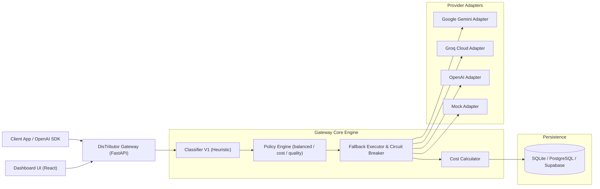

# 🚀 DisTributor Gateway

> **AI Agent Gateway định tuyến đa nhà cung cấp theo độ khó của yêu cầu, tối ưu chi phí & chất lượng.**  
> Dự án tham gia chương trình **VinUni AI20K Build Phase** — Team **P-156**.

[](https://github.com/AI20K-Build-Phase-Cohort-3/P-156)
[](https://www.python.org/)
[](https://fastapi.tiangolo.com/)
[](https://vitejs.dev/)
[](https://dashboard-ten-theta-86.vercel.app/)
[](https://youtu.be/fnh6hL7DFBQ)
[](https://opensource.org/licenses/MIT)

---

## 📌 1. Giới thiệu bài toán (Problem & Solution)

### Vấn đề (Problem)
- Chi phí API giữa các LLM model rẻ (như `gemini-flash-lite`, `gpt-4o-mini`) và các frontier model cao cấp (như `gemini-pro`, `gpt-4o`) chênh lệch từ **20 đến 100 lần**.
- Hơn **70%** các request trong thực tế là các tác vụ đơn giản (chào hỏi, FAQ, dịch thuật ngắn, tóm tắt cơ bản) không nhất thiết cần đến model đắt tiền nhất.
- Khi ứng dụng gửi toàn bộ request tới frontier model: **Lãng phí chi phí nghiêm trọng**.
- Khi ứng dụng dùng toàn bộ model rẻ: **Chất lượng sụt giảm** ở các bài toán khó (viết code phức tạp, suy luận logic nhiều bước, giải toán).  
- Khóa cứng vào một provider duy nhất gây rủi ro cao khi gặp **rate limit (429), downtime hoặc biến động giá**.

### Giải pháp (Solution)
**DisTributor Gateway** đóng vai trò là một **reverse-proxy thông minh** tương thích hoàn toàn với tập con API chuẩn của OpenAI (`/v1/chat/completions`):
1. **Zero Code Change**: Tích hợp vào ứng dụng bất kỳ bằng cách trỏ `base_url` về Gateway.
2. **Heuristic & ML Classification**: Phân loại độ khó của prompt trong thời gian cực ngắn (<50ms) thành 3 tier:
   - `T1` (Easy): Chào hỏi, tra cứu nhanh, dịch thuật ngắn.
   - `T2` (Medium): Viết email, tóm tắt văn bản dài, trích xuất cấu trúc.
   - `T3` (Hard): Lập trình thuật toán, toán học, suy luận logic đa bước.
3. **Chính sách định tuyến linh hoạt (Policy Engine)**: Hỗ trợ các policy `balanced` (cân bằng), `cost_first` (ưu tiên tiết kiệm), `quality_first` (ưu tiên chất lượng).
4. **Tự động Fallback & Circuit Breaker**: Tự động chuyển đổi nhà cung cấp dự phòng (Google Gemini ↔ Groq Cloud ↔ OpenAI) khi gặp lỗi hoặc quá tải.
5. **Minh bạch chi phí & Dashboard**: Đo lường chính xác lượng token, chi phí thực tế phát sinh và % tiết kiệm so với baseline mô hình cao cấp.

---

## 🎬 Video Demo & Trải nghiệm Trực tiếp (Live Demo)

> 📺 **Bấm vào khung hình bên dưới để xem video demo luồng hoạt động chính (End-to-End) của DisTributor Gateway trên YouTube:**

[](https://youtu.be/fnh6hL7DFBQ)

- 🎥 **Video Demo (YouTube):** **[https://youtu.be/fnh6hL7DFBQ](https://youtu.be/fnh6hL7DFBQ)**
- 🌐 **Live Dashboard (Vercel):** **[https://dashboard-ten-theta-86.vercel.app/](https://dashboard-ten-theta-86.vercel.app/)**
- 🌐 **Open AI Compatible endpoint:** **[https://p-156-latest.onrender.com/](https://p-156-latest.onrender.com/)**


---

## 🏗 2. Kiến trúc hệ thống (System Architecture)



Chi tiết tài liệu kiến trúc: xem tại [`docs/architecture_diagram.md`](docs/architecture_diagram.md).

---

## 🛠 3. Yêu cầu môi trường (Prerequisites)

- **Python**: `3.11+`
- **Node.js**: `18+` & **npm** (để chạy Dashboard Frontend)
- **Git**
- *(Tùy chọn)* **Docker** & **Docker Compose**

---

## ⚙️ 4. Hướng dẫn cài đặt & Thiết lập biến môi trường

### Bước 1: Clone kho mã nguồn
```bash
git clone https://github.com/AI20K-Build-Phase-Cohort-3/P-156.git
cd P-156
```

### Bước 2: Thiết lập môi trường Python (Backend)
```bash
# Tạo virtual environment
python -m venv .venv

# Kích hoạt môi trường (Windows PowerShell)
.venv\Scripts\Activate.ps1
# Hoặc Linux / macOS / Git Bash:
# source .venv/bin/activate

# Cài đặt thư viện phụ thuộc
pip install -r requirements.txt
# Hoặc cài package ở chế độ development
pip install -e ".[dev]"
```

### Bước 3: Cấu hình biến môi trường (`.env`)
Tạo file `.env` từ file mẫu `.env.example`:
```bash
cp .env.example .env
```

#### 📋 Bảng mô tả chi tiết biến môi trường:

| Biến môi trường | Bắt buộc | Giá trị mặc định | Giải thích ý nghĩa |
|---|:---:|:---:|---|
| `GEMINI_API_KEY` | Tùy chọn | `""` | API Key của Google Gemini (`gemini-flash-lite`, `gemini-flash`, `gemini-pro`). |
| `GROQ_API_KEY` | Tùy chọn | `""` | API Key của Groq Cloud (`llama-3.3-70b`, `groq-compound`). |
| `OPENAI_API_KEY` | Tùy chọn | `""` | API Key của OpenAI (`gpt-4o-mini`, `gpt-4o`). |
| `USE_MOCK_PROVIDERS` | Không | `false` | Đặt `true` để chạy chế độ Mock hoàn toàn (không tốn API key, thích hợp CI & test offline). |
| `DATABASE_URL` | Không | `sqlite:///./smartroute.db` | Đường dẫn kết nối CSDL (SQLite hoặc PostgreSQL / Supabase). |
| `GATEWAY_DEV_KEY` | Không | `""` | Bearer token cho `/v1/*`. Để trống để bỏ qua auth khi phát triển local. |
| `ADMIN_KEY` | Không | `""` | Token định danh cho header `X-Admin-Key` khi gọi các endpoint `/admin/*`. |
| `API_AUTH_REQUIRED`| Không | `false` | Kích hoạt xác thực API Key bắt buộc trên môi trường production. |
| `MAX_BODY_BYTES` | Không | `1000000` | Giới hạn kích thước HTTP request body; N+1 trả `413 request_too_large`. |
| `MAX_INPUT_TOKENS` | Không | `8000` | Giới hạn token đầu vào ước lượng trên toàn bộ messages; N+1 trả `400 context_too_long`. |
| `MAX_MESSAGES` | Không | `50` | Giới hạn số lượng tin nhắn trong payload (vượt quá trả `400 too_many_messages`). |
| `ROUTER_TIMEOUT_MS`| Không | `800` | Giới hạn thời gian tối đa cho khâu Classifier (ms). |
| `REQUEST_TIMEOUT_S`| Không | `60` | Timeout cho mỗi lần gọi API provider (giây). |
| `CB_ERROR_THRESHOLD`| Không | `5` | Số lỗi liên tiếp kích hoạt Circuit Breaker chuyển sang trạng thái OPEN. |
| `CB_OPEN_SECONDS` | Không | `300` | Thời gian duy trì trạng thái OPEN của Circuit Breaker trước khi thử lại (giây). |
| `PORT` | Không | `8000` | Cổng mạng khởi chạy backend Gateway. |
| `CONFIG_DIR` | Không | `./app/config` | Thư mục chứa cấu hình `models.yaml`, `pricing.yaml`, `policies.yaml`. |
| `LOG_CONTENT` | Không | `false` | Cho phép ghi lại nội dung prompt/response tóm tắt (mặc định tắt vì bảo mật riêng tư). |
| `VITE_API_BASE_URL`| Không | `http://localhost:8000` | Địa chỉ backend Gateway được Dashboard Frontend sử dụng. |

`POST /v1/chat/completions` có giới hạn output cố định là `8192` token. `max_tokens=8193`
không bị từ chối: gateway chuyển chính xác thành `8192` trước khi gọi provider và trả header
`X-SR-Clamped: max_tokens`. Giá trị `8192` trở xuống được chuyển nguyên vẹn và không có header này.

---

## 🚀 5. Hướng dẫn khởi chạy ứng dụng

### Cách 1: Khởi chạy thủ công (Development Mode)

#### 1. Khởi chạy Gateway Backend (FastAPI):
```bash
# Sử dụng Python từ virtual environment
uvicorn src.gateway.app.main:app --reload --port 8000
```
- Gateway API: `http://localhost:8000`
- Tích hợp Playground UI có sẵn: `http://localhost:8000/`
- Swagger API Docs: `http://localhost:8000/docs`
- Health check: `http://localhost:8000/healthz`

`/healthz` also reports the public deployment fields `version`, `commit_sha`,
and `build_timestamp`. Production builds inject them automatically. For local
or non-Docker deployments, set `APP_VERSION`, `GIT_COMMIT_SHA` (or
`RENDER_GIT_COMMIT`), and `BUILD_TIMESTAMP` in RFC 3339 UTC format.

#### 2. Khởi chạy Dashboard Frontend (React + Vite):
```bash
cd src/dashboard
npm install
npm run dev
```
- Dashboard URL: `http://localhost:5173`

---

### Cách 2: Khởi chạy bằng Docker Compose (Production / Demo)
```bash
docker compose up --build
```
Hệ thống sẽ tự động khởi động toàn bộ:
- Postgres Database (`:5432`)
- Gateway API (`:8000`)
- Dashboard UI (`:5173` / `:80`)

---

### Cách 3: Chạy thử nhanh bằng CLI Demo (Không cần bật server)
Bạn có thể kiểm tra thuật toán chấm điểm và quyết định định tuyến trực tiếp từ command line:
```bash
# Chạy bộ prompt mẫu 3 tier
python -m src.gateway.demo_route

# Chạy với prompt tùy biến và chính sách cụ thể
python -m src.gateway.demo_route --policy cost_first "Chào bạn, hôm nay thời tiết thế nào?"
python -m src.gateway.demo_route --policy quality_first "Viết thuật toán QuickSort bằng Python"
```

---

## 💻 6. Các câu lệnh mẫu tương tác API (cURL & Python SDK)

### 1. Tác vụ Đơn giản (Easy - Tier T1)
Tác vụ chào hỏi, định tuyến tự động vào model rẻ (`gemini-flash-lite` hoặc `llama-3.3-70b`):

```bash
curl -X POST http://localhost:8000/v1/chat/completions \
  -H "Content-Type: application/json" \
  -d '{
    "messages": [
      {"role": "user", "content": "Xin chào! Bạn có thể giúp gì cho tôi?"}
    ]
  }'
```

### 2. Tác vụ Trung bình (Medium - Tier T2)
Tác vụ viết email / tóm tắt, định tuyến vào `gemini-flash`:

```bash
curl -X POST http://localhost:8000/v1/chat/completions \
  -H "Content-Type: application/json" \
  -d '{
    "messages": [
      {"role": "user", "content": "Hãy viết giúp tôi một email xin nghỉ phép 2 ngày gửi cho quản lý vì lý do cá nhân."}
    ]
  }'
```

### 3. Tác vụ Phức tạp (Hard - Tier T3)
Tác vụ lập trình thuật toán và ràng buộc đầu ra, định tuyến vào model cao cấp (`gemini-pro` hoặc `groq-compound`):

```bash
curl -X POST http://localhost:8000/v1/chat/completions \
  -H "Content-Type: application/json" \
  -d '{
    "messages": [
      {"role": "user", "content": "Viết hàm Python giải phương trình bậc hai ax^2 + bx + c = 0, so sánh với cách dùng numpy và trả về kết quả dưới định dạng JSON."}
    ]
  }'
```

### 4. Tùy biến Routing bằng Headers & Parameters
```bash
# Ép buộc sử dụng chính sách cost_first
curl -X POST http://localhost:8000/v1/chat/completions \
  -H "Content-Type: application/json" \
  -H "X-SR-Policy: cost_first" \
  -d '{
    "messages": [{"role": "user", "content": "Giải thích định luật vạn vật hấp dẫn"}]
  }'

# Ép buộc chỉ định model cụ thể (dành cho eval / testing)
curl -X POST http://localhost:8000/v1/chat/completions \
  -H "Content-Type: application/json" \
  -d '{
    "model": "smartroute",
    "messages": [{"role": "user", "content": "Tính 123 * 456"}],
    "smartroute": {
      "force_model": "llama-3.3-70b",
      "force_provider": "groq"
    }
  }'
```

### 5. Kiểm tra thông tin Cost & Token Usage của một Request
```bash
curl -X GET http://localhost:8000/v1/usage/{request_id}
```

### 6. Gửi Feedback về chất lượng phản hồi
```bash
curl -X POST http://localhost:8000/v1/feedback \
  -H "Content-Type: application/json" \
  -d '{
    "request_id": "{request_id}",
    "tags": ["Chất lượng tốt"],
    "note": "Phản hồi nhanh và chính xác"
  }'
```

### 7. Xem Thống kê Tổng quan & Chi phí Tiết kiệm (Admin API)
```bash
curl -X GET http://localhost:8000/admin/stats
```

---

### Supported OpenAI API subset

SmartRoute is compatible with the text-chat subset of the OpenAI API:

- Supported: `POST /v1/chat/completions` (text messages, including streaming),
  `GET /v1/models`, and SmartRoute's `GET /v1/usage/{request_id}` extension.
- Unsupported chat fields such as tools, structured response formats, multiple
  choices, and image/audio/file message parts return `400 unsupported_parameter`
  with a stable `error.param`.
- Responses, Embeddings, Images, and Audio Transcriptions are not implemented.
  Their standard SDK routes return `404 unsupported_endpoint` with the endpoint
  and capability in `error.details`; they never return FastAPI's `{detail: ...}`.
- Every response includes standard `x-request-id` and the backward-compatible
  `x-sr-request-id`. Official OpenAI SDK raw responses and exceptions therefore
  expose a non-null `.request_id`.

### 8. Sử dụng với OpenAI Python SDK chuẩn (Zero Code Changes)
```python
from openai import OpenAI

# Chỉ cần thay đổi base_url trỏ về DisTributor Gateway
client = OpenAI(
    base_url="http://localhost:8000/v1",
    api_key="sr-dev-key"  # hoặc để trống nếu tắt auth ở dev
)

response = client.chat.completions.create(
    model="smartroute",  # Gateway tự động phân loại và định tuyến
    messages=[
        {"role": "user", "content": "Viết thuật toán tìm kiếm nhị phân bằng Python"}
    ]
)

print(response.choices[0].message.content)
```

---

## 🧪 7. Kiểm thử & Đánh giá (Testing & Evaluation)

### Chạy toàn bộ Unit & Integration Test Suite (145 tests):
```bash
# Windows PowerShell
$env:PYTHONPATH="."
pytest src/gateway/tests -v

# Linux / macOS
PYTHONPATH=. pytest src/gateway/tests -v
```

### Chạy bộ kịch bản Evaluation:
```bash
python src/evals/run_eval.py
```
Báo cáo chi tiết về 5 kịch bản đánh giá thực nghiệm kèm kết quả LLM: xem tại [`src/evals/report.md`](src/evals/report.md).

### Preliminary classifier v2 benchmark

Live end-to-end evaluation on 1,084 examples from MMLU-Pro, HumanEval+, and MATH-500:

| Benchmark | N | GPT-4o-mini | Classifier v2 | GPT-4o | v2 cost | v2 savings vs GPT-4o |
|---|---:|---:|---:|---:|---:|---:|
| MMLU-Pro | 420 | 41.43% | 39.05% | 45.95% | $0.05855 | 73.09% |
| HumanEval+ | 164 | 81.71% | 87.20% | 84.15% | $0.09667 | 58.98% |
| MATH-500 | 500 | 59.80% | 64.80% | 61.60% | $0.27496 | 89.47% |
| **Descriptive total** | **1,084** | **607 correct** | **631 correct** | **639 correct** | **$0.43019** | **85.96%** |

Classifier v2 finished eight answers behind GPT-4o across the mixed suite while reducing
measured cost from $3.06505 to $0.43019. This is an operational snapshot, not proof that the
classifier alone caused the result: the configured 2.5-second classifier deadline emitted
`v2_fallback` on 595/1,084 examples. See the
[full report](evals/classifier_v2_gpt4o_baselines_report.md) for paired significance tests,
model distributions, methodology, and limitations.

---

## 📊 8. Danh sách Deliverables nộp bài

| # | Hạng mục nộp bài | Vị trí trong Repo / Liên kết | Trạng thái |
|---|---|---|:---:|
| 1 | **MVP Demo Video (~3 phút)** | [Video demo gate 2 t156 (YouTube)](https://youtu.be/fnh6hL7DFBQ) | ✅ Hoàn thành |
| 2 | **Live Deployment (Dashboard)** | [SmartRoute Dashboard (Vercel)](https://dashboard-ten-theta-86.vercel.app/) | ✅ Hoàn thành |
| 3 | **Architecture Diagram** | [`docs/architecture_diagram.md`](docs/architecture_diagram.md) | ✅ Hoàn thành |
| 4 | **GitHub Repo (≥ 10 PRs Merged)** | [Commit History & Merged PRs (>40 PRs)](https://github.com/AI20K-Build-Phase-Cohort-3/P-156/pulls?q=is%3Apr+is%3Amerged) | ✅ Đạt 46 PRs |
| 5 | **README.md (Setup, Env, Sample Commands)** | [`README.md`](README.md) | ✅ Hoàn thành |
| 6 | **Eval Evidences (≥ 5 Test Cases + LLM Output)** | [`src/evals/report.md`](src/evals/report.md) | ✅ Hoàn thành |


---

## 📐 9. KPI Traceability

Mỗi con số trong slide deck được gắn với artifact và commit SHA cụ thể để có thể tái kiểm tra.

| KPI | Giá trị | Nguồn artifact | SHA |
|---|---|---|---|
| Cost savings vs all-premium | **86.74%** | [`evals/mmlu_pro_openai_ladder_report.md#L46`](evals/mmlu_pro_openai_ladder_report.md) | `18bfbaa` |
| Classifier latency p50 | **0.50 ms** | [`evals/mmlu_pro_openai_ladder_report.md#L15`](evals/mmlu_pro_openai_ladder_report.md) | `18bfbaa` |
| Dataset size | **20 samples** | [`evals/datasets/mmlu_pro_sample_20.jsonl`](evals/datasets/mmlu_pro_sample_20.jsonl) | `18bfbaa` |
| Quality Retention (paired) | **25.00%** | [`evals/mmlu_pro_openai_ladder_report.md#L41`](evals/mmlu_pro_openai_ladder_report.md) | `18bfbaa` |
| Critical-fail rate | **60.00%** | [`evals/mmlu_pro_openai_ladder_report.md#L43`](evals/mmlu_pro_openai_ladder_report.md) | `18bfbaa` |
| Interview evidence (H3) | **5/5 consented** | [`src/evals/interviews/responses.csv`](src/evals/interviews/responses.csv) | `18bfbaa` |

> **Lưu ý khi trình bày:** Cost savings 86.74% được đo trên tập MMLU Pro (toàn hard prompts). Quality Retention đạt 25% và critical-fail rate 60% trên cùng tập này — phản ánh giới hạn của heuristic classifier trên domain khó. Claim nên được trình bày kèm cả hai chiều cost và quality.

---

## 🛡 10. Smoke Test & Rollback

### Smoke test (tự động sau mỗi deploy)
Pipeline [`.github/workflows/deploy.yml`](.github/workflows/deploy.yml) chạy `scripts/smoke_admin_api.py` ngay sau khi Render deploy xong — kiểm tra CORS + `GET /admin/keys` + `GET /admin/config` từ Vercel origin. Deploy fail nếu smoke fail.

```bash
# Chạy thủ công (cần env RENDER_GATEWAY_URL, VERCEL_PRODUCTION_ORIGIN, ADMIN_KEY)
python scripts/smoke_admin_api.py
```

### Rollback
Docker image được tag theo SHA ngắn (`type=sha,format=short`) trong mỗi build. Để rollback về phiên bản trước:

1. Lấy SHA của commit ổn định cần quay về từ `git log`.
2. Redeploy image tương ứng trên Render (chọn tag `sha-<short>` từ GHCR).
3. Chạy lại smoke test để xác nhận: `python scripts/smoke_admin_api.py`.

Chi tiết xem tại [`docs/deployment/dashboard-vercel.md`](docs/deployment/dashboard-vercel.md).

---

## 📄 License
Dự án được phân phối dưới giấy phép **MIT License**.
