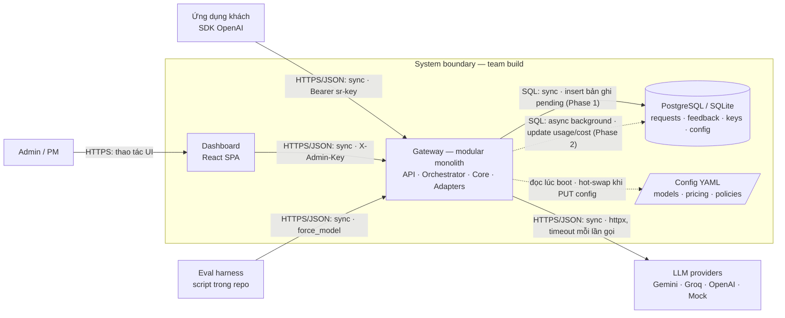
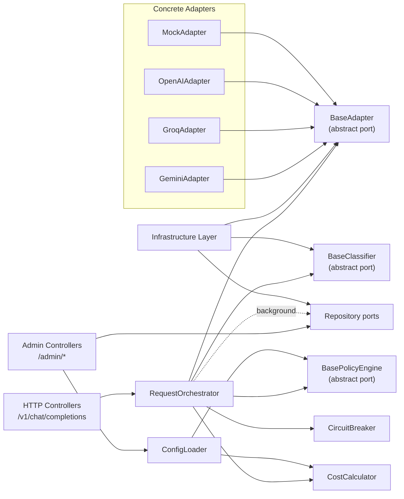
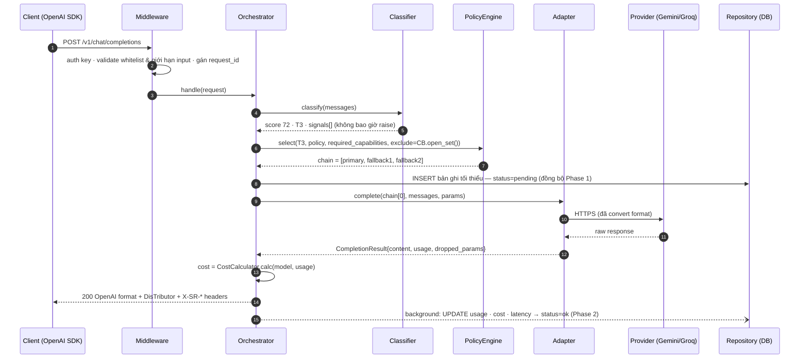
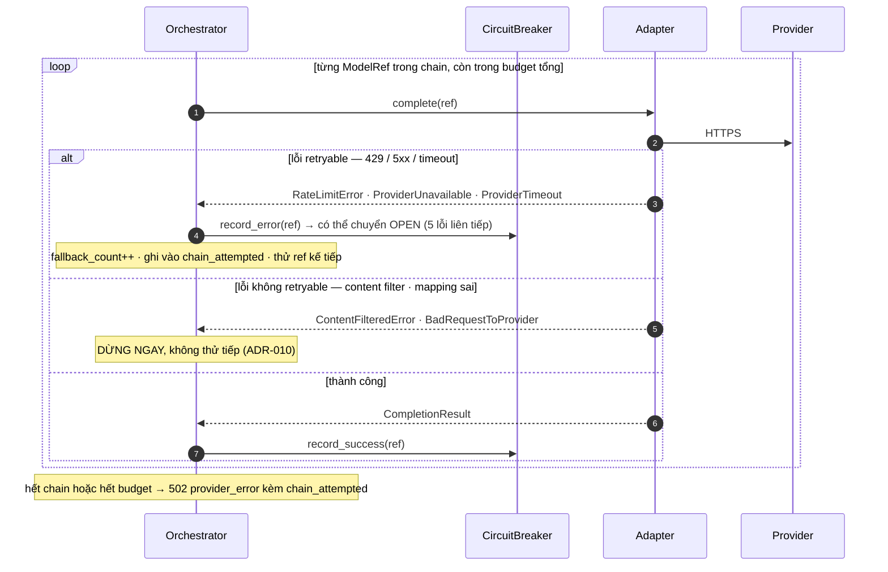
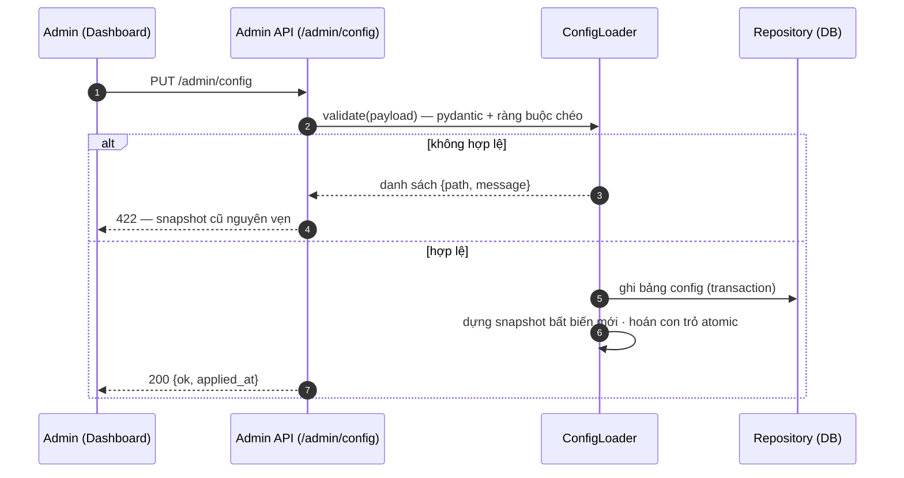
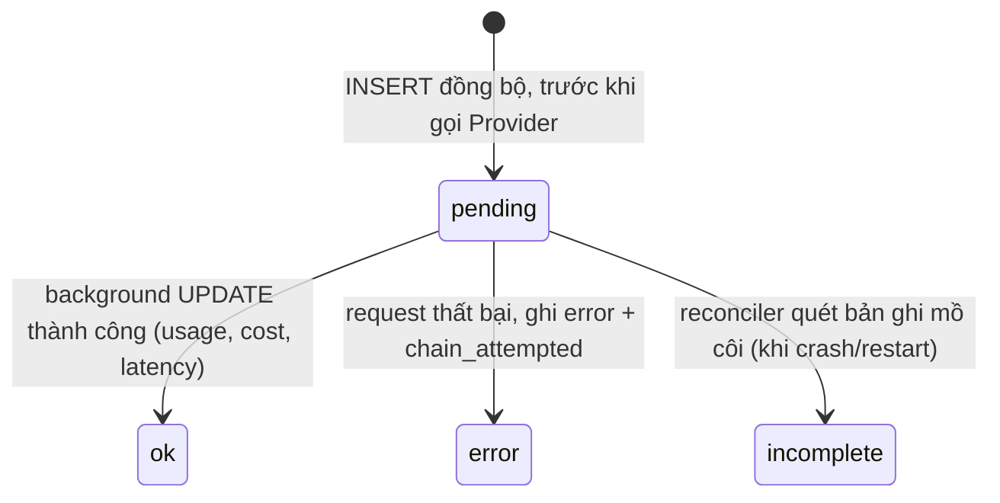
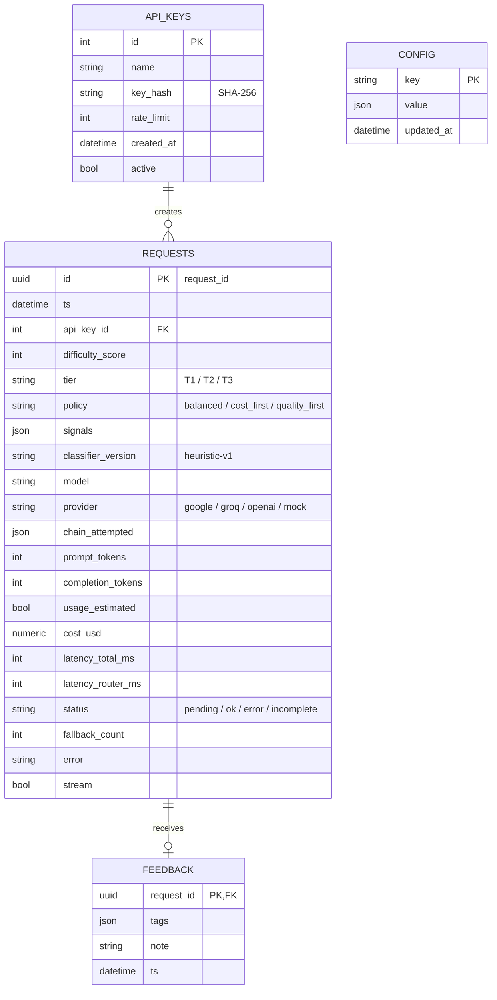
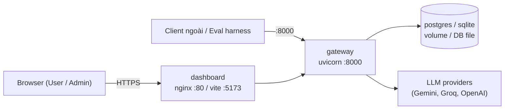

# DisTributor Gateway — Architecture Diagrams

> Nguồn kiến trúc chuẩn: [`docs/design/06_architecture.md`](design/06_architecture.md)  
> Tài liệu này tổng hợp toàn bộ các sơ đồ kiến trúc (System Boundary, Module View, Runtime Flows, State Machine, ERD, Deployment) và luồng dữ liệu của hệ thống **DisTributor Gateway**.

---

## 1. System Boundary & Interactions (Sơ đồ Biên Hệ thống)

Hệ thống đóng vai trò reverse-proxy thông minh đặt giữa ứng dụng client và các nhà cung cấp LLM:

---

## 2. Modular Monolith Architecture (Module View & Dependency Boundary)

Thiết kế theo mô hình **Modular Monolith** với nguyên tắc **Dependency Inversion**: Tầng HTTP Controller và Infrastructure phụ thuộc vào abstract ports của Domain Core, không có chiều ngược lại.

---

## 3. Runtime Flow A: Định tuyến một Request (Happy Path)

Quy trình xử lý tuần tự từ khi Client gửi request đến khi nhận câu trả lời và cập nhật log 2 pha (ADR-008):

---

## 4. Runtime Flow B: Fallback & Circuit Breaker (Xử lý Lỗi & Dự phòng)

Orchestrator là **owner duy nhất** của retry/fallback. Adapter không tự retry.

---

## 5. Runtime Flow C: Cập nhật Cấu hình Nóng (Hot-swap Config)

Đổi config từ Admin Dashboard mà không cần khởi động lại server:

---

## 6. Vòng đời Bản ghi Log (2-Phase Logging Lifecycle)

---

## 7. Database Entity Relationship Diagram (ERD)

---

## 8. Deployment Architecture

---

## 9. Bảng Trách nhiệm các Thành phần (Component Responsibilities)

| Thành phần | Trách nhiệm chính | **Không** chịu trách nhiệm |
|---|---|---|
| **Dashboard** | Render playground chat, biểu đồ stats, logs audit, config editor | Không tính toán business logic; không gọi trực tiếp LLM provider |
| **API Layer** | Xác thực key, validate input whitelist & limits (16k tokens, 50 msgs), đóng gói response chuẩn OpenAI | Không chứa logic chọn model; không xử lý taxonomy lỗi riêng của provider |
| **Orchestrator** | Điều phối toàn bộ luồng: classify $\rightarrow$ select $\rightarrow$ execute chain $\rightarrow$ cost $\rightarrow$ log; **owner duy nhất của retry/fallback** | Không biết schema riêng của từng provider; không ghi DB đồng bộ ngoài bản ghi `pending` |
| **Core Domain** | Chấm độ khó (Classifier), chọn chain theo policy (PolicyEngine), tính giá (CostCalculator), đếm lỗi provider (CircuitBreaker) | Không import FastAPI/SQLAlchemy; không I/O; không truy cập DB trực tiếp |
| **Adapters** | Chuyển đổi format 2 chiều giữa Gateway và API riêng của từng Provider, map taxonomy lỗi | **Không tự retry**; không chứa quy tắc chọn tier/policy; không quyết định outcome |
| **Repository** | Thao tác CRUD và SQL Aggregation cho `/admin/stats` | Không chứa business rule; không tự vá dữ liệu thiếu |
| **ConfigLoader** | Đọc DB override $\rightarrow$ fallback YAML, validate fail-fast, hoán con trỏ snapshot atomic | Không cho phép trạng thái nửa vời (sai 1 cấu hình là giữ nguyên snapshot cũ) |
