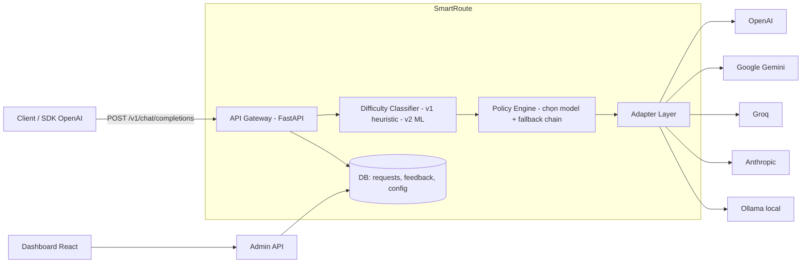
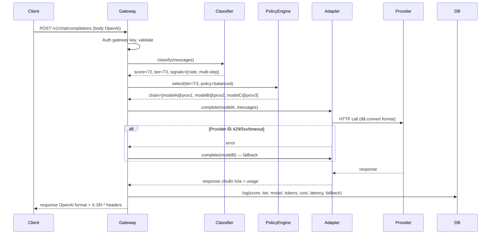

# PRD — SmartRoute Gateway
**AI Agent Gateway định tuyến đa nhà cung cấp theo độ khó request để tối ưu chi phí & chất lượng**

| | |
|---|---|
| Phiên bản | v1.1 — Gate 1 (cập nhật theo review mentor) |
| Ngày | 05/08/2026 |
| Tài liệu liên quan | `01_brief.md`, `03_wireframe_ui_flow.html`, `05_interfaces.md`, `06_architecture.md` |

> **Phân quyền source of truth giữa các tài liệu:**
> - **PRD này** sở hữu **requirement**: FR/NFR, acceptance criteria, eval plan, milestones.
> - **`06_architecture.md`** sở hữu **technical decision**: boundary, failure ownership, ADR, trade-off.
> - **`v1_f1.yaml`** (OpenAPI) sở hữu **HTTP schema** của Feature F1.
> - **`05_interfaces.md`** sở hữu contract lớp B (BE↔AI), C (Dev↔DevOps), D (config) và các bề mặt HTTP **chưa** có OpenAPI (admin, feedback, keys).
>
> Nội dung API/kiến trúc xuất hiện trong PRD chỉ là **tóm tắt để đọc nhanh** — khi lệch nhau, tài liệu sở hữu thắng.
>
> **Quy ước tên (tránh trộn feature / milestone / AC):** **Feature F1–F4** = vertical slice, định nghĩa ở `06_architecture.md` §2 (F1 = định tuyến có giải trình, không chỉ riêng classifier) · **Milestone M1–M3** = mốc thời gian (§10) · **AC-1…AC-6** = nhóm acceptance criteria (§3.2). AC-x **không** phải Feature Fx.

---

## 1. Tổng quan

### 1.1 Bối cảnh & giả thuyết nền tảng
Các ứng dụng LLM hiện trả cùng một mức giá (model cao cấp) cho mọi request, và khóa cứng vào một provider tạo rủi ro vận hành (rate limit, downtime, đổi giá). Đề tài dựa trên 3 giả thuyết — **được đánh dấu rõ trạng thái kiểm chứng** và có kế hoạch xác minh, kết quả bắt buộc đưa vào report cuối:

| ID | Giả thuyết | Trạng thái | Bằng chứng hiện có | Kế hoạch kiểm chứng |
|---|---|---|---|---|
| **H1** | 60–70% request thực tế của một ứng dụng chat/assistant là tác vụ dễ/trung bình | ⚠️ Chưa kiểm chứng | Chưa có — quan sát định tính | M1: thu thập ≥200 request thật (từ app của thành viên/bạn bè dev, ẩn danh hóa), gán nhãn tier thủ công → công bố phân bố thực trong report; phỏng vấn 3–5 developer đang tích hợp LLM |
| **H2** | Giá model rẻ vs cao cấp chênh **20–100 lần** | ✅ Bằng chứng sơ bộ | Khảo sát các bảng tổng hợp giá 08/2026 (CloudZero, BenchLM, Morph — dẫn từ trang giá chính thức): model rẻ ~$0.10–0.14/1M input (GPT-4.1 Nano $0.10/$0.40; DeepSeek V4 Flash $0.14/$0.28) vs frontier ~$5/1M input, $25–30/1M output (Claude Opus 4.8 $5/$25; GPT-5.5 $5/$30) → chênh ~36–100× tùy cặp; toàn dải thị trường còn rộng hơn | Trước mỗi lần benchmark: **snapshot bảng giá chính thức** của đúng các model hệ thống dùng, lưu `evals/pricing_snapshot_YYYYMM.md`; mọi con số cost trong report chỉ tính từ snapshot này |
| **H3** | Overhead định tuyến <300ms là chấp nhận được với người dùng cuối | ⚠️ Chưa kiểm chứng | Suy luận: tổng latency LLM thường 1–5s | Đo p95 thực ở M1; hỏi 3–5 dev về ngưỡng chấp nhận |

### 1.2 Tuyên bố sản phẩm
SmartRoute Gateway là một reverse-proxy thông minh, tương thích **tập con text-only của API OpenAI** (§1.5), tự động **chấm điểm độ khó** của từng request và **định tuyến** đến model/provider phù hợp theo policy do người dùng chọn, với **fallback đa nhà cung cấp** và **quan sát chi phí** đầy đủ.

### 1.3 Mục tiêu (Goals)
- G1: Giảm ≥40% chi phí so với baseline all-premium trên bộ eval hỗn hợp.
- G2: Quality Retention ≥ 0.95 theo công thức §9.3 (kèm guard riêng cho hard task).
- G3: Overhead định tuyến p95 < 300ms với heuristic router.
- G4: Tích hợp không cần sửa code client (chỉ đổi `base_url` + API key, trong phạm vi subset §1.5).
- G5: MVP chạy ổn với **2 provider thật + 1 mock**; mở rộng ≥3 provider thật sau khi vertical slice ổn định; tỉ lệ request thành công ≥99% nhờ fallback.

### 1.4 Non-goals (ngoài phạm vi)
- Fine-tune model nền tảng; billing/thanh toán thật; multi-tenant, SSO, RBAC enterprise; SLA production.
- **Ngoài MVP** (roadmap sau khi slice ổn): tool/function calling, `response_format` có cấu trúc, đầu vào đa phương thức (ảnh/audio), `n>1`, `logprobs`.

### 1.5 Đặc tả Input & phạm vi tương thích (MVP)
Tuyên bố phạm vi: hệ thống là **"text-only OpenAI-compatible subset"** — không cam kết toàn bộ bề mặt API OpenAI. Chi tiết contract từng trường: `05_interfaces.md` §A.1; ma trận theo provider: §A.1b.

**Hỗ trợ trong MVP:**

| Nhóm | MVP | Ghi chú |
|---|---|---|
| Kiểu nội dung | Chỉ text (`content` là string) | Content dạng mảng (ảnh/audio/file parts) → 400 `unsupported_parameter` |
| System prompt | ✔ | Adapter tự map theo format từng provider (vd Anthropic dùng trường `system` riêng) |
| Tham số sampling | `temperature`, `max_tokens`, `top_p`, `stop` | Provider đích không hỗ trợ tham số nào → adapter **drop** + header `X-SR-Dropped-Params` + log |
| Streaming SSE | ✔ (từ mốc M3) | Trước M3: `stream=true` → 400 `unsupported_parameter` |
| tools / tool_choice, `response_format`, `n>1`, `logprobs`, `seed` | ✗ | 400 `unsupported_parameter`, message nêu đúng tên trường |

**Giới hạn input** (env override — 05 §C.1):

| Giới hạn | Mặc định | Vượt → |
|---|---|---|
| Số messages | 50 | 400 `too_many_messages` |
| Tổng input tokens | 8.000 | 400 `context_too_long` |
| Kích thước body | 1 MB | 413 |
| `max_tokens` output | clamp ≤ 8.192 | tự hạ + header cảnh báo |

**Nguyên tắc xử lý không tương thích (3 tầng):**
1. Tham số/capability **ngoài whitelist MVP** → gateway từ chối sớm 400, nêu tên trường — dự đoán được, không im lặng nuốt.
2. Tham số **trong whitelist nhưng provider đích không hỗ trợ** → adapter drop + báo qua header/log (không fail request).
3. **Capability bắt buộc** của request (vd `stream`) → PolicyEngine chỉ đưa vào chain những model có capability đó (khai báo `model_capabilities` — 05 §B.4); tier hết model phù hợp → dùng tier cao hơn; toàn hệ thống không có → 400 `unsupported_capability`.

---

## 2. Persona, Pain points & User Stories

### 2.1 Persona
| Persona | Mô tả | Nhu cầu chính |
|---|---|---|
| **Dev (Duy)** | Backend dev tích hợp LLM vào app | Đổi 1 dòng config là chạy; ổn định; debug được routing |
| **Admin/PM (Lan)** | Quản lý chi phí & chất lượng dịch vụ AI | Nhìn thấy tiền tiết kiệm; chỉnh policy; kiểm soát model theo tier |
| **End-user (gián tiếp)** | Người dùng cuối của app | Trả lời nhanh với câu dễ, chính xác với câu khó |

### 2.2 Pain points & bối cảnh hiện tại

**Developer (Duy):**
- *Quy trình hiện tại:* gọi thẳng SDK của một provider, tên model ghi cứng trong code/env. Muốn tối ưu chi phí phải tự viết if-else chọn model theo loại request — hầu như không ai làm vì thiếu thời gian và không có dữ liệu về độ khó.
- *Công cụ đang dùng:* SDK chính chủ, hoặc thư viện gọi đa provider (kiểu LiteLLM) — nhưng các công cụ này chỉ **chuẩn hóa cách gọi**, vẫn bắt dev **tự quyết** model nào cho request nào và tự viết retry/fallback.
- *Chi phí chuyển provider:* mỗi provider khác schema request/response, khác taxonomy lỗi, khác cơ chế stream → đổi provider = sửa code + regression test toàn bộ. Đây chính là lý do tồn tại của adapter layer + API tương thích OpenAI.
- *Pain trực tiếp:* hóa đơn tăng không rõ do nhóm request nào; lỗi 429 làm rơi request lúc cao điểm; không có log mức "request này tốn bao nhiêu, vì sao chọn model đó".

**Admin/PM (Lan):**
- *Quy trình hiện tại:* biết chi phí qua hóa đơn cuối tháng của provider — không có breakdown theo loại request, không can thiệp được giữa chu kỳ.
- *Pain trực tiếp:* không có công cụ **ép** chính sách chi phí (chỉ dừng ở "nhắc dev dùng model rẻ"); không chứng minh được trade-off chi phí/chất lượng với cấp trên bằng số liệu.
- **Trách nhiệm khi routing sai (định nghĩa rõ):** Admin sở hữu cấu hình (ngưỡng tier, mapping, policy) → chịu trách nhiệm về trade-off đã chọn; **hệ thống** chịu trách nhiệm cung cấp bằng chứng truy vết (score, signals, chain_attempted) cho mọi quyết định để audit được; **Dev** chịu trách nhiệm dùng override cho request đặc biệt đã biết trước. Quy trình khi có sự cố chất lượng: xem log signals → chỉnh ngưỡng/mapping → (M3) bật escalation tự động.

**End-user (gián tiếp):**
- *Hưởng lợi:* câu dễ được trả lời nhanh hơn (model nhỏ có latency thấp hơn); dịch vụ ít gián đoạn hơn nhờ fallback đa provider.
- *Chịu rủi ro:* nếu route sai xuống tier thấp, câu trả lời cho tác vụ khó có thể sai hoặc nông — đây là rủi ro R1 và là lý do tồn tại của ngưỡng bảo thủ + guard chất lượng riêng cho hard task (§9.3).

### 2.3 User Stories (US)
| ID | User story | Ưu tiên |
|---|---|---|
| US-01 | Là dev, tôi muốn trỏ SDK OpenAI sang gateway (đổi `base_url`) mà không sửa code nghiệp vụ | Must |
| US-02 | Là dev, tôi muốn mỗi response kèm metadata routing (tier, model, cost, latency) để debug | Must |
| US-03 | Là admin, tôi muốn cấu hình model chính + danh sách fallback cho từng tier | Must |
| US-04 | Là admin, tôi muốn chọn policy tổng (cost-first / balanced / quality-first) | Must |
| US-05 | Là dev, tôi muốn hệ thống tự fallback sang provider khác khi lỗi 429/5xx/timeout | Must |
| US-06 | Là admin, tôi muốn dashboard hiển thị chi phí, savings %, phân bố tier/provider | Must |
| US-07 | Là admin, tôi muốn xem log từng request kèm **lý do routing** (điểm số, tín hiệu) | Must |
| US-08 | Là dev, tôi muốn hỗ trợ streaming (SSE) như OpenAI | Should |
| US-09 | Là admin, tôi muốn gửi feedback chất lượng để hệ thống điều chỉnh routing | Could |
| US-10 | Là dev, tôi muốn force model/tier cho request đặc biệt (override) | Should |
| US-11 | Là admin, tôi muốn quản lý API key của gateway và giới hạn rate theo key | Could |
| US-12 | Là giảng viên/reviewer, tôi muốn xem báo cáo eval chứng minh cost↓ & quality giữ | Must |

---

## 3. Yêu cầu chức năng

### 3.1 Danh sách FR
| ID | Yêu cầu | Mô tả ngắn | MoSCoW |
|---|---|---|---|
| FR-01 | OpenAI-compatible endpoint (subset) | `POST /v1/chat/completions`, `GET /v1/models`; **tập con text-only theo §1.5**; param ngoài whitelist → 400 | Must |
| FR-02 | Heuristic difficulty classifier (v1) | Chấm điểm 0–100 từ tín hiệu prompt → tier T1/T2/T3 | Must |
| FR-03 | Provider adapters | **MVP: 2 adapter thật (Gemini, Groq) + MockAdapter**; mở rộng OpenAI/Anthropic/Ollama sau khi slice ổn — tất cả qua interface chung | Must |
| FR-04 | Model mapping theo tier | Config `models.yaml`: mỗi tier có primary + fallbacks | Must |
| FR-05 | Logging + tính cost | **Ghi 2 pha**: insert `pending` đồng bộ + update usage/cost/latency nền; giá từ `pricing.yaml` | Must |
| FR-06 | Routing metadata trả về | Header `X-SR-*` + trường `smartroute` trong response JSON | Must |
| FR-07 | Playground UI | Trang test: nhập prompt → thấy response + badge routing | Should |
| FR-08 | Override routing | Body extension `smartroute.force_model` / `force_tier` | Should |
| FR-09 | Fallback chain + retry | Lỗi 429/5xx/timeout → thử model kế tiếp trong chain; ghi `fallback_count`; **content-filter KHÔNG fallback** (ADR-010) | Must |
| FR-10 | Circuit breaker | Provider lỗi liên tiếp N lần → tạm loại khỏi routing trong X phút | Should |
| FR-11 | Policy engine | 3 policy dịch thành cách chọn model trong tier + điều chỉnh ngưỡng tier; **lọc model theo capability** | Must |
| FR-12 | Classifier v2 (ML/LLM) | LLM nhỏ hoặc embedding classifier; so sánh v1 vs v2 trên eval set — **chỉ làm khi M1–M2 ổn** | Could |
| FR-13 | Dashboard analytics | KPI cards, chart cost theo ngày, phân bố tier, provider share | Must |
| FR-14 | Config UI | Chỉnh ngưỡng tier, mapping model, policy từ dashboard (ghi xuống config/DB) | Should |
| FR-15 | Streaming SSE | Pass-through stream từ provider về client theo chuẩn OpenAI | Should |
| FR-16 | API key gateway + rate limit | CRUD key, giới hạn req/phút theo key | Could |
| FR-17 | Feedback + escalation | `POST /v1/feedback`; phát hiện trả lời kém → re-route tier cao hơn | Could |
| FR-18 | Eval harness | **Mini-eval 50 prompt chạy từ M1**; full 200 + report ở M2; 4 chế độ (all-cheap, all-premium, random, smartroute) | Must |
| FR-19 | Semantic cache | Cache theo embedding prompt tương tự (stretch) | Could |

### 3.2 Acceptance Criteria cấp feature
Nhóm AC đánh số **AC-1…AC-6** (đổi từ F1–F6 để không đụng độ với Feature F1–F4 trong `06_architecture.md`). AC là điều kiện nghiệm thu **đo được** cho từng feature, cover cả happy path lẫn các nhánh biên mentor yêu cầu (provider timeout, capability không hỗ trợ, usage sai, hết fallback chain, config không hợp lệ). Test tự động hóa tối đa bằng MockAdapter (ép lỗi qua `#force_429` / `#force_500` / `#force_timeout` / `#force_bad_usage`).

**AC-1 — Difficulty Classifier** (FR-02, FR-12)
| # | Kịch bản | Đạt khi |
|---|---|---|
| AC-1.1 | Bộ 30 prompt gán nhãn chuẩn (10/tier, song ngữ) | v1 đúng ≥80% (24/30) **và** không có prompt nhãn hard nào bị gán T1 |
| AC-1.2 | Hiệu năng | p95 classify < 100ms (heuristic, đo offline) |
| AC-1.3 | Đầu vào bất thường (rỗng, 1 ký tự, toàn emoji, 15k tokens) hoặc lỗi nội bộ | Không exception; trả T2 + signal `classifier_error`; request vẫn hoàn tất (ADR-009) |

**AC-2 — Routing & Policy** (FR-04, FR-08, FR-11)
| # | Kịch bản | Đạt khi |
|---|---|---|
| AC-2.1 | Cùng 1 prompt T2, đổi policy | `cost_first` → model rẻ nhất tier; `quality_first` → `quality_rank` cao nhất (config test cố định) |
| AC-2.2 | Override | `force_model` hợp lệ → dùng đúng model, bỏ qua classifier; không tồn tại → 400 `unknown_model` |
| AC-2.3 | Capability không hỗ trợ | `stream=true` → chain chỉ chứa model có capability `stream`; tier rỗng sau lọc → dùng chain tier cao hơn; toàn hệ rỗng → 400 `unsupported_capability` |

**AC-3 — Fallback & Circuit** (FR-09, FR-10)
| # | Kịch bản | Đạt khi |
|---|---|---|
| AC-3.1 | Mock ép 429 ở primary | Trả lời từ fallback #1; `fallback_count=1`; `chain_attempted` đủ 2 mục |
| AC-3.2 | Provider treo > `REQUEST_TIMEOUT_S` | Tự chuyển model kế tiếp; request không chết theo provider |
| AC-3.3 | Hết chain | 502 `provider_error` kèm `chain_attempted`; log `status=error` |
| AC-3.4 | 5 lỗi retryable liên tiếp | Circuit OPEN: model rời mọi chain, `/v1/models` `enabled=false`, hiển thị ở `/healthz`; hết `CB_OPEN_SECONDS` → HALF_OPEN thử đúng 1 request |
| AC-3.5 | Provider trả content-filter | 400 ngay lập tức, **không** fallback (ADR-010); log ghi rõ |

**AC-4 — Cost & Usage Logging** (FR-05, FR-06)
| # | Kịch bản | Đạt khi |
|---|---|---|
| AC-4.1 | 5 case đối chiếu tính tay | `cost = in×giá_in + out×giá_out` từ `pricing.yaml`, sai số 0 |
| AC-4.2 | Provider trả usage thiếu/sai (mock giả lập) | Adapter tự ước lượng token, log `usage_estimated=true` — không crash, không cost=0 âm thầm |
| AC-4.3 | Gọi `GET /v1/usage/{id}` ngay sau response | 200 với `status=pending\|complete`; **không bao giờ 404** với id đã cấp (ghi 2 pha); mọi request kể cả lỗi đều có bản ghi |

**AC-5 — API Compatibility** (FR-01, §1.5)
| # | Kịch bản | Đạt khi |
|---|---|---|
| AC-5.1 | SDK OpenAI Python chính thức, chỉ đổi `base_url` + key | Completion thường chạy đúng |
| AC-5.2 | Gửi `tools` / `response_format` / content dạng mảng ảnh | 400 `unsupported_parameter`, message nêu đúng tên trường |
| AC-5.3 | 51 messages / 17k input tokens / body 1.5MB | Lần lượt 400 `too_many_messages`, 400 `context_too_long`, 413 |
| AC-5.4 | Body sai schema | 422 kèm đường dẫn trường lỗi |

**AC-6 — Dashboard & Config** (FR-13, FR-14)
| # | Kịch bản | Đạt khi |
|---|---|---|
| AC-6.1 | Seed 1.000 bản ghi | Savings % trên UI khớp công thức A.6 tính tay từ DB |
| AC-6.2 | PUT config hợp lệ / không hợp lệ | Hợp lệ → request kế tiếp dùng ngưỡng mới không restart; không hợp lệ → 422, hành vi cũ nguyên vẹn (snapshot) |
| AC-6.3 | `/admin/stats` với 10k bản ghi | Trả về < 2s |

---

## 4. Yêu cầu phi chức năng (NFR)

| ID | Yêu cầu | Mục tiêu |
|---|---|---|
| NFR-01 | Hiệu năng | Overhead router p95 < 300ms (heuristic); < 1s nếu dùng LLM classifier (có cache) |
| NFR-02 | Độ tin cậy | ≥99% request thành công nhờ fallback (**cách đo — denominator, loại lỗi được tính: §9.4**); graceful degradation khi mọi provider lỗi (trả lỗi chuẩn OpenAI format) |
| NFR-03 | Bảo mật | Provider API key chỉ nằm trong env/secret; không log key; tùy chọn redact nội dung prompt trong log; gateway key hash trong DB |
| NFR-04 | Khả năng mở rộng | Adapter theo plugin pattern — thêm provider mới ≤ 1 file + 1 mục config |
| NFR-05 | Quan sát được | Mọi quyết định routing giải thích được (điểm + tín hiệu kích hoạt lưu trong log) |
| NFR-06 | Chất lượng code | Unit test ≥70% cho `core/` (classifier, policy, cost); CI lint + test |
| NFR-07 | Triển khai | `docker compose up` chạy được toàn bộ (gateway + db + dashboard) |

---

## 5. Kiến trúc hệ thống

> **Tài liệu kiến trúc chính thức và đầy đủ (C4 ba cấp, runtime views, circuit breaker, deployment, ADR):** xem `docs/06_architecture.md`. Mục này chỉ giữ sơ đồ tổng thể và luồng chính để đọc nhanh trong ngữ cảnh PRD.

### 5.1 Sơ đồ tổng thể


### 5.2 Luồng xử lý một request


### 5.3 Thành phần
| Thành phần | Trách nhiệm | Công nghệ |
|---|---|---|
| API Gateway | Nhận request chuẩn OpenAI, auth, orchestrate, trả response/stream | FastAPI + Uvicorn |
| Classifier | Chấm điểm độ khó → tier; giải thích tín hiệu | Python thuần (v1) → sentence-transformers hoặc LLM nhỏ (v2) |
| Policy Engine | Dịch (tier, policy) → chuỗi model ưu tiên; lọc capability; circuit breaker | Python + config YAML |
| Adapter Layer | Chuẩn hóa call/response/stream/usage cho từng provider | httpx async; 1 class/provider kế thừa `BaseAdapter` |
| Storage | Log request, feedback, config, api keys | PostgreSQL (Docker Compose dev, Supabase prod) qua SQLAlchemy |
| Dashboard | Playground, analytics, config, logs, keys | React + Vite + Recharts |
| Eval harness | Chạy benchmark 4 chế độ, sinh report | Python script + JSONL dataset |

---

## 6. Thiết kế Router (lõi của đề tài)

### 6.1 Tier độ khó
| Tier | Tên | Đặc trưng | Model ví dụ (chốt lại ở M1 theo bảng giá thời điểm đó) |
|---|---|---|---|
| **T1** | Easy | Chào hỏi, QA đơn giản, dịch câu ngắn, format lại text | Gemini Flash-Lite, GPT-5-nano/mini, Claude Haiku, Llama-3.3-70B (Groq), model local |
| **T2** | Medium | Tóm tắt, viết email/bài ngắn, dịch dài, QA có ngữ cảnh | Gemini Flash, GPT-5-mini, Claude Sonnet (tùy policy) |
| **T3** | Hard | Code/debug, toán, suy luận đa bước, phân tích dài, agentic | GPT-5.x, Claude Sonnet/Opus, Gemini Pro |

### 6.2 Classifier v1 — Heuristic scoring
Điểm 0–100, cộng dồn theo tín hiệu; mọi tín hiệu kích hoạt được lưu vào log để giải thích quyết định.

| Tín hiệu | Cách phát hiện | Điểm |
|---|---|---|
| Độ dài prompt | tokens: <50 → +0; 50–300 → +10; >300 → +18 | 0–18 |
| Có code | regex ```` ``` ````, `def |class |import |SELECT |function`, từ khóa "debug/refactor/fix bug/viết hàm" | +22 |
| Toán/logic | ký hiệu toán, "chứng minh/giải/solve/tính", chuỗi số + phép tính | +20 |
| Suy luận đa bước | "phân tích/so sánh/đánh giá/lập kế hoạch/step by step/vì sao", ≥2 câu hỏi trong 1 prompt | +15 |
| Ràng buộc output phức tạp | yêu cầu JSON schema, bảng, độ dài chính xác, nhiều điều kiện | +10 |
| Ngữ cảnh dài đính kèm | context/tài liệu > 2.000 tokens | +10 |
| Sáng tạo dài | "viết bài/essay/truyện" + yêu cầu > 500 từ | +10 |
| Fast-path Easy | greeting/câu ≤ 8 từ không chứa tín hiệu nào ở trên | ép T1, bỏ qua chấm điểm |

**Ánh xạ tier (mặc định, chỉnh được trong config/UI):** `score < 30 → T1`, `30–59 → T2`, `≥ 60 → T3`.
Ngưỡng khởi điểm đặt **bảo thủ** (nghiêng về tier cao hơn khi phân vân) để bảo vệ chất lượng; nới dần theo dữ liệu eval.

Hỗ trợ song ngữ Việt–Anh cho từ khóa ngay từ v1. **Khi classifier lỗi nội bộ → mặc định T2** (phân tích phương án tại ADR-009 trong `06_architecture.md`); tỉ lệ `classifier_error` được phơi ở `/healthz` — vượt 5% trong 5 phút → trạng thái degraded.

> **v1.5 — cải tiến heuristic (thiết kế tại `09_classifier_v1_5.md`).** Bảng trên mô tả bản **đang chạy**; nó có hai điểm yếu đo được trong domain coding: (a) `length` bơm điểm theo *độ dài lời kể* nên cùng một task hello-world nhảy T1→T2 chỉ vì user viết dài hơn; (b) `code +22` là nhị phân nên không phân giải được "sửa hello world" với "implement Raft consensus" — và fast-path `≤8 từ` còn đẩy nhầm các task khó ngắn gọn xuống T1. `09_classifier_v1_5.md` sở hữu thiết kế thay thế: phân vùng instruction/artifact, thang hạng coding **C1/C2/C3** (6 driver khó + 5 marker dễ, mỗi driver có guard), bỏ `length` khỏi nhánh coding. **Vẫn thuần CPU, không LLM call — không phải FR-12.** Bảng §6.2 này giữ vai trò source of truth cho trọng số cho tới khi v1.5 land, khi đó thay bằng bảng §7 của tài liệu đó.

### 6.3 Classifier v2 — ML/LLM
Hai phương án, triển khai ít nhất một (nếu M1–M2 ổn định — FR-12) và **so sánh với v1** trên eval set:
1. **LLM-as-classifier:** gọi model siêu rẻ (Flash-Lite/nano class) với prompt cố định trả về JSON `{score, reason}`; cache kết quả theo hash prompt; ~vài chục token/lần.
2. **Embedding classifier:** sentence-transformers (đa ngôn ngữ, chạy local) → logistic regression/SVM huấn luyện trên ~500–1000 prompt gán nhãn (tự gán + lấy mẫu từ benchmark: chitchat/Alpaca = easy, tóm tắt = medium, GSM8K/HumanEval = hard).

**Kiến trúc hybrid cuối:** fast-path heuristic cho case hiển nhiên → classifier v2 cho phần còn lại → fallback về heuristic nếu classifier lỗi/timeout.

> **Thiết kế chi tiết tại `12_classifier_v2.md`.** Tài liệu đó chọn phương án 1 (LLM-as-classifier) và **thu hẹp** mô tả ở trên ở ba chỗ: (a) v2 trả về **hạng C1/C2/C3** chứ không phải `score` tự do — để không đi vòng qua hàng rào *"band quyết định tier, modifier không bao giờ đổi tier"* của `09_classifier_v1_5.md` §6.1; (b) "phần còn lại" **không phải** mọi request ngoài fast-path, mà là vùng v1.5 **tự nó không có bằng chứng chắc** — định nghĩa theo trạng thái bằng chứng của `_determine_band`, không theo khoảng cách score tới ngưỡng; (c) deliverable của FR-12 là **batch offline + toggle opt-in trên Playground**, không phải bật inline mặc định — vì một round-trip LLM lớn hơn budget classify của ADR-009, nên inline chỉ an toàn nếu tần suất kích hoạt < 5%, và tần suất đó **chưa được đo**. Phương án 2 (embedding) chưa làm; điều kiện mở lại ghi ở §4.1 của tài liệu đó. Tài liệu đó tự áp ràng buộc **không dùng eval** (§0) — mọi câu hỏi cần số đo gom ở §12 của nó.

### 6.4 Policy Engine
```yaml
# config/policies.yaml (ví dụ)
policies:
  cost_first:      # ưu tiên model rẻ nhất trong tier; hạ ngưỡng tier -10
    tier_shift: -10
    order_by: cost_asc
  balanced:        # mặc định
    tier_shift: 0
    order_by: quality_then_cost
  quality_first:   # nâng ngưỡng tier +10; ưu tiên model mạnh nhất
    tier_shift: +10
    order_by: quality_desc
```
```yaml
# config/models.yaml (ví dụ — cập nhật model/giá thực tế ở M1)
tiers:
  T1: { primary: gemini-flash-lite, fallbacks: [llama-70b-groq, mock-cheap] }
  T2: { primary: gemini-flash, fallbacks: [llama-70b-groq, mock-mid] }
  T3: { primary: llama-70b-groq, fallbacks: [gemini-pro, mock-premium] }
```
- **Fallback trigger:** HTTP 429, 5xx, timeout (mặc định 60s non-stream). **Lỗi content-filter của provider KHÔNG kích hoạt fallback** — trả 400 cho client (lý do & phương án đã cân nhắc: ADR-010).
- **Lọc capability:** trước khi chốt chain, loại model không đủ capability request yêu cầu (§1.5 nguyên tắc 3).
- **Circuit breaker:** 5 lỗi liên tiếp/provider → mở mạch 5 phút (skip provider đó), half-open thử lại 1 request.

### 6.5 Escalation & feedback loop
- Phát hiện trả lời kém từ model rẻ: refusal pattern, độ dài bất thường thấp, user gửi lại prompt gần giống trong 2 phút → tự động re-route lên tier cao hơn (tối đa 1 lần/chuỗi).
- `POST /v1/feedback` (tags + note theo `request_id`) → dữ liệu để tinh chỉnh ngưỡng và huấn luyện lại classifier v2. Tags là mảng nhãn chọn sẵn: `Định tuyến sai`, `Chất lượng kém`, `Chậm`, `Giao diện`, `Khác`.

---

## 7. Đặc tả API

> **Contract chính thức, đầy đủ từng trường (request/response, error envelope, SSE, abstract class BE↔AI, env vars DevOps):** xem `docs/05_interfaces.md`. Whitelist tham số MVP & ma trận tương thích theo provider: 05 §A.1–A.1b. Mục này chỉ tóm tắt định hướng.

### 7.1 `POST /v1/chat/completions` (OpenAI-compatible subset)
- Body: tập con chuẩn OpenAI theo §1.5 (`model`, `messages`, `temperature`, `max_tokens`, `top_p`, `stop`, `stream`). Trường `model` của client được coi là *gợi ý*; gateway quyết định model thật trừ khi override.
- Extension (tùy chọn):
```json
{
  "smartroute": { "policy": "cost_first", "force_model": null, "force_tier": null }
}
```
- Response: chuẩn OpenAI + bổ sung:
```json
"smartroute": {
  "difficulty_score": 72, "tier": "T3", "signals": ["code", "multi_step"],
  "model_used": "claude-sonnet", "provider": "anthropic",
  "cost_usd": 0.00342, "router_latency_ms": 41, "fallback_count": 0
}
```
- Headers: `X-SR-Tier`, `X-SR-Model`, `X-SR-Cost`, `X-SR-Score`.

### 7.2 Endpoint khác
| Endpoint | Mô tả |
|---|---|
| `GET /v1/models` | Danh sách model khả dụng qua gateway (kèm capabilities) |
| `GET /v1/usage/{request_id}` | Metadata routing/cost của request đã gửi (status pending\|complete) |
| `POST /v1/feedback` | Ghi nhận tags + note theo request_id |
| `GET /admin/stats?from&to` | KPI tổng hợp cho dashboard |
| `GET /admin/requests?filter` | Log request phân trang |
| `GET/PUT /admin/config` | Đọc/ghi ngưỡng tier, mapping, policy |
| `POST /admin/keys` | Tạo/thu hồi gateway API key |
| `GET /healthz` | Health check gateway + trạng thái circuit các provider |

---

## 8. Mô hình dữ liệu

```mermaid
erDiagram
    API_KEYS ||--o{ REQUESTS : creates
    REQUESTS ||--o| FEEDBACK : receives
    API_KEYS { int id PK; string name; string key_hash; int rate_limit; datetime created_at; bool active }
    REQUESTS {
        uuid id PK; datetime ts; int api_key_id FK
        int difficulty_score; string tier; string policy
        json signals; string model; string provider
        int prompt_tokens; int completion_tokens
        numeric cost_usd; int latency_total_ms; int latency_router_ms
        string status; int fallback_count; string error; bool stream
    }
    FEEDBACK { uuid request_id FK; json tags; string note; datetime ts }
    CONFIG { string key PK; json value; datetime updated_at }
```
- `status ∈ pending | ok | error`. **Ghi 2 pha:** insert đồng bộ bản ghi tối thiểu (id, ts, key, score, tier, model, `status=pending`) *trước khi trả response*; usage/cost/latency được update ở background → `GET /v1/usage/{id}` không bao giờ 404 với id đã cấp (ADR-008).
- Nội dung prompt/response chỉ lưu khi bật cờ `LOG_CONTENT=true` (mặc định tắt hoặc redact) — phục vụ NFR-03.

---

## 9. Kế hoạch đánh giá (Evaluation Plan)

### 9.1 Dataset
~200 prompt song ngữ Việt–Anh, chia **2 nhóm chấm khác nhau**:
- **Nhóm A — có đáp án (~45%):** toán kiểu GSM8K, bài code nhỏ có test case, trích xuất thông tin có ground truth → chấm **tự động** (accuracy).
- **Nhóm B — mở (~55%):** chitchat, tóm tắt, viết email, dịch → chấm **LLM-as-judge** so cặp với baseline premium.

Mỗi prompt gán nhãn kỳ vọng easy/medium/hard (phân bố ~40/35/25) để đo routing accuracy. Lưu `evals/datasets/mixed_200.jsonl`. **Mini-eval 50 prompt** (subset cân bằng) chạy từ M1 để phát hiện lệch sớm.

### 9.2 Chế độ chạy & baseline
`all_cheap` · `all_premium` (baseline chất lượng & chi phí) · `random` · `smartroute` (v1; thêm v2 nếu làm ở M3). Response của `all_premium` chạy 1 lần rồi cache tái dùng để tiết kiệm chi phí eval.

### 9.3 Công thức Quality Retention (QR) — định nghĩa chặt
```
Nhóm A:  QR_A = acc_smartroute / acc_all_premium

Nhóm B:  mỗi prompt, judge chấm cặp (smartroute vs all_premium) 2 LẦN, ĐẢO VỊ TRÍ:
         thắng cả 2 lượt = 1 · thua cả 2 lượt = 0 · còn lại (hòa hoặc 2 lượt mâu thuẫn) = 0.5
         QR_B = Σ điểm / N_B

Tổng:    QR = w_A·QR_A + w_B·QR_B     (w_A, w_B = tỉ trọng nhóm trong dataset)

ĐẠT mục tiêu chất lượng khi thỏa ĐỒNG THỜI:
  (1) QR ≥ 0.95
  (2) QR_hard ≥ 0.90        — tính riêng trên prompt nhãn hard,
                              chặn "điểm trung bình che giấu routing sai nghiêm trọng"
  (3) critical_fail ≤ 5%    — tỉ lệ prompt nhóm A nhãn hard bị route xuống T1 VÀ trả lời sai
```
**Judge protocol:** một model cố định, **khác họ với mọi model trong chain định tuyến** (vd chain dùng Google/Groq/OpenAI → judge dùng Claude); `temperature=0`; rubric 3 tiêu chí (đúng yêu cầu · chính xác · đầy đủ) trả về JSON; prompt judge được commit trong `evals/` để tái lập. Chấm 2 lượt đảo vị trí để triệt tiêu position bias; mâu thuẫn giữa 2 lượt tính 0.5 (tie).

### 9.4 Metric khác
- *Cost:* tổng USD mỗi chế độ, **giá lấy từ `evals/pricing_snapshot_*.md`** (H2) → savings % so với all_premium.
- *Latency:* p50/p95 tổng và riêng phần router.
- *Routing accuracy:* confusion matrix tier dự đoán vs nhãn kỳ vọng (v1; và v1 vs v2 nếu có).

#### Measurement protocol cho success rate ≥ 99% (NFR-02, G5)
```
success_rate = N_ok / (N_ok + N_error + N_incomplete)
```
- **Denominator:** mọi request đã qua auth + validate và **được cấp `request_id`** (tức có bản ghi trong bảng `requests`). Request bị từ chối vì lỗi phía client — 422 sai schema, 400 `unsupported_parameter`/`too_many_messages`/`context_too_long`/`unknown_model`, 400 `content_filtered` (ADR-010), 401, 413, 429 vượt rate limit của key — **không tính vào mẫu số**: đó là hành vi đúng của gateway, không phải lỗi hệ thống.
- **Numerator (`N_ok`):** request kết thúc với `status=ok` (client nhận 2xx).
- **Tính là failure:** 502 `provider_error` (hết fallback chain), 500 `internal_error`, và bản ghi `incomplete` (kẹt `pending`, reconciler dọn — `06_architecture.md` §5).
- **Nguồn dữ liệu & cửa sổ đo:** aggregate trực tiếp từ bảng `requests` theo `status`. Báo cáo trên 2 cửa sổ: (1) toàn bộ lần chạy full eval 200 prompt, (2) cửa sổ 24h vận hành demo. Report cuối công bố cả hai kèm N của từng cửa sổ.

### 9.5 Đầu ra
`evals/report.md`: bảng 4 chế độ, đường cong cost–quality trade-off, confusion matrix, mục **kiểm chứng giả thuyết H1–H3** (§1.1), và phân tích lỗi (10 case tệ nhất kèm nguyên nhân).

---

## 10. Milestones & tiêu chí nghiệm thu

Chiến lược: **vertical slice trước** — dựng một lát cắt mỏng chạy xuyên suốt (endpoint → classify → route → provider thật → log → mini-eval) rồi mới mở rộng bề ngang; tính năng mới chỉ vào khi slice ổn định. *(Ngày là dự kiến — khóa lại theo lịch chính thức của chương trình.)*

| Mốc | Hạn dự kiến | Phạm vi | Acceptance criteria |
|---|---|---|---|
| **M0 — Thiết kế** ✔ | 02/08 | 6 tài liệu `docs/` | Được duyệt; repo đúng cấu trúc; AI Log có entry |
| **M1 — Vertical slice (MVP)** | ~16/08 | **Lõi bắt buộc (không cắt):** text-only endpoint (FR-01) · heuristic v1 (FR-02) · **1 adapter thật (Gemini) + Mock** (FR-03) · fallback tuần tự cơ bản, chưa circuit (FR-09) · log 2 pha + cost (FR-05, FR-06). **Cắt được nếu trễ, dời sang đầu M2 (theo thứ tự cắt trước → sau):** playground tối thiểu (FR-07) → override (FR-08) → adapter thật thứ 2 Groq (FR-03) → mini-eval 50 prompt (FR-18, tối thiểu vẫn chạy bảng cost trên mock) | SDK OpenAI đổi `base_url` chạy được; 3 prompt dễ/vừa/khó route đúng 3 tier qua provider thật; **AC-1, AC-3.1–3.3, AC-4, AC-5** pass (bắt buộc); mini-eval xuất bảng cost 4 chế độ (nếu không cắt) |
| **M2 — Mở rộng + Eval đầy đủ** | ~30/08 | Provider thứ 3 (OpenAI hoặc Anthropic) · circuit breaker (FR-10) · policy engine 3 chế độ (FR-11) · dashboard stats + logs (FR-13) · config UI (FR-14) · **full eval 200 + report v1** (FR-18) · Postgres + compose full stack | Demo circuit khi ép lỗi; savings % trên dashboard khớp DB; QR đo được theo §9.3; **AC-2, AC-3.4–3.5, AC-6** pass |
| **M3 — Hoàn thiện** | ~13/09 | Streaming (FR-15) · key management (FR-16) · *(nếu M1–M2 ổn)* classifier v2 (FR-12) + escalation (FR-17) · tối ưu, docs, demo video, final report | Đạt target §1.3 (hoặc phân tích nguyên nhân rõ); mục kiểm chứng H1–H3 có trong report; README đủ để người ngoài chạy lại |

---

## 11. Rủi ro & giảm thiểu

| # | Rủi ro | Ảnh hưởng | Xác suất | Giảm thiểu |
|---|---|---|---|---|
| R1 | Classifier route task khó vào model rẻ → chất lượng tụt | Cao | Trung bình | Ngưỡng bảo thủ; fast-path chỉ cho case hiển nhiên; guard QR_hard & critical_fail (§9.3); escalation (FR-17); đo routing accuracy mỗi lần chỉnh |
| R2 | Provider đổi API/giá, hết quota | Trung bình | Cao | Free tier (Groq, Gemini), Ollama local, mock adapter cho CI; giá trong `pricing.yaml` + snapshot theo H2 |
| R3 | Chi phí chạy eval nhiều lần | Trung bình | Trung bình | Eval set giới hạn 200; cache response; chạy premium baseline 1 lần rồi tái dùng |
| R4 | Overhead latency lớn (nhất là LLM classifier) | Trung bình | Trung bình | Heuristic fast-path; cache theo hash prompt; async I/O |
| R5 | Scope creep, không kịp mốc | Cao | Trung bình | **Vertical slice trước (§10)**; MoSCoW cứng; DoD từng mốc; tính năng Could chỉ làm khi Must/Should xong |
| R6 | LLM-as-judge thiên vị khi đo quality | Trung bình | Trung bình | Judge khác họ với model được chấm; chấm 2 lượt đảo vị trí, mâu thuẫn = tie (§9.3); task có đáp án chấm tự động |

---

## 12. Câu hỏi mở
1. Khóa ngày chính thức các mốc M1–M3 theo lịch chương trình.
2. Provider thứ 3 ở M2: OpenAI hay Anthropic? (đề xuất chọn theo free credit sẵn có của team)
3. Chọn judge model cụ thể cho §9.3 — ràng buộc: khác họ với mọi model trong chain định tuyến.
4. Dashboard auth dùng 1 admin key trong env — xác nhận đủ cho phạm vi đồ án?
5. Có yêu cầu deploy public (Render/Railway) hay demo local `docker compose` là đủ?

---

**Changelog**
- v1.2 (07/08/2026) — phản hồi review mentor lần 2: thêm bảng phân quyền source of truth (PRD=requirement, architecture=technical decision, OpenAPI=HTTP schema) + quy ước tên Feature/Milestone/AC ở đầu file; đổi nhóm AC §3.2 từ F1–F6 → AC-1…AC-6 (hết đụng độ với Feature F1–F4); thêm measurement protocol cho success rate 99% (§9.4 — denominator, loại lỗi được tính); tách phạm vi M1 thành lõi bắt buộc vs cắt được kèm thứ tự cắt (§10).
- v1.1 (05/08/2026) — phản hồi review mentor: thêm §1.1 giả thuyết H1–H3 kèm bằng chứng giá 08/2026 & kế hoạch kiểm chứng; §1.5 đặc tả Input (text-only OpenAI-compatible subset, giới hạn, 3 tầng xử lý không tương thích); §2.2 pain points từng persona + trách nhiệm khi routing sai; §3.2 Acceptance Criteria cấp feature; siết công thức Quality Retention §9.3 (judge protocol, tie, guard hard task); tái cấu trúc §10 theo vertical slice — MVP 2 provider thật + mock, hạ FR-12/16 xuống Could; chốt 2 quyết định kỹ thuật: content-filter không fallback (ADR-010), classifier lỗi → T2 (ADR-009); log ghi 2 pha chống race `/v1/usage` (ADR-008). Bỏ nhãn Gate trong nội dung theo quyết định team.
- v1.0 (02/08/2026) — bản đầu.
