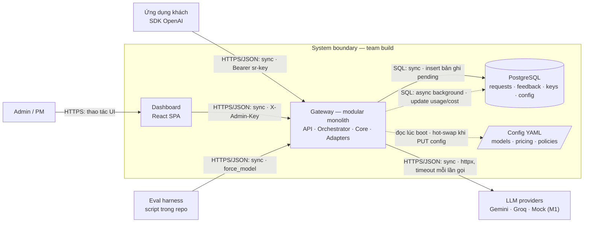
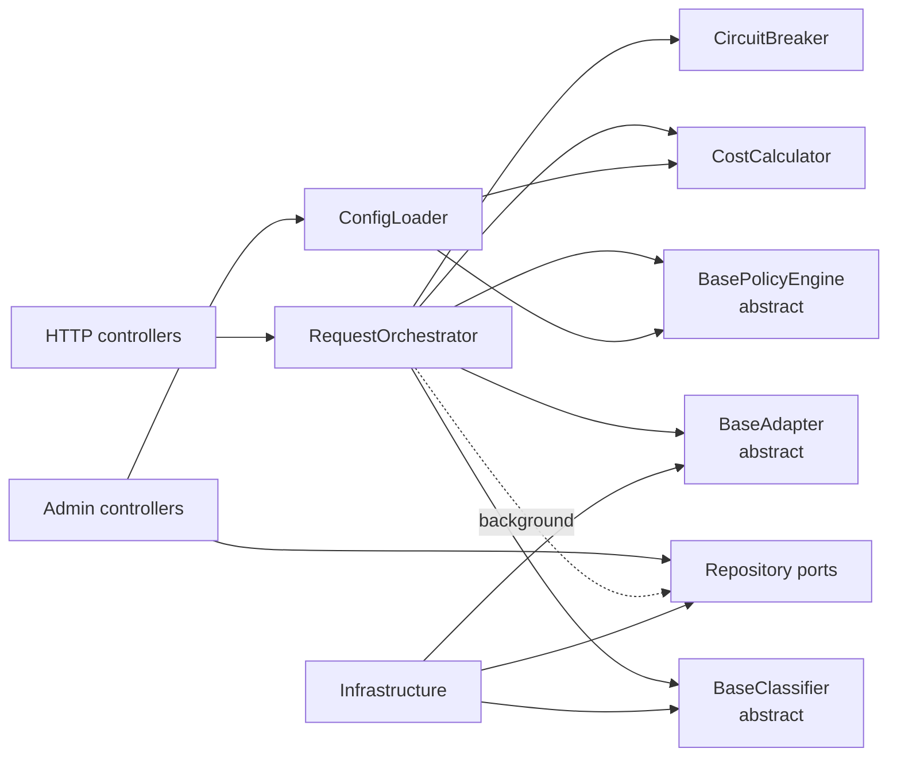
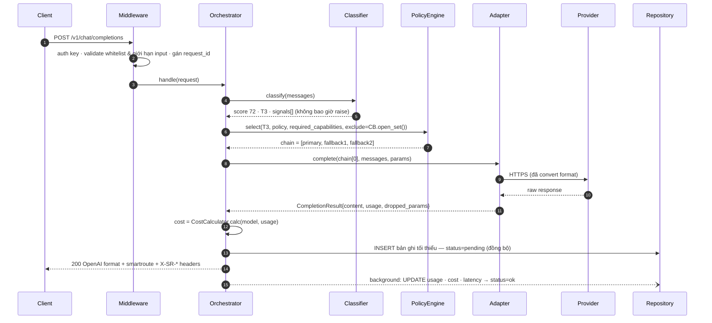
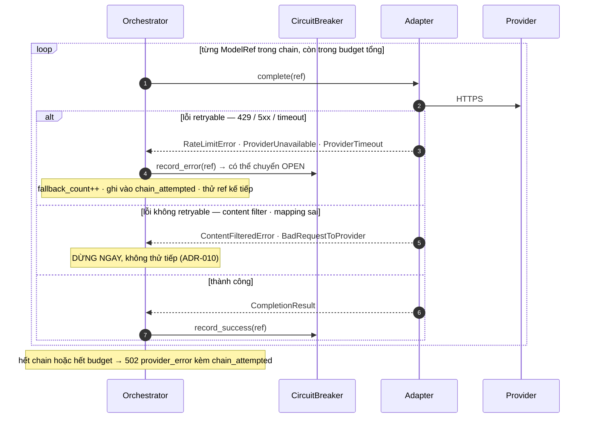
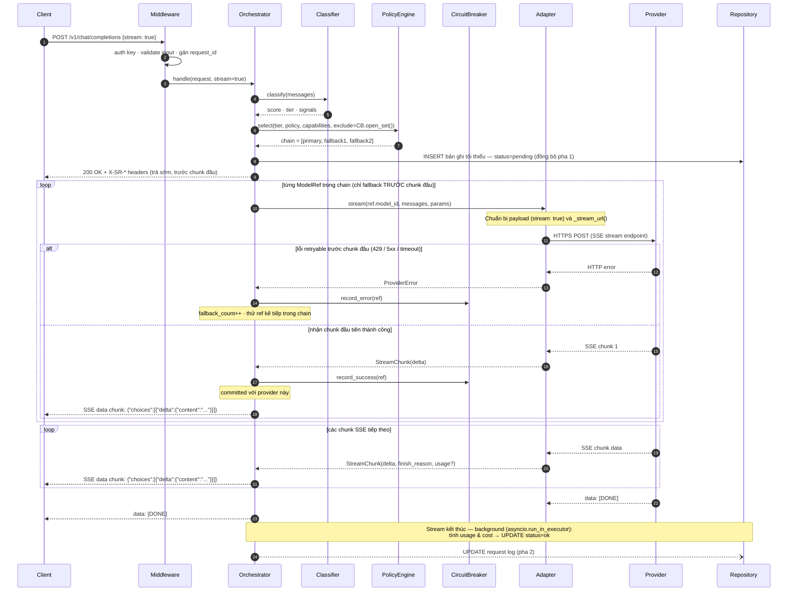
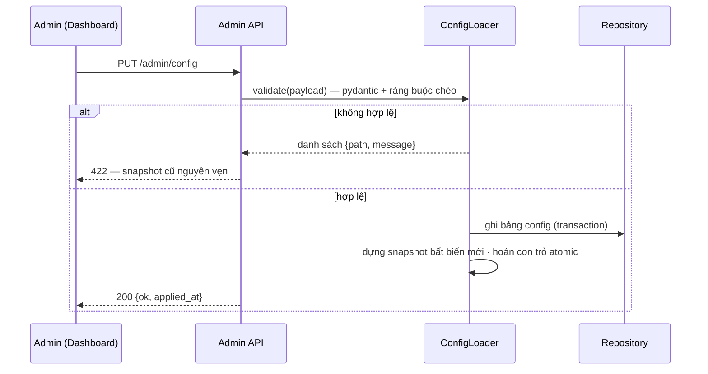
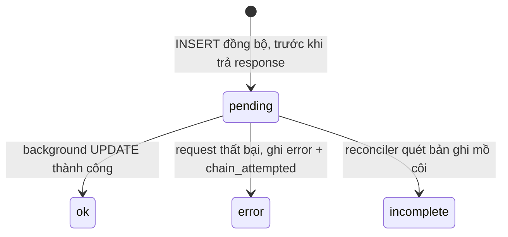
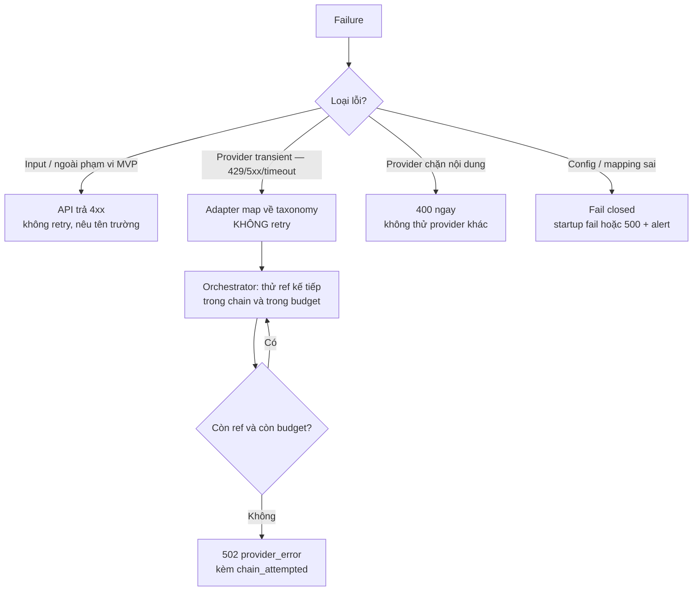
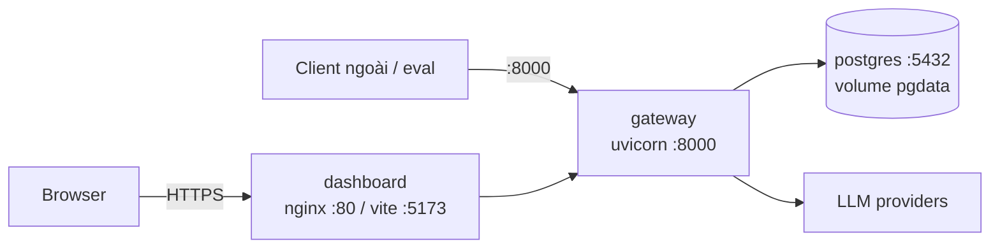

# Architecture Design — SmartRoute Gateway

**Phiên bản:** 1.2 · **Trạng thái:** Proposed · **Owner:** Tech Lead
**PRD:** [`02_prd.md`](02_prd.md) · **Interface F1:** [`05_interfaces.md`](05_interfaces.md) · **OpenAPI F1:** [`v1_f1.yaml`](v1_f1.yaml) · **Phạm vi:** M1–M3 (một học kỳ, team 3–4 người)

> Tài liệu mô tả **how** của hệ thống và chỉ giữ đủ thông tin để review kiến trúc. **Phân quyền source of truth** (chi tiết ở đầu `02_prd.md`): PRD sở hữu requirement · file này sở hữu **technical decision** · `v1_f1.yaml` sở hữu HTTP schema F1 · `05_interfaces.md` sở hữu contract B/C/D và bề mặt HTTP chưa có OpenAPI. ADR hiện được tóm tắt trong bảng §3 và §6 — file ADR riêng sẽ đặt tại `docs/design/adr/` khi có quyết định mới sau khi chốt tài liệu này.

---

## 1. Context & Goals

Ứng dụng LLM hiện trả cùng mức giá cao cấp cho mọi request, kể cả câu chào hỏi, và khóa cứng vào một provider nên chịu rủi ro rate limit, downtime, đổi giá. SmartRoute Gateway là reverse-proxy đặt giữa ứng dụng và các LLM provider: chấm điểm độ khó từng request, định tuyến đến model phù hợp theo policy, fallback khi provider lỗi, và ghi lại đủ dữ liệu để chứng minh tiết kiệm được bao nhiêu.

Người dùng: **developer** tích hợp LLM (đổi `base_url`, không sửa code nghiệp vụ) và **admin/PM** kiểm soát chi phí theo policy.

Mục tiêu kỹ thuật:

- Tương thích **tập con text-only của API OpenAI** — tích hợp chỉ bằng đổi `base_url` + key; tham số ngoài phạm vi bị từ chối sớm và tường minh, không im lặng nuốt.
- Mọi quyết định routing **giải thích được**: điểm số, tín hiệu kích hoạt, chuỗi model đã thử đều lưu lại và tra được bằng một `request_id`.
- Overhead định tuyến p95 < 300ms; tỉ lệ request thành công ≥ 99% nhờ fallback đa provider.
- Thêm provider mới ≤ 1 file adapter + 1 mục config, không sửa core.
- Một team 3–4 người build, test và demo được trong một học kỳ; `docker compose up` là đủ để chạy toàn bộ.

**Ngoài phạm vi:** fine-tune model, billing/thanh toán thật, multi-tenant/SSO/RBAC enterprise, SLA production, semantic cache, vector DB, agent framework. **Ngoài MVP** (roadmap sau khi vertical slice ổn định): tool/function calling, structured output, đầu vào đa phương thức, `n>1`, `logprobs`.

---

## 2. Architecture Diagram



Toàn bộ luồng nghiệp vụ là **sync/performance-sensitive**: client chờ câu trả lời, nên không có worker và không có message broker. Chỉ đúng **một** việc chạy async: cập nhật usage/cost/latency vào bản ghi log sau khi response đã trả (§5, ADR-008). Eval harness gọi gateway qua chính contract công khai với `smartroute.force_model` để cả 4 chế độ benchmark đi qua một code path duy nhất, không có đường tắt riêng cho eval.

### Component responsibilities

| Component | Trách nhiệm | **Không** chịu trách nhiệm |
|---|---|---|
| Dashboard | Render dữ liệu API trả về: playground, stats, logs, config, keys | Không tính toán nghiệp vụ — kể cả `savings_pct`; không gọi provider; không tự quyết quyền |
| API Layer | Auth 2 loại key, validate whitelist & giới hạn input, dựng response chuẩn OpenAI | Không chứa logic chọn model; không bắt lỗi riêng của từng provider |
| Orchestrator | Ghép luồng classify → select → thử chain → cost → log; **owner duy nhất của retry/fallback** | Không biết provider nào có schema gì; không tự chấm điểm; không ghi DB đồng bộ ngoài bản ghi `pending` |
| Core Domain (classifier, policy, cost, circuit) | Chấm độ khó, dựng chain, tính cost, đếm lỗi provider | Không import FastAPI / SQLAlchemy / SDK provider; không đọc env ngoài constructor; không ghi DB |
| Adapters | Convert request/response 2 chiều, map lỗi thô về taxonomy chung, khai báo capability | **Không retry** (§3, §6); không chứa rule tier/policy; không quyết định outcome của request |
| Repository | CRUD + aggregate cho stats, transaction/constraint | Không chứa business rule; không tự vá dữ liệu thiếu |
| ConfigLoader | Đọc DB override → fallback YAML, validate fail-fast, hot-swap snapshot | Không cho phép trạng thái nửa vời: sai một chỗ là giữ nguyên snapshot cũ |

### Module view bên trong modular monolith



Dependency chỉ đi **vào trong**: controller và infrastructure phụ thuộc vào contract của domain, không ngược lại. Nhờ vậy classifier và policy engine test thuần được, không cần mock HTTP hay DB. Đây là ranh giới module trong cùng codebase, không phải network boundary.

| Module | Owns | Public surface tối thiểu |
|---|---|---|
| `core/classifier` | Chấm điểm độ khó, tín hiệu giải thích | `classify(messages) -> ClassificationResult` |
| `core/policy` | Ánh xạ (tier, policy) → chain, lọc capability, áp `exclude` | `select(...) -> RoutingPlan` |
| `core/circuit` | Đếm lỗi retryable per (model, provider), máy trạng thái | `record_error`, `record_success`, `open_set` |
| `core/cost` | usage × pricing → Decimal, cả cost thật và baseline premium | `calc`, `calc_baseline` |
| `core/orchestrator` | Luồng nghiệp vụ duy nhất, sở hữu retry và outcome | `handle(request) -> Result` |
| `adapters` | Convert format, map lỗi, khai báo `model_capabilities` | Implement `BaseAdapter`; không chứa business rule |

### Feature × component check

| Feature | Dashboard | API | Orchestrator | Core Domain | Adapters | DB | Config |
|---|:---:|:---:|:---:|:---:|:---:|:---:|:---:|
| F1 — Định tuyến có giải trình (M1) | ✓ playground | ✓ | ✓ | ✓ classifier · policy · cost | ✓ | ✓ | ✓ |
| F2 — Policy & độ tin cậy (M2) | ✓ config UI | ✓ | ✓ | ✓ policy · circuit | ✓ | ✓ | ✓ |
| F3 — Quan sát chi phí (M2) | ✓ stats · logs | ✓ | — | ✓ cost | — | ✓ | ✓ pricing |
| F4 — Streaming · key · feedback (M3) | ✓ | ✓ | ✓ | ✓ classifier v2 | ✓ stream | ✓ | ✓ |
| Eval harness (M1→M3) | — | ✓ dùng contract công khai | ✓ | ✓ | ✓ | ✓ | ✓ pricing snapshot |

### Runtime flow A — định tuyến một request (F1, happy path)



### Runtime flow B — fallback và circuit breaker



Adapter **không** tự retry — mọi lần thử lại đều là một vòng của loop này, nên tổng số lần gọi provider của một request luôn bằng số phần tử `chain_attempted` và đọc được từ log.

### Cross-tier fallback — hành vi hiện tại và hướng mở rộng

**Fallback lên (T1→T2→T3) — đã hoạt động:**
`PolicyEngineV1._tiers_from(tier)` trả về tuple từ tier hiện tại trở lên. Khi tier hiện tại không còn model khả dụng sau lọc (circuit-open, capability), policy tự động dùng chain của tier cao hơn. T2 xử lý task T1 dư sức — overkill nhưng đúng.

| Tier gốc | `_tiers_from()` trả về | Ý nghĩa |
|----------|------------------------|---------|
| T1 | (T1, T2, T3) | Thử T1, hết thì T2, hết thì T3 |
| T2 | (T2, T3) | Thử T2, hết thì T3 |
| T3 | (T3,) | Chỉ T3, không fallback |

**Fallback xuống (T3→T2→T1) — chưa có (#130):**
Khi toàn bộ chain cùng tier thất bại **tại runtime** (mọi provider trả lỗi), hệ thống trả 502 thay vì thử tier thấp hơn. Hướng mở rộng: orchestrator retry với chain tier thấp hơn, nhưng chỉ khi client opt-in (`allow_tier_downgrade`) và response phân biệt `tier_requested` vs `tier_effective`.

### Runtime flow D — streaming SSE (F4)



**Điểm khác biệt so với non-stream:**
- Headers `X-SR-*` trả **trước** chunk đầu — không thay đổi được sau khi stream bắt đầu (ADR-007).
- Metadata routing (`smartroute`) **không** nhúng vào SSE event (sẽ phá parser SDK chuẩn) — tra qua `GET /v1/usage/{id}` sau khi stream xong (ADR-007).
- Fallback chỉ xảy ra nếu provider lỗi **trước chunk đầu tiên** — sau đó đã committed với provider đó.
- Log pha 2 chạy qua `run_in_executor` (không phải `BackgroundTasks`) vì generator async kết thúc sau khi route function đã return.

**Gemini cần URL khác:** `_stream_url()` override → `:streamGenerateContent?alt=sse`; `_prepare_stream_payload()` không thêm `"stream": true` (khác OpenAI/Groq).

### Runtime flow C — đổi config nóng (F2)



Request đang chạy giữ snapshot cũ đến khi kết thúc; request mới thấy config mới. Không restart, không có trạng thái nửa vời.

---

## 3. Component Choices & Trade-offs

| Component | Chọn | Vì sao | Alternative đã loại / trade-off |
|---|---|---|---|
| Application (ADR-001) | Modular monolith phân lớp, một image | Team 3–4 người một học kỳ; module tách theo contract là đủ để làm song song | Microservices: thêm network, deploy, tracing phân tán mà không tạo value cho phạm vi đồ án |
| Ngôn ngữ/framework (ADR-002) | Python + FastAPI + httpx async | Luồng I/O-bound; pydantic validate config/contract fail-fast; hệ sinh thái sẵn cho classifier v2 | Node/Go nhanh hơn ở CPU nhưng bỏ mất hệ sinh thái ML và làm chậm team |
| Database (ADR-003) | PostgreSQL (Docker Compose dev, Supabase prod), một ORM | Đồng nhất engine dev/CI/prod; `DATABASE_URL` là biến duy nhất phân biệt môi trường | SQLite: không đại diện được môi trường thật, driver divergence giữa test và prod |
| Background work | `BackgroundTasks` của FastAPI trong cùng process | Chỉ có một việc nền duy nhất (cập nhật usage/cost), không cần worker riêng | Worker + bảng job như hệ ingest: đúng cho batch dài, thừa cho một câu UPDATE |
| Config (ADR-004) | YAML seed versioned trong git + DB override, DB thắng khi boot | YAML review được qua PR; UI đổi nóng ghi DB — một quy tắc, không mơ hồ | Chỉ YAML: sửa file + restart, mất tính năng config UI. Chỉ DB: không review được lịch sử thay đổi |
| Classifier (ADR-005) | Heuristic v1 trước, ML/LLM v2 sau | Có baseline giải thích được và đo được để chứng minh giá trị của v2 — yêu cầu học thuật của đề tài | Làm thẳng ML: rủi ro cao ở MVP, không có mốc so sánh |
| Circuit & rate-limit state (ADR-006) | In-memory, một instance | Đủ cho phạm vi đồ án; ghi rõ giới hạn và đường nâng cấp | Redis ngay từ đầu: thêm service phải vận hành cho một nhu cầu chưa xuất hiện |
| Metadata khi stream (ADR-007) | Headers + `GET /v1/usage/{id}` | Không phá parser của SDK OpenAI — giữ lời hứa "đổi `base_url` là chạy" | Chèn event SSE tùy biến: SDK chuẩn không hiểu, phá mục tiêu G4 |
| AI boundary | Domain phụ thuộc abstract port; SDK/HTTP chỉ nằm trong concrete adapter | Test orchestrator không cần gọi provider thật; không rò schema provider vào business logic | Gọi SDK trực tiếp trong orchestrator: nhanh hơn lúc đầu, nhưng thêm provider thành sửa core |
| Orchestration | Pipeline hàm tuần tự + vòng lặp chain | Luồng tuyến tính, không có tool planning hay pause/resume | LangGraph/agent framework/RAG/vector DB: **không giải quyết pain nào của đề tài này** |

Không thêm Redis, Kafka, Kubernetes, vector DB, reranker hay cache trước khi có metric chứng minh cần. Mỗi component mới phải trả lời được: phục vụ pain nào, team vận hành nổi không, cắt đi thì MVP mất gì.

> **Lưu ý cho slide và repo:** mọi sơ đồ cũ của nhóm còn chứa LangGraph, agent tools, RAG hoặc ChromaDB (từ đề cương ban đầu) đã **lỗi thời** và phải gỡ. Tài liệu này là nguồn kiến trúc duy nhất.

### Upgrade triggers

| Hiện tại | Chỉ nâng cấp khi |
|---|---|
| `BackgroundTasks` trong process | Tỉ lệ bản ghi kẹt `pending` > 1% trong một ngày, hoặc cần retry có backoff cho việc ghi log |
| Circuit/rate-limit in-memory (ADR-006) | Chạy > 1 replica gateway, hoặc cần circuit state sống sót qua restart |
| Heuristic classifier v1 | Routing accuracy v1 < 80% trên bộ 30 prompt (AC-1.1), **và** M1–M2 đã ổn định |
| Không cache | p95 router vượt 300ms sau khi đã async hoá, hoặc eval cho thấy > 20% prompt lặp lại |
| 2 provider thật + mock | Vertical slice M1 đã pass toàn bộ AC-1 / AC-3.1–3.3 / AC-4 / AC-5 |

### AI boundary decision

Orchestrator và API layer **không** gọi SDK provider trực tiếp. Mỗi capability AI có một abstract port thuộc application boundary và một concrete adapter thuộc infrastructure:

```text
Orchestrator → BaseClassifier ← ClassifierV1Heuristic          (Python thuần, không I/O)
                              ← ClassifierV2Llm / V2Embedding → LLM · model local   [M3]
Orchestrator → BaseAdapter    ← GeminiAdapter · GroqAdapter · MockAdapter → provider HTTPS API
```

Tách port theo capability thay vì một `AIService` tổng quát: chấm độ khó và sinh câu trả lời có SLO, input và cách xử lý lỗi hoàn toàn khác nhau — classifier phải trả về trong 800ms và **không bao giờ raise**, adapter được phép raise và có timeout 60s.

| Concern | Abstract port owns | Concrete adapter owns | Orchestrator owns |
|---|---|---|---|
| Input/output | Domain DTO và invariant (`Message`, `Usage`, `CompletionResult`) | Map DTO ↔ schema riêng của provider | Dựng params, dùng kết quả |
| Timeout | Contract kỳ vọng lỗi đã chuẩn hóa | Enforce `REQUEST_TIMEOUT_S` cho **một** lần gọi | Enforce budget tổng của request (§6) |
| **Retry** | Khai báo lỗi nào `retryable` | **Không retry** — kể cả transport retry của httpx | Owner **duy nhất**: vòng lặp chain, đúng một lượt/model |
| Validation | Usage bắt buộc chính xác; thiếu → `usage_estimated=True` | Validate raw response, tự ước lượng token khi provider trả thiếu | Không persist kết quả invalid, không để cost = 0 âm thầm |
| Observability | Tên lỗi/metric chuẩn | provider · model · latency thật | `request_id`, `chain_attempted`, outcome |
| Đổi provider | Business caller không đổi một dòng | Thêm/thay concrete adapter + 1 mục config | Không đổi |

Chi tiết method, DTO, taxonomy lỗi và fake provider (`MockAdapter`) nằm trong [`05_interfaces.md`](05_interfaces.md) §B.

---

## 4. Interface Boundary

Interface được tách khỏi tài liệu này và cấp theo từng feature, không định nghĩa trước toàn bộ:

- **F1 — pinned cho M1:** [`05_interfaces.md`](05_interfaces.md) + [`v1_f1.yaml`](v1_f1.yaml). OpenAPI là **executable contract**, được validate và kiểm backward-compatibility trong CI; mọi thay đổi phải qua PR label `interface-change`. **Chỉ chuyển trạng thái frozen** sau khi vertical slice M1 chạy được và FE/BE/AI đã cùng review contract trên implement thật — trước đó chấp nhận chỉnh sửa có kiểm soát.
- **F2–F4 — draft/sketch:** contract được chốt trong task tương ứng, **trước khi** FE/BE code, không phải từ đầu dự án.
- Base path `/v1` cho client và `/admin` cho dashboard; health không version hoá; error envelope thống nhất.
- Thay đổi làm đổi flow, trust boundary hoặc dependency → cập nhật **tài liệu này**. Thay đổi schema thuần → chỉ cập nhật Interface Design/OpenAPI.

---

## 5. Data Model

```mermaid
erDiagram
    API_KEYS ||--o{ SESSIONS : owns
    API_KEYS ||--o{ REQUESTS : creates
    SESSIONS ||--o{ REQUESTS : contains
    SESSIONS ||--o| SESSION_FEEDBACK : receives
    REQUESTS ||--o| FEEDBACK : receives
    API_KEYS { int id PK; string name; string key_hash; int rate_limit; datetime created_at; bool active }
    SESSIONS {
        uuid id PK; int api_key_id FK
        datetime started_at; datetime last_activity_at
    }
    REQUESTS {
        uuid id PK; datetime ts; int api_key_id FK; uuid session_id FK
        int difficulty_score; string tier; string policy
        json signals; string classifier_version
        string model; string provider; json chain_attempted
        int prompt_tokens; int completion_tokens; bool usage_estimated
        numeric cost_usd; int latency_total_ms; int latency_router_ms
        string status; int fallback_count; string error; bool stream
    }
    FEEDBACK { uuid request_id FK; json tags; string note; datetime ts }
    SESSION_FEEDBACK { uuid session_id FK; json tags; string note; datetime ts }
    CONFIG { string key PK; json value; datetime updated_at }
```

| Entity | Trường/quy tắc chính |
|---|---|
| `api_keys` | Chỉ lưu `key_hash` (SHA-256), không bao giờ lưu key gốc; thu hồi = `active=false`. M1 dùng một key tĩnh từ env nên bảng có thể trống |
| `sessions` | Nhóm các request thuộc cùng một cuộc hội thoại; `session_id` do client tạo (Playground) hoặc gateway cấp qua `POST /v1/sessions`; `last_activity_at` cập nhật mỗi request mới trong session |
| `requests` | Bản ghi bất biến sau khi `status` rời `pending`; `signals` và `chain_attempted` là bằng chứng để audit quyết định routing (NFR-05); `session_id` nullable — API client thuần không bắt buộc dùng session |
| `feedback` | Tối đa một feedback/`request_id` (unique constraint → gửi lại trả `409`); `tags` là JSON array các nhãn chọn từ FE (`Nên dùng model mạnh hơn`, `Nên dùng model nhỏ hơn`, `Chất lượng kém`, `Chậm`, `Khác`) — lưu có cấu trúc để query được; không lưu `rating` (không có UI nhập) |
| `session_feedback` | Tối đa một feedback/`session_id` (unique constraint → gửi lại trả `409`); cùng cơ chế `tags` + `note` như `feedback` nhưng đánh giá trải nghiệm tổng thể cả cuộc hội thoại, không phải từng lần routing |
| `config` | Override của YAML; boot đọc DB trước, thiếu thì fallback YAML (ADR-004) |

Ràng buộc quan trọng:

- Nội dung prompt/response **chỉ** được lưu khi `LOG_CONTENT=true`, và khi đó cũng chỉ lưu preview 500 ký tự (NFR-03).
- `cost_usd` luôn tính từ `pricing.yaml`; model không có giá → `ConfigError` **lúc startup**, không phải lúc runtime.
- Baseline premium **không lưu sẵn** — tính lại từ token đã log × giá `premium_baseline_model` tại thời điểm truy vấn, để đổi model baseline vẫn so sánh lại được toàn bộ lịch sử.
- Index bắt buộc cho `/admin/stats`: `requests(ts)`, `requests(tier)`, `requests(provider)`, `requests(api_key_id, ts)`, `requests(session_id)`.

### Vòng đời bản ghi log và transaction boundary



- **Transaction ghi log (2 pha — ADR-008):** một câu `INSERT` đồng bộ với các trường đã biết chắc (`id`, `ts`, `api_key_id`, `difficulty_score`, `tier`, `policy`, `signals`, `model`, `provider`, `status=pending`) *trước khi* response trả về; usage/cost/latency `UPDATE` ở background. Ghi đồng bộ toàn bộ thì phạm NFR-01; ghi nền toàn bộ thì `GET /v1/usage/{id}` bị race 404. Hai pha lấy ưu điểm cả hai với chi phí một `INSERT` nhỏ.
- **Bản ghi mồ côi:** nếu process restart giữa hai pha, bản ghi kẹt `pending` vĩnh viễn và làm lệch `/admin/stats`. Một reconciler chạy lúc startup và định kỳ chuyển bản ghi `pending` cũ hơn `LOG_RECONCILE_AFTER_S` sang `status=incomplete`; `/admin/stats` loại `incomplete` khỏi tổng cost nhưng vẫn đếm vào tổng số request. *(Giá trị mặc định — xem §9.)*
- **Transaction đổi config:** ghi bảng `config` và dựng snapshot mới trong cùng một bước; sai bất kỳ đâu thì không ghi gì và snapshot cũ nguyên vẹn.
- **Đọc cho stats:** SQL aggregate theo khoảng thời gian, filter `status` ngay trong query — không lọc muộn ở tầng ứng dụng.

---

## 6. Task Characteristics & Failure Handling

| Flow | Đặc tính | Failure behavior |
|---|---|---|
| `POST /v1/chat/completions` | Sync, performance-sensitive | Lỗi retryable → thử model kế tiếp; hết chain hoặc hết budget → `502` kèm `chain_attempted`; không trả câu trả lời chắp vá |
| Classify độ khó | Sync, trong budget router | **Không bao giờ raise**: lỗi/timeout → `T2`, `signals=[classifier_error]`, request vẫn hoàn tất (ADR-009) |
| Ghi log pha 2 | Background, best effort có kiểm soát | Thất bại không ảnh hưởng response đã trả; bản ghi được reconciler dọn (§5) |
| `PUT /admin/config` | Transactional, consistency-first | Sai schema/ràng buộc chéo → `422`, không partial update, hành vi cũ nguyên vẹn |
| `GET /admin/stats` | Read-heavy, aggregate | Chỉ đọc; số liệu là hàm của DB + `pricing.yaml`, không có state riêng |
| Eval batch | Offline, tốn tiền thật | Baseline premium chạy một lần rồi cache; giá lấy từ pricing snapshot đã commit |

### SLO và timeout budget

Ba con số về latency trong PRD **không xung đột** — chúng ở ba mức khác nhau, và đây là cách đọc chính thức:

| Mức | Giá trị | Loại | Ý nghĩa |
|---|---|---|---|
| Classify đơn lẻ | p95 < 100ms | **Target**, đo offline | Chỉ khâu heuristic scoring, không tính I/O (AC-1.2) |
| Khâu router | p95 < 300ms | **SLO** của hệ thống | classify + policy select + circuit lookup, đo trên traffic thật (NFR-01) |
| `ROUTER_TIMEOUT_MS` | 800ms | **Hard cap** | Trần cứng; vượt là classifier tự cắt và trả `T2`, không phải mục tiêu để chạm tới |

Budget của một request non-stream:

| Khâu | Budget | Ghi chú |
|---|---|---|
| Auth + validate input | ≤ 50ms | Đếm token, kiểm whitelist |
| Router (classify + select) | ≤ 300ms p95, cắt cứng ở 800ms | Trong đó classify ≤ 100ms |
| Một lần gọi provider | `REQUEST_TIMEOUT_S` = 60s | Timeout của **một** lần thử, do adapter enforce |
| **Tổng cả request** | `TOTAL_REQUEST_BUDGET_S` — **cần chốt (§9)** | Orchestrator kiểm trước mỗi lần thử; hết budget thì dừng chain và trả `502` |
| Ghi bản ghi `pending` | ≤ 10ms | Một `INSERT`, nằm trong đường sync |

Điểm phải chốt: hiện `REQUEST_TIMEOUT_S=60` × chain 3 model = **180s worst case**, dài hơn timeout mặc định của phần lớn HTTP client và của chính SDK OpenAI. Cần một trần tổng, nếu không client sẽ tự ngắt trước khi gateway kịp fallback và log sẽ ghi thành công một request mà client đã coi là lỗi.

### Failure ownership



**Đúng một component sở hữu retry: Orchestrator.** Adapter không retry, httpx không bật transport retry, và không có decorator retry nào trong `core/`. Nếu vi phạm, tổng số lần gọi provider của một request thành cấp số nhân và không đọc được từ `chain_attempted` — vừa đốt quota vừa làm sai số đo latency. Đây là ràng buộc phải có test: gọi mock ép `#force_429` với chain 3 model và assert đúng 3 lần gọi.

Ánh xạ taxonomy lỗi → HTTP trả client:

| Exception nội bộ | `retryable` | Sau khi hết chain | `error.type` | HTTP |
|---|---|---|---|---|
| `RateLimitError` | ✔ | Thử ref kế tiếp | `provider_error` | 502 |
| `ProviderUnavailable` | ✔ | Thử ref kế tiếp | `provider_error` | 502 |
| `ProviderTimeout` | ✔ | Thử ref kế tiếp | `provider_error` | 502 |
| `ContentFilteredError` | ✗ | **Dừng ngay** (ADR-010) | `invalid_request_error` | 400 |
| `BadRequestToProvider` | ✗ | Dừng ngay, log để sửa mapping | `internal_error` | 500 |
| `NoCapableModelError` | — | — | `invalid_request_error` | 400 |

Circuit breaker chỉ đếm trên `retryable=True`, per (model, provider): 5 lỗi liên tiếp → OPEN 300s → HALF_OPEN thử đúng một request. Model đang OPEN vào `exclude` của PolicyEngine nên tự rời mọi chain, và hiện `enabled=false` ở `GET /v1/models`.

### Security và observability tối thiểu

**Bảo mật:** hai vòng auth tách bạch (client `Bearer sr-...`, admin `X-Admin-Key`); provider key chỉ tồn tại trong env của container gateway — không DB, không log, không UI; gateway key lưu hash SHA-256; prompt/response mặc định không ghi.

**Observability:** log JSON-lines ra stdout `{ts, level, msg, request_id}`; `request_id` sinh ở middleware và chảy xuyên suốt log → DB → header → UI Logs, tra được một request từ đầu đến cuối bằng một ID. Metric của đồ án lấy từ DB qua `/admin/stats`, không cần Prometheus. Tên chuẩn hoá cho log/metric:

```text
router_latency_ms{classifier_version,tier}
provider_request_duration_ms{provider,model,outcome}
provider_errors_total{provider,model,error_type}
classifier_error_rate            → >5% trong 5 phút thì /healthz báo degraded (ADR-009)
fallback_total{from_provider,to_provider}
```

Readiness fail khi DB hoặc config không sẵn sàng. **Provider LLM lỗi không làm mất readiness** — đó là tình huống fallback/circuit được thiết kế để xử lý, không phải lý do để loại gateway khỏi load balancer.

---

## 7. Risks & Mitigations

| # | Risk | Impact | Mitigation | Cut line |
|---|---|---|---|---|
| R1 | Classifier route task khó xuống model rẻ | Chất lượng tụt ở đúng nhóm task quan trọng nhất | Ngưỡng bảo thủ; fast-path chỉ cho case hiển nhiên; guard `QR_hard ≥ 0.90` và `critical_fail ≤ 5%`; đo routing accuracy mỗi lần chỉnh ngưỡng | Nếu không đạt guard: nâng ngưỡng T3 và chấp nhận savings thấp hơn 40%, báo cáo trung thực thay vì tinh chỉnh dataset |
| R2 | Provider đổi API/giá, hết quota | Không chạy được demo hoặc eval | Free tier Groq/Gemini; `MockAdapter`; giá trong `pricing.yaml` + snapshot theo H2 | Chạy demo hoàn toàn trên mock + Ollama local; eval dùng snapshot giá đã commit |
| R3 | Chi phí chạy eval nhiều lần | Vượt ngân sách cá nhân | Eval set 200; cache response; baseline premium chạy một lần | Hạ về mini-eval 50 prompt và nói rõ giới hạn thống kê trong report |
| R4 | Overhead latency lớn, nhất là classifier v2 | Phá NFR-01 | Heuristic fast-path; cache theo hash prompt; async I/O; hard cap 800ms | Bỏ classifier v2 khỏi phạm vi, giữ v1 và trình bày so sánh trên eval offline |
| R5 | Scope creep, không kịp mốc | Nhiều feature nông, không cái nào xong | Vertical slice trước; MoSCoW cứng; DoD từng mốc | Cắt theo thứ tự: FR-19 → FR-17 → FR-16 → FR-12 → FR-15. F1+F3 là phần không được cắt |
| R6 | LLM-as-judge thiên vị khi đo quality | Số liệu chất lượng không tin được | Judge khác họ với mọi model trong chain; chấm 2 lượt đảo vị trí, mâu thuẫn = tie; nhóm có đáp án chấm tự động | Nếu judge không ổn định: chỉ báo cáo accuracy nhóm A và ghi rõ nhóm B là định tính |
| R7 | `savings_pct` trên dashboard bị hiểu là số đo thật | Kết luận trung tâm của đề tài bị bác ở review | Khai báo rõ giả định trong UI và report: baseline tính từ **token đã log của model rẻ** × giá premium, tức giả định model premium sinh cùng lượng token output | Trình bày `savings_pct` dashboard là **ước lượng vận hành**; số liệu chính thức trong report chỉ lấy từ eval có chạy `all_premium` thật |

---

## 8. Deployment & Capacity



Ba chế độ chạy, **cùng một codebase, khác env** — không có nhánh code theo môi trường:

1. **Dev local:** `docker compose up db -d` + `USE_MOCK_PROVIDERS=true` — Postgres qua Docker, không cần API key.
2. **Demo/staging:** `docker compose up` với Postgres + key thật.
3. **CI:** GitHub Actions Postgres service container + `USE_MOCK_PROVIDERS=true`.

Capacity giả định cho phạm vi đồ án: 1–5 người dùng đồng thời (playground + dashboard), eval harness chạy tuần tự với concurrency giới hạn để không đụng rate limit free tier, vài nghìn request mỗi lần eval. Một instance gateway là đủ; scale ngang không bị chặn về mặt kiến trúc (gateway stateless theo request) nhưng cần chuyển circuit state và rate-limit counter ra ngoài process trước (ADR-006).

### Runtime configuration và release order

| Runtime | Required config | Startup / readiness |
|---|---|---|
| gateway | `DATABASE_URL`, `ADMIN_KEY`, `GATEWAY_DEV_KEY`, `CONFIG_DIR` | Ready khi DB reachable **và** 3 file YAML validate pass. Thiếu provider key → adapter tự disable, **không** crash |
| dashboard | `VITE_API_BASE_URL` (build-time) | `GET /` 200; không hard-block theo gateway |
| postgres | `POSTGRES_USER/PASSWORD/DB`, volume `pgdata` | `pg_isready` |

Thứ tự khởi động: `db (healthy) → gateway (readyz) → dashboard`. Migration Alembic chạy trong entrypoint gateway (`alembic upgrade head`, idempotent) nên DevOps không cần bước riêng.

Release order mỗi lần deploy: backup DB → migration → rollout gateway → smoke test (gửi 3 prompt dễ/vừa/khó qua SDK OpenAI, kiểm `X-SR-Tier` và `/v1/usage`) → rollout dashboard → theo dõi `classifier_error_rate` và circuit state ở `/healthz`. Rollback chỉ an toàn khi migration backward-compatible; migration phá huỷ không nằm trong phạm vi đồ án.

---

## 9. Open Questions

| Câu hỏi | Owner | Deadline |
|---|---|---|
| `TOTAL_REQUEST_BUDGET_S` chốt bao nhiêu? (đề xuất 90s: đủ cho 1 lần thử chậm + 1 fallback, vẫn dưới timeout mặc định của SDK OpenAI) | Tech Lead | Trước khi code FR-09 (M1) |
| `LOG_RECONCILE_AFTER_S` và cách `/admin/stats` xử lý bản ghi `incomplete` | Backend Lead | Trước khi code FR-05 (M1) |
| Khoá ngày chính thức M1–M3 theo lịch chương trình | PM nhóm | Trước khi tạo Milestones trên GitHub |
| Danh sách model + snapshot giá chính thức cho M1 (hiện các ví dụ config còn dùng placeholder không đồng bộ) | AI Lead | Trước mini-eval M1 |
| Provider thứ 3 ở M2: OpenAI hay Anthropic? (chọn theo free credit sẵn có) | Tech Lead | Trước grooming M2 |
| Judge model cho §9.3 — ràng buộc: khác họ với mọi model trong chain | AI Lead | Trước full eval M2 |
| Một `ADMIN_KEY` trong env có đủ cho dashboard auth trong phạm vi đồ án? | Mentor xác nhận | Trước code FR-13 (M2) |
| Có yêu cầu deploy public (Render/Railway) hay demo local `docker compose` là đủ? | Mentor xác nhận | Trước M3 |

---

## 10. Design Review Checklist

- [ ] Mọi Must feature có chỗ trong diagram và trong ma trận Feature × Component (§2).
- [ ] Mũi tên có protocol và data; sync và async được phân biệt rõ (§2).
- [ ] Mỗi component có lý do chọn, alternative đã loại và trade-off (§3).
- [ ] Mỗi thuộc tính chất lượng có tactic cụ thể và nơi hiện thực (§1, §6).
- [ ] Failure path không trả câu trả lời chắp vá, không nhân retry qua nhiều layer, không che lỗi provider (§6).
- [ ] Budget latency cộng lại không vượt SLO, và có trần tổng cho request (§6).
- [ ] Interface đủ để chia task M1 hiện tại; F2–F4 chưa cần đóng băng (§4).
- [ ] Không thêm component hạ tầng nào chưa có metric chứng minh cần (§3).

Architecture được chốt khi Tech Lead + AI Lead + ít nhất một reviewer khác đồng ý. Thay đổi lớn sau khi chốt phải cập nhật quyết định/trade-off ở §3 hoặc §6 **trước khi** code.

---

**Changelog**

- **v1.3** (07/08/2026) — phản hồi review mentor lần 2: sửa toàn bộ link chết (`05_interface_design_f1.md` → `05_interfaces.md`, `openapi/v1_f1.yaml` → `v1_f1.yaml`, bỏ tham chiếu `docs/adr/` chưa tồn tại); thêm phân quyền source of truth ở header; đổi tham chiếu AC theo tên mới AC-1…AC-6 của PRD §3.2; hạ trạng thái contract F1 từ frozen → **pinned** (freeze chính thức sau khi FE/BE/AI review qua vertical slice M1).
- **v1.2** — refactor theo format Architecture Design chuẩn (10 mục): thêm header block và trạng thái tài liệu; gắn protocol + sync/async lên mọi mũi tên; thêm cột "không chịu trách nhiệm", ma trận Feature × Component, runtime flow C (hot-swap config); chuyển ADR-001→007 thành bảng Component Choices có alternative, thêm Upgrade triggers định lượng và mục AI boundary decision; chuyển ERD từ PRD §8 về §5 kèm transaction boundary và vòng đời bản ghi log; thêm SLO/timeout budget phân rã (hoà giải 100ms/300ms/800ms, nêu vấn đề trần tổng chain), Failure ownership và ràng buộc **Orchestrator là owner duy nhất của retry**; thêm cột cut line cho Risks và risk R7 về `savings_pct`; thêm capacity, runtime config, release order; Open Questions có owner + deadline; thêm Design Review Checklist.
- **v1.1** (05/08/2026) — nguyên tắc không LangGraph/agent tools/RAG/vector DB; ghi log 2 pha (ADR-008); ADR-009 (classifier lỗi → T2 + guard degraded); ADR-010 (content-filter không fallback); PolicyEngine lọc theo capability.
- **v1.0** (04/08/2026) — tách kiến trúc khỏi PRD §5 thành tài liệu độc lập: C4 ba cấp, máy trạng thái circuit, config hot-reload, bảng ADR, hướng dẫn mở rộng.
