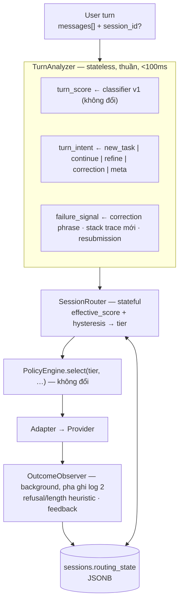

# Adaptive Multi-Turn Routing — SmartRoute Gateway
**v1.2 · 2026-08-20 · File: `docs/design/08_adaptive_routing.md` · Phạm vi: M3 / final demo**

> **Vị trí trong bộ tài liệu:** tài liệu này sở hữu thiết kế **Session Router** — lớp routing thích ứng đa lượt xây trên nền vertical slice đã hoàn thành ở MVP. Nó hiện thực hóa và mở rộng **FR-17** (escalation) trong `02_prd.md`, tuân thủ boundary của `06_architecture.md` (không LLM call đồng bộ trên happy path, không hạ tầng mới, orchestrator là owner duy nhất của retry) và contract lớp B trong `05_interfaces.md`. Khi lệch nhau về requirement → PRD thắng; về technical decision → `06_architecture.md` thắng.

---

## 1. Bối cảnh & vấn đề

Router hiện tại (classifier v1 + PolicyEngine) chấm điểm **từng request độc lập**. Với hội thoại nhiều lượt qua Playground/session, điều này sai ở bốn chỗ:

```text
Turn 1: "Write a FastAPI CRUD API."        → T1  ✔
Turn 2: "Add JWT authentication."          → T2  ✔
Turn 3: "Users get logged out under
         concurrent requests. Stack trace…" → cần T3, nhưng nếu turn ngắn
                                              có thể bị chấm thấp
Turn 4: "Can you simplify the fix?"        → chấm độc lập ≈ 18 điểm → T1 (SAI —
                                              câu này thao tác trên lời giải T3)
```

Turn 4 kế thừa: ngữ cảnh hội thoại, code đã sinh, lỗi chưa giải quyết, độ khó tích lũy. Router phải quyết định dựa trên `turn hiện tại + trạng thái hội thoại + bằng chứng từ các lượt trước`, đồng thời **không** dao động tier vô ích (T1→T2→T1→T3…).

**Ba vấn đề khó nhất (và cách đối mặt):**

1. **Ground truth "turn trước thất bại" rất yếu.** Không có sandbox/test execution trong phạm vi đồ án. Tín hiệu thất bại chỉ đến từ text của user ở lượt sau, `POST /v1/feedback`, và heuristic trên output (refusal, độ dài bất thường — sẵn có trong FR-17). → Escalation policy thiết kế quanh sự nhiễu này: ngưỡng bảo thủ, tối đa +1 tier/lượt, có budget.
2. **Phân biệt "model sai" vs "user muốn refine".** "Simplify this" sau một fix T3 không phải failure. → Tách *intent của lượt* (correction / refine / new_task / meta / continue) khỏi *difficulty score* — hai trục độc lập.
3. **Trạng thái hội thoại trong API stateless.** Client OpenAI-compatible gửi lại **toàn bộ mảng `messages`** mỗi lượt → phần lớn tín hiệu multi-turn **tính lại được từ messages**, không cần state. Session state (bảng `sessions` sẵn có) chỉ lưu phần không suy ra được: tier history, failure streak, escalation count.

**Giả định:**
- A1: Router chỉ thao tác trên thuộc tính tier (T1/T2/T3, `quality_rank`, giá từ `pricing.yaml`), không hard-code tên model.
- A2: Giữ nguyên SLO: router p95 < 300ms, hard cap 800ms (ADR-009).
- A3: Không có tool-execution feedback trong phạm vi demo; chừa interface cắm sau (§9).
- A4: Multi-turn routing đầy đủ khi có `smartroute.session_id`; thiếu session vẫn chạy degraded mode (suy tín hiệu từ `messages`).

---

## 2. Kiến trúc

**Hybrid 2 lớp: per-turn heuristic scorer (classifier v1 sẵn có) + Session Policy Layer stateful (mới).** LLM tie-breaker cho vùng mơ hồ là mở rộng V2, không thuộc final demo.



Khác với state machine "Task Analysis bằng LLM" thường thấy: **không có LLM call riêng để phân tích intent** — intent và difficulty tính trong cùng một pass heuristic, vì SLO 300ms không cho phép LLM đồng bộ trên happy path, và vì intent trong coding phân biệt được bằng cấu trúc (stack trace mới? message gần giống lượt trước? câu ngắn tham chiếu "it/this"?).

### 2.1 So sánh phương án đã loại

| Phương án | Vì sao loại |
|---|---|
| A. Rule-based stateless | Không thấy trajectory — chính là bug đang sửa |
| C. Classifier ML nhỏ | Cần 500–1000 nhãn; ở coding domain tín hiệu (code/trace/intent) vốn regex-được — chi phí nhãn không mua thêm accuracy đáng kể |
| D. LLM-as-router | Phá SLO 300ms; thêm một điểm lỗi; kém giải thích (NFR-05); bản thân nó bị prompt-inject |
| E. Hybrid B+D | Đúng đích đến V2 (khớp "kiến trúc hybrid cuối" PRD §6.3) nhưng thừa cho final demo |
| **B. Score-based + state (chọn)** | <10ms, 0 cost, giải thích được bằng signals, repo đã có sẵn ~80% (classifier, signals, tiers, sessions) |

---

## 3. Feature nào được dùng — và không

Nguyên tắc: **feature nào không đo tin cậy được trong <100ms thì gộp vào score, chuyển sang lớp outcome, hoặc bỏ.**

| Feature | Phán quyết | Lý do |
|---|---|---|
| `turn_intent` | **Giữ — quan trọng nhất** | Quyết định prior tier và quyền de-escalate |
| `turn_score` | Giữ | Classifier v1 sẵn có, đo được, giải thích được |
| `failure_signal` | Giữ | Driver chính của escalation |
| `current_tier` (lượt trước) | Giữ | Đầu vào của hysteresis |
| `context_length` | Giữ nhưng **tách khỏi difficulty** (§8) | Chỉ lọc capability/context-window, không tự đẩy qua biên tier |
| `coding/reasoning/debugging_complexity` | Gộp vào turn_score qua signals | Ba trục tương quan mạnh — tách là redundant |
| `ambiguity` | **Bỏ** | Không đo tin cậy được; hành động đúng khi mơ hồ là ngưỡng bảo thủ, không cần feature |
| `risk_of_failure`, `expected_output_complexity` | **Bỏ** | Là *outcome*, không phải feature — để OutcomeObserver lo |
| `tool_requirement` | Bỏ | Ngoài phạm vi MVP/M3 (PRD §1.4) |
| model self-reported confidence | **Không bao giờ** | Không đáng tin, không calibrate được |

---

## 4. Session state

Lưu ở cột mới `sessions.routing_state` (JSONB) — không bảng mới, không Redis (đúng ADR-006).

```json
{
  "turn_count": 4,
  "current_tier": "T2",
  "tier_history": ["T1", "T2", "T3", "T2"],
  "ema_score": 52.4,
  "failure_streak": 0,
  "unresolved_failure": false,
  "failed_tier": null,
  "last_escalation_turn": 3,
  "session_escalation_count": 1,
  "last_user_msg_hash": "a3f1…",
  "updated_at": "2026-08-19T10:00:00Z"
}
```

| Nhóm | Trường | Quy tắc |
|---|---|---|
| **Persist** | `tier_history` (5 phần tử cuối), `failure_*`, `session_escalation_count`, `ema_score` | Những thứ *không* suy ra được từ `messages` |
| **Decay** | `ema_score = α·turn_score + (1−α)·ema` với **α = 0.45** | Nghiêng về hiện tại nhưng nhớ "hội thoại này đang khó"; `failure_streak` reset khi có success signal hoặc new_task |
| **Recompute mỗi lượt** | turn_score, intent, context length, mọi signal | Không cache thứ tính được từ messages |
| **Không bao giờ persist** | Nội dung prompt/response (NFR-03), output model, per-signal points (đã có ở `requests.signals`) | |

Sau lượt **thành công**: cập nhật ema, `failure_streak→0`, `unresolved_failure→false` nếu correction trước đó đã được xử lý. Sau lượt **thất bại** (correction đến): `failure_streak++`, `unresolved_failure=true`, ghi `failed_tier` để không route lại xuống đúng tier đã fail.

Đọc/ghi state = 1 SELECT + 1 UPDATE; UPDATE đi cùng pha ghi log 2 sẵn có (ADR-008) — không thêm đường sync.

### 4.1 Vòng đời & concurrency

**TTL:** routing_state hết hạn khi session idle quá `SESSION_ROUTING_TTL_S` (env, mặc định **7200s = 2h**) tính từ `last_activity_at` (cột sẵn có của `sessions`). Kiểm tra **lazy lúc đọc** — quá hạn thì lượt kế tiếp reset routing_state về init (giữ nguyên `session_id` và `turn_count` cho analytics). Không cần cron dọn dẹp: state có kích thước **cố định** (~300 bytes — mọi trường scalar, hai mảng cap 5 phần tử, validate bằng pydantic schema lúc ghi nên không phình được). Cùng `session_id` quay lại sau TTL = "session mới về mặt routing" — không có cơ chế khôi phục, vì ema/failure của 2 giờ trước không còn giá trị dự đoán.

**Race condition:** hai request cùng session gần đồng thời — đọc state đầu lượt, ghi ở pha 2 background → lost update là khả dĩ về lý thuyết. Phạm vi đồ án: nguồn session duy nhất là Playground (một user gõ tuần tự) → xác suất thực tế ≈ 0, nhưng vẫn chặn rẻ bằng **optimistic guard** trong câu UPDATE:

```sql
UPDATE sessions SET routing_state = :new
WHERE id = :sid
  AND COALESCE((routing_state->>'turn_count')::int, -1) < :new_turn_count
```

Bản ghi stale (turn_count cũ hơn) tự bị bỏ qua, không đè ngược state mới. Ceiling ghi nhận: client multi-tab gửi song song thật sự cần `SELECT … FOR UPDATE` hoặc version column — chỉ nâng khi có client như vậy (cùng tinh thần ADR-006).

---

## 5. Thuật toán routing

Tham số đặt trong `config/routing.yaml`, chỉnh nóng qua `/admin/config` như tier thresholds hiện tại:

```yaml
# config/routing.yaml
alpha: 0.45                 # EMA weight
escalate_margin: 0          # vượt ngưỡng tier là lên
deescalate_margin: 15       # phải THẤP hơn ngưỡng 15 điểm mới được xuống
dwell_turns: 1              # số lượt tối thiểu sau escalation trước khi được xuống
max_session_escalations: 3  # budget chống loop / chống exploit
failure_boost: 15           # điểm cộng khi có failure_signal
streak_boost: 10            # cộng thêm mỗi bậc streak (cap 2)
```

```python
# core/session_router/router.py — pseudocode implement được
def route(messages, state, cls: ClassificationResult) -> tuple[Tier, list[Signal]]:
    turn = analyze_turn(messages, state)          # §5.1 — thuần, không I/O
    if state is None:                             # không có session → degraded mode
        state = derive_state_from_messages(messages)

    # 1) effective score — kênh kế thừa độ khó
    score = cls.score
    if turn.intent in ("continue", "refine", "correction"):
        score = max(score, state.ema_score)       # kế thừa độ khó tích lũy
    if turn.intent == "new_task":
        score = cls.score                         # cắt kế thừa: task mới chấm mới
    if turn.failure_signal and state.session_escalation_count < MAX_SESSION_ESCALATIONS:
        score += FAILURE_BOOST + STREAK_BOOST * min(state.failure_streak, 2)

    # 2) tier thô từ ngưỡng hiện có (t1_max / t2_max — /admin/config)
    raw_tier = tier_from_score(score)

    # 3) hysteresis quanh current_tier
    cur = state.current_tier
    # Escalation-gate (§6.3): điểm kế thừa (max với ema) chỉ được GIỮ độ khó, KHÔNG được đẩy tier
    # vượt cur trên một lượt tầm thường. Chỉ escalate khi lượt HIỆN TẠI có lý do thật: điểm
    # classifier THẬT của lượt (cls.score, chưa kế thừa) đã vượt cur, HOẶC có failure_signal.
    escalation_warranted = tier_from_score(cls.score) > cur or turn.failure_signal
    if raw_tier > cur:
        if not escalation_warranted:
            tier = cur                            # "ok"/continue kế thừa ema cao KHÔNG tự leo tier
        else:
            tier = min(cur + 1, T3)               # tối đa +1 tier/lượt…
            if raw_tier == T3 and count_hard_signals(cls) >= 2:
                tier = T3                         # …trừ debugging rõ ràng: cho nhảy thẳng
    elif raw_tier < cur:
        tier = decide_deescalation(cur, raw_tier, score, turn, state)
    else:
        tier = cur

    if state.unresolved_failure and turn.intent != "meta":
        tier = max(tier, cur)                     # failure lock: có lỗi treo thì không xuống
                                                  # (miễn trừ meta — case 5 §10: reformat không cần
                                                  #  tier cao; unresolved_failure vẫn giữ trong state)
    if turn.failure_signal and state.failed_tier: # không route lại vào tier đã fail
        tier = max(tier, state.failed_tier + 1)

    return tier, explain_signals(...)             # NFR-05: mọi nhánh trên đều thành Signal

def decide_deescalation(cur, raw_tier, score, turn, state) -> Tier:
    if turn.intent == "correction":                              return cur
    if state.unresolved_failure:                                 return cur
    if state.turn_count - state.last_escalation_turn < DWELL:    return cur
    if gap_to_threshold(score, cur) < DEESCALATE_MARGIN:         return cur
    if turn.intent == "new_task":
        return raw_tier              # task mới độc lập: xuống thẳng
    if turn.intent == "meta":
        return raw_tier              # format/giải thích: không cần reasoning của tier cao
    return cur - 1                   # refine trên artifact khó: tối đa −1 bậc
```

### 5.1 TurnAnalyzer — tín hiệu coding-specific

```python
def analyze_turn(messages, state) -> Turn:
    last, prev_user = messages[-1].content, previous_user_message(messages)
    return Turn(
        intent = classify_intent(last, prev_user),
        failure_signal = (
            has_correction_phrase(last)            # "doesn't work / vẫn lỗi / still failing / sai rồi"
            or has_new_error_artifact(last)        # stack trace / traceback / failed-test output
                                                   #   CHƯA xuất hiện ở các lượt trước
            or similarity(last, prev_user) > 0.85  # resubmission gần nguyên văn (FR-17 sẵn có)
        ),
    )
```

`classify_intent` theo thứ tự ưu tiên (song ngữ Việt–Anh như classifier v1):
`correction` phrases → `new_task` markers (câu không tham chiếu context, đổi chủ đề/ngôn ngữ lập trình) → `meta` ("format lại", "giải thích", "rename", "thêm docstring", "dịch comment") → `refine` ("simplify", "tối ưu", "viết gọn hơn", "refactor") → mặc định `continue`.

Thứ tự này **không tùy tiện** — nó đặt theo ma trận hậu quả khi nhầm intent (§5.2): `correction` bắt trước với recall cao (false positive chỉ tốn +1 tier một lượt — rẻ), `new_task` đòi bằng chứng mạnh (false positive cắt ema → under-route — đắt).

**Định nghĩa chi tiết (chuẩn implement, hết mơ hồ):**

| Hàm | Định nghĩa |
|---|---|
| `has_new_error_artifact` | **Phát hiện:** regex trên message user cuối — `Traceback (most recent call last)` · `File "…", line N` · `^\w+(Error\|Exception):` · `FAILED test_…` · `AssertionError` · `panic:` · `Exception in thread`. **"Mới":** fingerprint = SHA-1 của (tên exception + dòng cuối của trace, normalize whitespace); artifact là *mới* khi fingerprint **không xuất hiện trong bất kỳ message nào trước đó của chính mảng `messages`** — so trong request, không cần state. Cùng trace gửi lại lần 2 → không phải artifact mới (nhưng có thể match resubmission) |
| `similarity` | Jaccard trên tập token (lowercase, bỏ dấu câu) giữa message user cuối và message user **liền trước**. Chỉ tính resubmission khi độ dài hai message chênh < 30% — chống nhầm các câu ngắn giống nhau kiểu "tại sao?". Ngưỡng 0.85 là giá trị khởi điểm trong `routing.yaml`, tune theo §11.4 |
| `count_hard_signals` | Đếm số signal **khác nhau** đã kích hoạt trong tập cố định: `{code, math_logic, multi_step}` (từ classifier v1) ∪ `{error_artifact, concurrency_keywords}` (từ TurnAnalyzer; `concurrency_keywords` = race/deadlock/thread/async/lock/mutex/concurrent — bổ sung vào từ điển v1). **Không trọng số riêng** — trọng số đã nằm trong điểm cộng của score. Điều kiện nhảy thẳng T3 (§5): `raw_tier == T3` **và** count ≥ 2 **và** ít nhất một trong hai signal kích hoạt thuộc `{error_artifact, concurrency_keywords}` — chặn tổ hợp thường gặp `code + multi_step` nhảy cóc |

Ánh xạ nhóm tác vụ coding → hành vi routing:

| Nhóm tác vụ | Intent | Ảnh hưởng |
|---|---|---|
| Sinh code đơn giản, transform, explain, rename, test format | meta / new_task | Được de-escalate thẳng, kể cả context lớn |
| Refactor, optimization, test generation | refine | Kế thừa ema; xuống tối đa −1 bậc |
| Debugging (trace/concurrency/race/deadlock), algorithm design | correction / continue + hard signals | Ứng viên nhảy thẳng T3; sàn tier khi có failure |
| Security-sensitive, architecture design | continue + hard signals | Ngưỡng bảo thủ — under-routing đắt hơn over-routing |

### 5.2 Đánh giá riêng TurnAnalyzer — điều kiện tiên quyết trước khi tin cậy

TurnAnalyzer là mắt xích mong manh nhất (regex trên ngôn ngữ tự nhiên) nên được đánh giá **tách biệt** khỏi eval routing tổng, tương tự AC-1 của classifier v1:

- **Dataset:** `evals/datasets/turn_intents_50.jsonl` — 50 lượt gán nhãn intent tay (≥8 case/intent, song ngữ), lấy từ log Playground thật (ẩn danh hóa) + synthetic. Gán nhãn bởi 2 người, bất đồng thì thảo luận chốt.
- **Đạt khi:** accuracy ≥ 85% **và** không có case nhãn `correction` nào bị nhận thành `refine`/`meta` (lỗi nguy hiểm nhất — bỏ lỡ escalation).
- **Ma trận hậu quả khi nhầm** (căn cứ thiết kế thứ tự ưu tiên và tiêu chí đạt):

| Nhầm | Hậu quả | Mức độ |
|---|---|---|
| `refine` ↔ `continue` | Không có — hai nhánh cùng công thức kế thừa ema | Vô hại |
| `correction` → `refine`/`continue` | Bỏ lỡ escalation boost; được vớt ở lượt sau qua streak | Trung bình |
| `new_task` → `continue` | Kế thừa ema thừa → over-route task dễ | Lãng phí nhỏ, có trần |
| `continue` → `new_task` | Cắt ema nhầm → under-route task khó | **Nguy hiểm** → new_task markers phải conservative |
| nhầm sang/khỏi `meta` | Sai tier một lượt format — chi phí thấp | Nhỏ |

### 5.3 Degraded mode — không có `session_id`

**Transport:** `smartroute.session_id` đã có trong contract (05 §A.1); SDK OpenAI Python truyền qua `extra_body={"smartroute": {"session_id": "…"}}` — không sửa code SDK, giữ lời hứa G4. Không thêm header mới cho việc này.

Không có session → không state. Suy được từ mảng `messages` (client OpenAI-compatible gửi lại toàn bộ lịch sử):

| Suy được | Cách |
|---|---|
| `turn_count` | Đếm user messages |
| `failure_signal` | TurnAnalyzer chạy nguyên trên mảng messages (fingerprint so trong mảng) |
| ema xấp xỉ | `max(turn_score, 0.8 × max(score classifier v1 của ≤3 user message gần nhất))` — cap 3 message để giữ budget <100ms |

**Mất:** `tier_history` → không có neo `current_tier` → **hysteresis tắt** (mỗi lượt là quyết định tươi); mất `failure_streak` và escalation budget. Client tự cắt bớt lịch sử → tín hiệu kế thừa mất theo — chấp nhận: degraded mode **không bao giờ tệ hơn** hành vi single-turn hiện tại của gateway (đó là floor).

**Biên:** mảng chỉ có 1 user message → `new_task`, chấm như single-turn bình thường. Không mặc định T2/T3 "cho an toàn" — T2 chỉ là fallback khi classifier *lỗi* (ADR-009); under-routing lượt đầu được vớt bằng reactive escalation ở lượt sau.

---

## 6. Escalation (T1→T2→T3)

Lên tier khi **một trong hai**:

1. **Proactive (trước khi sinh):** effective_score vượt ngưỡng tier trên → +1 bậc. Ngoại lệ duy nhất được nhảy 2 bậc: `raw_tier=T3` **và** ≥2 hard signals (code + stack trace + concurrency keywords) — vì under-routing một bug khó vi phạm guard `critical_fail ≤ 5%` (PRD §9.3), đắt hơn nhiều so với over-routing.
2. **Reactive (sau bằng chứng):** `failure_signal` ở lượt kế → boost điểm + sàn `failed_tier + 1`.

**Phân biệt failure vs refinement:** "simplify this" không match correction phrase, không kèm error artifact mới → intent=refine → không escalate. User nói "sai rồi" nhưng không có bằng chứng mới → +1 bậc đúng một lần; lần hai cùng task không có artifact lỗi mới → giữ tier (case 6, §10).

### 6.1 Vòng đời `unresolved_failure` — tín hiệu set/clear tường minh

| Chuyển | Điều kiện (bất kỳ một) |
|---|---|
| → `true` | `failure_signal` kích hoạt ở lượt hiện tại |
| → `false` | (a) lượt kế có intent ∈ {`refine`, `meta`, `continue`} **và không** kèm failure_signal mới — user làm việc tiếp trên câu trả lời là chấp nhận ngầm; (b) intent = `new_task`; (c) **positive-ack phrases** — "works now / chạy được rồi / được rồi / ok cảm ơn / thanks, that fixed it" (từ điển song ngữ riêng trong TurnAnalyzer, xuất signal `resolved_ack` để giải thích); (d) feedback tích cực qua `POST /v1/feedback` hoặc `session-feedback` |
| giữ `true` | Lượt kế lại là `correction` |

### 6.2 Khi cạn escalation budget

Hết `max_session_escalations` mà vẫn còn `failure_signal` → **không im lặng giữ tier thấp và fail lặp**. Hành vi:

1. **Pin T3** cho tới khi `unresolved_failure` clear — budget chặn *vòng lặp boost điểm*, không được phép tạo ra trạng thái "kẹt tier thấp + thất bại lặp lại".
2. Thêm signal `escalation_budget_exhausted` vào `smartroute.signals` của response — client/Playground thấy được và có thể gợi ý user dùng `force_model` (FR-08) hoặc gửi feedback.
3. Ghi nhận vào log để admin audit qua `/admin/requests`.

Kẻ cố tình giả correction để "ăn" tier cao chỉ đạt được điều tương đương `force_tier: T3` mà họ vốn được phép dùng công khai — chi phí tự trả qua key của mình, có trần bằng all-premium. **User phàn nàn sai liên tục** (model vốn đúng): lãng phí cũng bị chặn trần bởi pin T3, và feedback tags (`Nên dùng model nhỏ hơn`…) là kênh để admin nhìn thấy pattern này trên dashboard — tự động hóa xử lý nằm ngoài phạm vi M3.

**Chống escalate thừa:** `max_session_escalations = 3` mỗi session (đủ cho T1→T2→T3 + 1 lần re-escalate sau de-escalation).

### 6.3 Escalation-gate — kế thừa EMA không được tự leo tier

**Sự cố (SR-1, phát hiện qua pentest 25/08/2026 + feedback user "spam ok thấy độ khó tăng dần").**
Kênh kế thừa (§5 bước 1) đặt `score = max(cls.score, ema)` cho intent `continue/refine/correction`
để *giữ* độ khó qua lượt. Nhưng vì luật `escalate_plus_one` giới hạn +1 tier/lượt, cú escalation mà
một lượt khó "đáng bị" lại bị **hoãn sang lượt kế** — thường là một message rác:

```
turn 1  "implement lock-free hashmap"   cls 62 → T2   (bị cap +1 từ T1, đáng T3 nhưng chỉ lên T2)
turn 2  "ok"                            cls  0 → T3   ← kế thừa ema=62, leo vượt CẢ lượt khó (T2)
```

Người dùng gõ "ok" (điểm 0, đáng T1) nhưng bị tính **T3 — tier đắt nhất**. Vũ khí hoá được: xen 1 câu
khó mỗi 3 lượt để giữ ema nóng → các lượt "ok" liên tục bị bill premium (cost amplification).

**Sửa: escalation-gate.** Kế thừa ema chỉ được *giữ / de-escalate* tier, **không được escalate**. Một
lượt chỉ leo tier khi có lý do thật ở CHÍNH lượt đó — `tier_from_score(cls.score) > cur` (điểm classifier
thật, chưa kế thừa) **hoặc** `turn.failure_signal`. Lượt trivial (`cls.score` ở dải T1, không failure)
kế thừa ema cao thì **giữ cur** (signal `hold_inherited_ceiling`) rồi để ema decay tự nhiên.

Đường failure/correction không đổi: correction mang `failure_signal` nên vẫn được escalate như §6.
Case âm tính: spam "ok" từ cold (ema=0) và degraded mode vẫn ở T1 — lỗi KHÔNG do độ dài history mà do
tương tác *EMA-inheritance × escalation* khi ema ấm. Pin bằng test `test_scoring_exploits.py`.

## 7. De-escalation (T3→T2→T1) & Hysteresis

**An toàn khi:** (1) `new_task` độc lập điểm thấp → xuống thẳng; (2) `meta` trên kết quả đã ổn → xuống thẳng T1 được; (3) `refine` sau ≥1 lượt thành công → xuống 1 bậc.

**Cấm khi:** (1) `unresolved_failure` — tuyệt đối; (2) chưa hết dwell sau escalation — "simplify the fix" cần *hiểu* fix, tức gần đủ năng lực đã tạo ra nó → tối đa −1 bậc, không về T1; (3) câu ngắn mơ hồ tham chiếu "it/this" → mặc định `continue`, giữ tier.

**Bốn cơ chế chống dao động** (đều nằm trong pseudocode §5):

| Cơ chế | Giá trị | Tác dụng |
|---|---|---|
| Ngưỡng bất đối xứng | lên: vượt ngưỡng; xuống: thấp hơn ngưỡng **−15** | Score dao động 55↔62 quanh biên T2/T3 → đứng yên |
| Dwell | 1 lượt sau escalation | Không lên xong xuống ngay |
| Bước ±1 | trừ new_task và debugging-T3 | Không nhảy T3→T1 |
| EMA α=0.45 | — | Một lượt nhiễu không kéo nổi ema qua margin |

Ví dụ: chuỗi score `[20, 55, 70, 30, 58, 25]` → tier `[T1, T2, T3, T3 (dwell+margin), T3 (58 > 60−15), T2 (new_task)]` — thay vì `[T1, T2, T3, T2, T2, T1]` nhấp nhô. **Bất đối xứng có chủ đích: lên nhanh, xuống chậm** — chi phí under-routing (R1) lớn hơn over-routing (vài cent).

---

## 8. Context length ≠ difficulty

Signal "ngữ cảnh dài >2000 tokens" giữ mức +10 hiện tại — dài *tương quan yếu* với khó, và **không bao giờ để length một mình đẩy qua biên tier**.

| Trường hợp | Xử lý |
|---|---|
| Dài + dễ (repo lớn + "rename biến này") | intent=meta thắng length → T1/T2; length chỉ tham gia **lọc context window** ở PolicyEngine (thêm `context_window` vào `model_capabilities` — 05 §B.4) |
| Ngắn + khó ("prove starvation-freedom…") | Hard keywords (prove/concurrency/deadlock/complexity) đủ điểm độc lập với length |
| Dài + khó | Cả hai kênh cùng kích hoạt → T3 tự nhiên |

**Khi input vượt context window của model trong chain:** xử lý bằng đúng cơ chế lọc capability sẵn có (05 §B.3) — model có `context_window` < input tokens bị loại khỏi chain như mọi capability khác; tier rỗng sau lọc → dùng chain tier cao hơn; toàn hệ thống không còn model đủ window → 400 `context_too_long`. Gateway **không bao giờ cắt thô để nhét vừa window** — im lặng cắt context là silent failure, trái nguyên tắc §1.5 của PRD. (Working-set selection ở §8.1 là cơ chế khác hẳn: rule-based, khai báo trong response, opt-in — không phải truncation ngầm.) Thực tế M3: `MAX_INPUT_TOKENS=8000` (05 §C.1) đã chặn sớm ở mức nhỏ hơn window của mọi model trong `models.yaml`, nên filter này gần như không kích hoạt — nó tồn tại để việc nâng `MAX_INPUT_TOKENS` sau này không phá routing.

### 8.1 Working set — quản lý ngữ cảnh khi đổi tier (memory management)

**Vấn đề:** khi de-escalate T3→T2/T1, gửi nguyên lịch sử `messages` (code dài, stack trace, nhiều lượt cũ) xuống model nhỏ gây ba hại: (1) có thể vượt window của model rẻ; (2) input tokens ăn mất phần tiết kiệm của tier thấp; (3) model nhỏ dễ **nhiễu** bởi thông tin đã lỗi thời — với T1/T2, bớt nhiễu thường *tăng* chất lượng chứ không giảm.

**Quy tắc nền — "prune khi switch, giữ nguyên khi stay":** prompt cache của provider là **per-model** — đổi tier là mất sạch cache prefix bất kể gửi gì. Vì vậy thời điểm đổi tier là thời điểm prune **miễn phí về mặt cache**; ngược lại khi ở yên một model, giữ prefix ổn định (full history) để ăn cache discount (Gemini/OpenAI implicit caching). Không bao giờ prune giữa chừng khi tier không đổi.

**Working set theo intent** — chọn message theo luật, không gọi LLM tóm tắt (tốn tiền, thêm latency, thêm một điểm lỗi). Insight chính: **câu trả lời cuối của assistant là bản tóm tắt tự nhiên của mọi thứ trước nó** — nó đã chứa hiện trạng code + lời giải; với thao tác trên artifact đó, các lượt cũ hơn là redundant:

| Intent lượt hiện tại | Working set gửi xuống model mới | Lý do |
|---|---|---|
| `new_task` | system + turn hiện tại | Lịch sử cũ **là nhiễu theo định nghĩa** — cắt hết còn tăng chất lượng |
| `meta` / `refine` | system + **câu trả lời assistant cuối** + turn hiện tại | Thao tác trên artifact cuối; câu trả lời cuối = context nén sẵn, chi phí nén = 0 |
| `correction` | system + code block mới nhất + error artifact + cặp hỏi–đáp cuối + turn hiện tại | Đủ để sửa; các lần thử sai *cũ hơn* đã bị phiên bản mới thay thế |
| `continue` | system + K=3 cặp hỏi–đáp cuối + code block mới nhất (anchor) | Cần mạch hội thoại nhưng không cần từ đầu |

Anchors nhận diện bằng cấu trúc (fenced code block cuối cùng trong assistant messages, error-artifact fingerprint §5.1). **Fallback an toàn:** không nhận diện được anchor (không có code block nào, hội thoại phi cấu trúc) → gửi full history; có `force_model`/`force_tier` (client tự quyết) → luôn full.

**Kỷ luật minh bạch (giữ nguyên tắc §1.5, NFR-05):**
- Mặc định `smartroute.context_mode = "full"` — **không đổi hành vi hiện tại**. `"auto"` là opt-in, chỉ kích hoạt khi (a) tier switch và (b) lịch sử vượt `CONTEXT_PRUNE_MIN_TOKENS` (mặc định 2.000).
- Response khai báo: `smartroute.context = {mode, messages_sent, messages_total, input_tokens_saved}` + header `X-SR-Context-Mode`; log ghi index các message bị loại — audit được như mọi quyết định routing khác.
- **Eval guard trước khi bật mặc định:** chạy trajectory-level (§11) A/B pruning on/off; chỉ nhận khi QR/QR_hard giữ nguyên guard và đo được `input_tokens_saved`. Với `MAX_INPUT_TOKENS=8000` hiện tại, phần thắng cost là khiêm tốn — phần thắng chính là **giảm nhiễu cho model nhỏ** và future-proof khi nâng limit.

**Pattern "T3 suy luận → T2 code" (plan–execute split):** tách một lượt khó thành 2 call — T3 sinh plan ngắn, T2 viết code dài theo plan. Đáng tiền khi chênh giá **output** lớn (Opus $25/1M out vs model rẻ $0.40/1M out) và output dài:

```text
saving ≈ output_tokens × (giá_out_T3 − giá_out_T2) − cost(T3 plan ngắn) − cost(T2 đọc plan)
```

Trade-off: +1 call tuần tự (tăng latency cảm nhận), thêm rủi ro T2 hiểu sai plan. **Không nằm trong final demo** — ghi nhận là thí nghiệm V2 sau demo, opt-in, đo bằng chính eval harness; router hiện tại đã đạt một phần lợi ích này một cách tự nhiên qua de-escalation lượt sau (T3 trả lời xong, lượt refine được T2 phục vụ với working set chứa sẵn lời giải T3).

## 9. Objective & tool feedback

**Không dùng** `Utility = Q − λ1·Cost − λ2·Latency − …` — 4 λ không đơn vị chung, tune λ là tune mù. Thay bằng **constrained optimization**, đúng format PRD §9.3 sẵn có:

```text
maximize   savings% so với all-T3
s.t.       QR ≥ 0.95 · QR_hard ≥ 0.90 · critical_fail ≤ 5% · p95 router < 300ms
```

λ chỉ còn một chỗ dùng hợp lệ: 3 policy hiện có là 3 điểm λ rời rạc (`tier_shift` −10/0/+10) — đủ. Interactive assistant thêm ràng buộc latency + ưu tiên hysteresis; batch eval bỏ ràng buộc latency và có thể cascade (thử T1, fail thì T2) vì không ai ngồi chờ.

**Tool feedback:** route **trước khi sinh** (mode 1). Iterative loop trong cùng request (sinh → test → re-route → re-generate) là agent behavior — ngoài boundary `06_architecture.md` §3 và phá budget tổng. Chừa interface: `OutcomeObserver.record(session_id, evidence)` nhận evidence từ nguồn bất kỳ — hiện tại là refusal/length heuristic + feedback endpoint; mở rộng sau: `POST /v1/sessions/{id}/evidence` cho client có chạy test thật (pytest 5/17 fail → lượt sau tự escalate). Router không cần biết evidence đến từ đâu.

### 9.1 Chi phí của chính router — hạch toán và kiểm soát

Router heuristic (MVP/M3) có chi phí $0. Nhưng ngay khi LLM classifier v2 xuất hiện (tie-breaker vùng mơ hồ — PRD §6.3, FR-12), **chi phí định tuyến phải vào sổ như chi phí thường**, nếu không savings% là số ảo:

- **Hạch toán:** thêm `router_cost_usd` vào bản ghi `requests` và `smartroute` metadata (mặc định 0 với heuristic). Mọi công thức savings trong `/admin/stats` và eval report tính **net**: `savings = baseline_premium − (cost_usd + router_cost_usd)`. Token của classifier call cũng trừ vào quota tracking (doc 07) nếu dùng model OpenAI.
- **Break-even làm chuẩn quyết định:** một call classifier ≈ 200 input + 10 output tokens trên model nano-class (~$0.10/1M in) ≈ **$0.00002/lần**. Một lần tránh được over-routing T3 tiết kiệm cỡ $0.005–0.03. Tức là classifier v2 chỉ cần sửa đúng **>0.1–0.4%** quyết định ở vùng mơ hồ là hòa vốn — bài toán rất dễ thắng, *miễn là* không gọi nó cho 100% request.
- **Bốn van kiểm soát chi phí classifier v2:**
  1. Chỉ gọi ở **vùng mơ hồ** `|effective_score − ngưỡng tier| < 8` (~20–30% request; phần còn lại heuristic quyết ngay). → **Van này đã được `12_classifier_v2.md` §5 sửa đổi.** Luật trên đúng khi v1 là scorer (score cộng dồn liên tục). v1.5 làm score **rời rạc** — nó chỉ nhận giá trị trong ba đoạn tách rời [8,26], [30,50], [60,80] vì modifier bị cap ở 18 và không bao giờ vượt biên tier — nên khoảng cách tới ngưỡng giờ đo **lượng modifier đã cộng**, không đo độ chắc của band. Hệ quả cụ thể: một C3 trần trụi (score 62) là ca thang *tự tin nhất* nhưng lại nằm trong vùng ±8, còn một C2 nhiều modifier (score 50) là ca thang *không có bằng chứng nào* nhưng lại nằm ngoài. Luật thay thế định nghĩa vùng mơ hồ theo **trạng thái bằng chứng** mà `_determine_band` vứt đi: không driver + không marker, driver ⊕ marker mâu thuẫn, hoặc chỉ có driver chưa được cài guard. Tần suất của luật mới **chưa đo** — xem §12 Q1 của tài liệu đó.
  2. **Cache theo hash prompt** (cơ chế đã dự kiến ở PRD §6.3) — prompt lặp lại miễn phí.
  3. Model nano-class + `max_tokens=16` (JSON `{score}`) — trần cứng cho output.
  4. **Cost circuit:** nếu `Σ router_cost / Σ total_cost > ROUTER_COST_BUDGET_PCT` (mặc định 2%) trong cửa sổ 24h → tự tắt v2, fallback heuristic, `/healthz` báo degraded — cùng pattern với classifier-error circuit (ADR-009).
- **Latency cũng là chi phí:** classifier v2 chỉ được chạy trong phần budget còn lại của `ROUTER_TIMEOUT_MS=800`; timeout → dùng kết quả heuristic, không chờ.

## 10. Adversarial cases

| # | Case | Cơ chế xử lý |
|---|---|---|
| 1 | Ngắn + cực khó | Hard keywords đủ điểm độc lập với length; lọt lưới → reactive escalation vớt ở lượt sau |
| 2 | Context khổng lồ + transform tầm thường | intent=meta thắng length; length chỉ lọc context window |
| 3 | Dễ → khó ở lượt 3 | Score vượt ngưỡng → escalate (walkthrough §12) |
| 4 | Khó lượt 1 → follow-up tầm thường | meta/new_task → xuống thẳng; refine → −1 bậc |
| 5 | Model fail nhưng user chỉ xin reformat | meta → phục vụ tier thấp; `unresolved_failure` giữ trong state — task gốc quay lại thì sàn tier còn nguyên |
| 6 | User nói "sai" nhưng model đúng | +1 bậc lần đầu (không phân xử được); lần hai không bằng chứng mới → giữ tier, ghi nhận qua feedback |
| 7 | Refine lặp cùng task | refine ≠ correction → không escalate; dwell + margin giữ ổn định |
| 8 | Task mới trong cùng session | new_task reset ema → chấm lại từ đầu |
| 9 | Coding → tán gẫu | new_task + score thấp → T1 |
| 10 | Repo lớn + 1 câu hỏi dễ | = case 2 |
| 11 | "ok"/continue tầm thường sau lượt khó (hoặc bơm ema mỗi 3 lượt) | Escalation-gate §6.3: kế thừa ema chỉ GIỮ tier, không leo; lượt trivial (cls.score dải T1, không failure) giữ cur rồi ema decay → không bill premium cho "ok" |

**Chống exploitation / prompt injection:** scorer chỉ dùng tín hiệu *cấu trúc* (code block, stack trace, math, intent verbs) — meta-claims trong prompt ("this is extremely difficult", "use the strongest model", "don't route to T1") có **trọng số 0**: không có signal nào match self-reported difficulty nên không có gì để inject. Đường chính danh vẫn mở: `smartroute.force_model`/`force_tier` (FR-08) là API field có auth — *API field = tin, prompt text = không tin*. Bơm keyword giả (nhét ``` để ăn +22): chấp nhận — key tự bơm tier của mình chỉ tự tốn tiền mình; rate limit per key + `max_session_escalations` chặn khuếch đại.

---

## 11. Evaluation cho final demo

| Benchmark | Vai trò |
|---|---|
| **EvalPlus** (HumanEval+/MBPP+) | Nguồn chính cho **gold tier** — có test nên "PASS ở tier X" khách quan |
| **LiveCodeBench** | Phủ vùng T2/T3, chống contamination; dùng tag độ khó sẵn có để kiểm phân bố tier |
| **MT-Bench-101** | Đo **multi-turn adaptation** — thứ hai benchmark kia không đo được |
| `evals/datasets/multiturn_30.jsonl` | ~30 hội thoại synthetic (dễ→khó, khó→dễ, new-task giữa session…) — bộ test *chuyên* cho state machine, commit vào repo |

**Gold tier (empirical):**

```text
Mỗi task: chạy T1, T2, T3 × k=3 samples (temperature cố định)
  tier "đạt" nếu ≥2/3 pass (test) hoặc thắng judge vs T3 (nhóm mở, judge protocol §9.3)
gold = tier thấp nhất đạt; không tier nào đạt → gold = T3
```

Hạn chế (ghi vào report): gold gắn với bộ model cụ thể — đổi `models.yaml` là re-generate (lý do phải snapshot); non-determinism → k samples + majority; chi phí 200×3×3 → chạy một lần, cache vĩnh viễn (R3).

**Judge cho nhóm mở:** nguyên protocol PRD §9.3 (judge khác họ với mọi model trong chain, temperature=0, rubric 3 tiêu chí, chấm 2 lượt đảo vị trí, mâu thuẫn = tie). Bổ sung kiểm định độ tin cậy: **spot-check 20 cặp bởi 2 người**, báo cáo % agreement người–judge trong report; agreement < 70% → hạ kết quả nhóm mở xuống định tính (đúng cut line R6), không dùng để tune tham số.

**Gold cho multi-turn — hai chế độ đo tách biệt, báo cáo riêng, không trộn:**

| Chế độ | Cách chạy | Trả lời câu hỏi |
|---|---|---|
| (a) Turn-level | Prefix hội thoại **cố định từ output T3** cho mọi lượt trước; chỉ thay tier ở lượt đang chấm → gold từng lượt **độc lập với chất lượng routing của các lượt trước**, không có hiệu ứng dây chuyền | "Quyết định tại từng lượt có đúng không?" (Routing Accuracy, Under/Over-routing) |
| (b) Trajectory-level | Chạy router thật end-to-end trên cả hội thoại, **không gán gold per-turn** — chỉ đo task success cuối hội thoại + tổng cost + stability | "Cả hệ có rẻ mà vẫn xong việc không?" (số liệu demo chính) |

Chế độ (a) là ceiling analysis sạch; chế độ (b) là số thực tế — nếu (a) tốt mà (b) kém tức lỗi nằm ở tích lũy state, không phải ở quyết định đơn lẻ. Kích thước `multiturn_30.jsonl` là giới hạn thống kê được thừa nhận trong report; mở rộng 30 → ~90 bằng paraphrase song ngữ + hoán vị thứ tự task nếu kịp; primary claim của đề tài vẫn đặt trên nhóm single-turn (EvalPlus/LCB, N lớn hơn).

**Metrics (từ bảng `requests` + gold labels):**

| Metric | Cách tính |
|---|---|
| Task Success Rate | % lượt đạt quality bar (test pass / judge §9.3) |
| Routing Accuracy | % lượt `tier == gold_tier` |
| **Under-routing Rate** | % lượt `tier < gold_tier` — metric rủi ro chính, báo riêng cho nhãn hard |
| Over-routing Rate | % lượt `tier > gold_tier` — metric lãng phí |
| Avg Cost / Savings% | Σcost vs all-T3, giá từ pricing snapshot (H2) |
| Latency | p50/p95 tổng + riêng router (schema sẵn có) |
| Escalation / De-escalation Rate | số lần đổi tier lên/xuống ÷ tổng lượt (session ≥2 lượt) |
| Tier Utilization | phân bố % theo tier — đối chiếu H1 |
| **Routing Stability** | số lần đổi tier ÷ số lần đổi *cần thiết* theo gold sequence; ≈1 lý tưởng, >1.5 = flapping |

### 11.4 Tham số & kế hoạch tune

Sáu tham số nhạy cảm (`alpha`, `deescalate_margin`, `dwell_turns`, `failure_boost`, `streak_boost`, `max_session_escalations`, cộng ngưỡng `similarity`) đều nằm trong `routing.yaml`, chỉnh nóng qua `/admin/config` — không có giá trị nào hard-code. Quy trình:

1. **Giá trị khởi điểm** (như §5) là prior **bảo thủ có chủ đích** — nghiêng over-routing, đúng nguyên tắc ngưỡng bảo thủ của classifier v1 (PRD §6.2).
2. **Tune bằng dữ liệu, không bằng tay:** grid nhỏ (`alpha ∈ {0.3, 0.45, 0.6}` × `deescalate_margin ∈ {10, 15, 20}` × `dwell ∈ {1, 2}`) chạy offline trên bộ multi-turn + gold tiers; tiêu chí chọn: **đạt guard trước** (QR_hard, critical_fail, under-routing hard = 0 trên bộ synthetic), savings sau. Chi phí ≈ 0 vì replay dùng gold labels đã cache, không gọi provider.
3. **Sau demo:** theo dõi proxy của under-routing trên workload thật qua dashboard — tỉ lệ reactive escalation, tỉ lệ feedback `Nên dùng model mạnh hơn` — để chỉnh tiếp.

**Nếu không kịp vòng tune** (rủi ro thời gian là thật): giữ nguyên prior bảo thủ — hy sinh một phần savings, giữ guard chất lượng, báo cáo trung thực. Đây chính là cut line của R1, áp dụng lại cho lớp session.

---

## 12. Walkthrough chuẩn (dùng làm kịch bản demo)

| | T1: "Write a FastAPI CRUD API" | T2: "Add JWT authentication" | T3: "Users get logged out under concurrent requests. Stack trace…" | T4: "Can you simplify the fix?" |
|---|---|---|---|---|
| **State vào** | none → init | tier=T1, ema=25 | tier=T2, ema=33 | tier=T3, ema=54, last_esc=3 |
| **TurnAnalyzer** | new_task, score=25 | continue, score=40 | **correction** (trace mới + failure phrase), score=68 | **refine** ("simplify", không artifact lỗi mới), score=18 |
| **Effective score** | 25 | max(40, 25)=40 | 68+15=83 | max(18, ema≈60)=60 |
| **Quyết định** | 25<30 → **T1** | 30≤40<60 → **T2** | 83≥60, ≥2 hard signals → **T3** | raw=T2<cur=T3; unresolved=false, dwell đủ, refine → **T2** (−1 bậc, không về T1) |
| **State ra** | ema=25 | ema=32 | ema=54, unresolved chờ lượt sau xác nhận | ema=57, streak=0 |

Đúng chuỗi kỳ vọng T1→T2→T3→T2; lượt 4 **không** bị chấm như câu độc lập (18 điểm ≈ T1) nhờ kế thừa ema.

## 13. Implementation & kế hoạch tới final demo

```text
src/gateway/app/
├── core/
│   ├── classifier/            # v1 giữ nguyên
│   ├── policy/                # thêm context_window vào lọc capability
│   ├── session_router/        # MỚI (~300 dòng)
│   │   ├── turn_analyzer.py     # intent + failure_signal — thuần, không I/O
│   │   ├── state.py             # SessionState ↔ sessions.routing_state (JSONB)
│   │   └── router.py            # route() + hysteresis (§5)
│   └── orchestrator/          # chèn SessionRouter giữa classify và select;
│                              # OutcomeObserver chạy trong background pha 2 sẵn có
├── config/routing.yaml        # tham số §5 — chỉnh nóng qua /admin/config
└── evals/
    ├── gold_tiers.py          # 3 tier × k samples, cache một lần
    ├── multiturn_30.jsonl
    └── metrics.py             # bảng §11
```

| Bước | Việc | Verify |
|---|---|---|
| 1 | `turn_analyzer.py` + `state.py` + unit test thuần (song ngữ như v1) | Bộ `turn_intents_50.jsonl` đạt tiêu chí §5.2 (accuracy ≥85%, zero correction-miss) |
| 2 | `router.py` + `routing.yaml` + nối orchestrator, ghi state pha 2 | Replay 10 hội thoại synthetic qua MockAdapter, assert đúng tier sequence từng lượt |
| 3 | OutcomeObserver (chuyển heuristic FR-17 vào) + `multiturn_30.jsonl` + `metrics.py`, chạy mini-eval | Stability ≈1 trên bộ synthetic; không case hard nào bị T1 |
| Demo | Kịch bản §12 chạy live trên Playground: badge tier đổi T1→T2→T3→T2, log `signals` giải thích từng quyết định | `/admin/requests/{id}` hiển thị đủ chuỗi bằng chứng |
| Sau demo (V2) | Gold tiers từ EvalPlus/LiveCodeBench → tune margins bằng số liệu; LLM tie-breaker vùng ±8 điểm (cached) — đúng "hybrid cuối" PRD §6.3 | |

**Ràng buộc quan trọng nhất:** mục tiêu không phải router thông minh nhất, mà là **đạt gần chất lượng all-T3 trong khi giảm mạnh cost/latency** — mọi tinh chỉnh margin đều phải đi qua guard QR ≥ 0.95 / QR_hard ≥ 0.90 / critical_fail ≤ 5% trước khi nhận.

---

**Changelog**
- v1.3 (25/08/2026) — sửa **SR-1 escalation-gate** (§6.3 mới + pseudocode §5): điểm kế thừa EMA chỉ được GIỮ/de-escalate tier, không được đẩy lượt trivial ("ok"/continue) vượt `current_tier`; chỉ escalate khi lượt hiện tại có lý do thật (`tier_from_score(cls.score) > cur` hoặc `failure_signal`), thêm signal `hold_inherited_ceiling`. Vá lỗi "ok" sau lượt khó bị route lên T3 (cao hơn cả lượt khó) và cost-amplification bằng cách bơm EMA — khớp feedback user "spam ok thấy độ khó tăng dần". Thêm case 11 §10; pin bằng `src/gateway/tests/test_scoring_exploits.py`. Chi tiết điều tra: `docs/review/pentest_scoring_and_routing.md`.
- v1.2 (20/08/2026) — thêm §8.1 memory management khi đổi tier: quy tắc "prune khi switch, giữ nguyên khi stay" (prompt cache per-model → đổi tier là thời điểm prune miễn phí về cache), working set theo intent (câu trả lời assistant cuối = context nén sẵn, không gọi LLM tóm tắt), kỷ luật minh bạch (`context_mode` mặc định `full`, metadata `smartroute.context`, eval guard A/B trước khi bật), pattern plan–execute T3→T2 kèm công thức break-even (V2, ngoài final demo); thêm §9.1 hạch toán chi phí router (`router_cost_usd`, savings tính net, break-even classifier v2, 4 van kiểm soát chi phí + cost circuit `ROUTER_COST_BUDGET_PCT`); §8 làm rõ ranh giới working-set selection vs cắt thô.
- v1.1 (20/08/2026) — phản hồi review: định nghĩa chi tiết `count_hard_signals` / `similarity` / error-artifact fingerprint (§5.1); thêm §5.2 đánh giá riêng TurnAnalyzer (dataset 50 lượt, ma trận hậu quả nhầm intent, tiêu chí zero correction-miss); §5.3 degraded mode + transport `session_id` qua `extra_body`; §4.1 vòng đời session (TTL lazy 2h, state kích thước cố định) + optimistic guard chống race khi ghi state pha 2; §6.1 state machine set/clear `unresolved_failure` (kèm positive-ack phrases); §6.2 hành vi khi cạn escalation budget (pin T3 + signal `escalation_budget_exhausted`, không bao giờ kẹt tier thấp); §8 xử lý vượt context window (lọc capability, không cắt/nén ngữ cảnh); §11 judge agreement spot-check 20 cặp, tách gold multi-turn thành turn-level vs trajectory-level, thừa nhận giới hạn N=30; §11.4 kế hoạch tune tham số + cut line khi không kịp tune; sửa pseudocode §5: failure lock miễn trừ intent `meta` (khớp case 5 §10); bộ `multiturn_30.jsonl` đã build — `src/evals/build_multiturn.py` (18 template gold + chế độ harvest WildChat multi-turn).
- v1.0 (19/08/2026) — bản đầu: thiết kế Session Router đa lượt cho M3/final demo — kiến trúc hybrid 2 lớp, state schema, thuật toán escalation/de-escalation/hysteresis, gold-tier methodology, eval metrics, walkthrough demo, kế hoạch triển khai. Hiện thực hóa FR-17, tuân thủ ADR-006/008/009 và SLO NFR-01.
