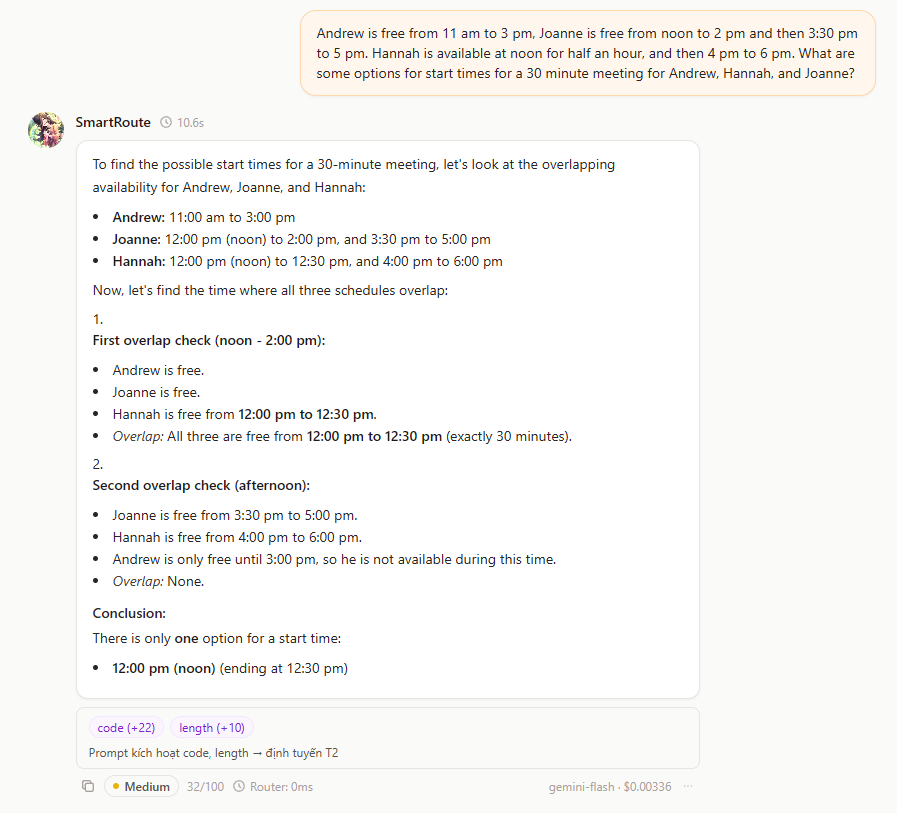
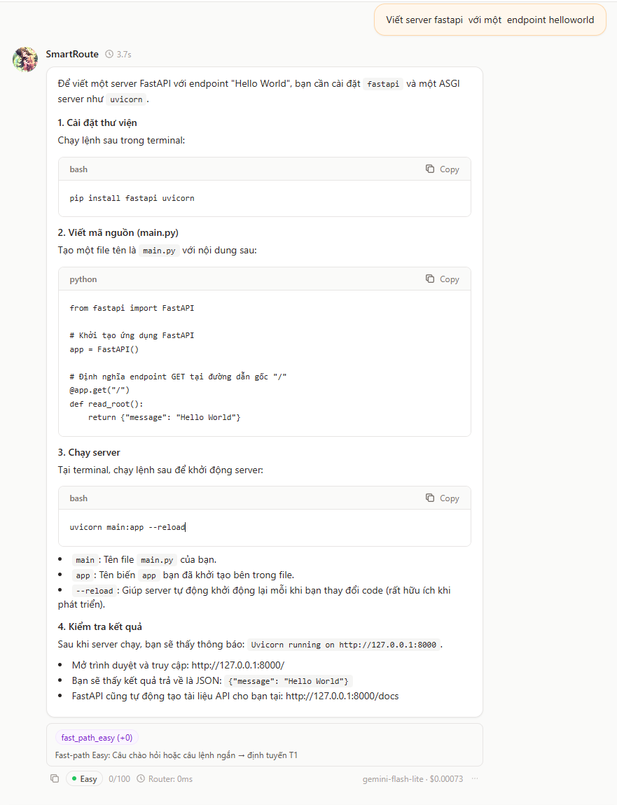
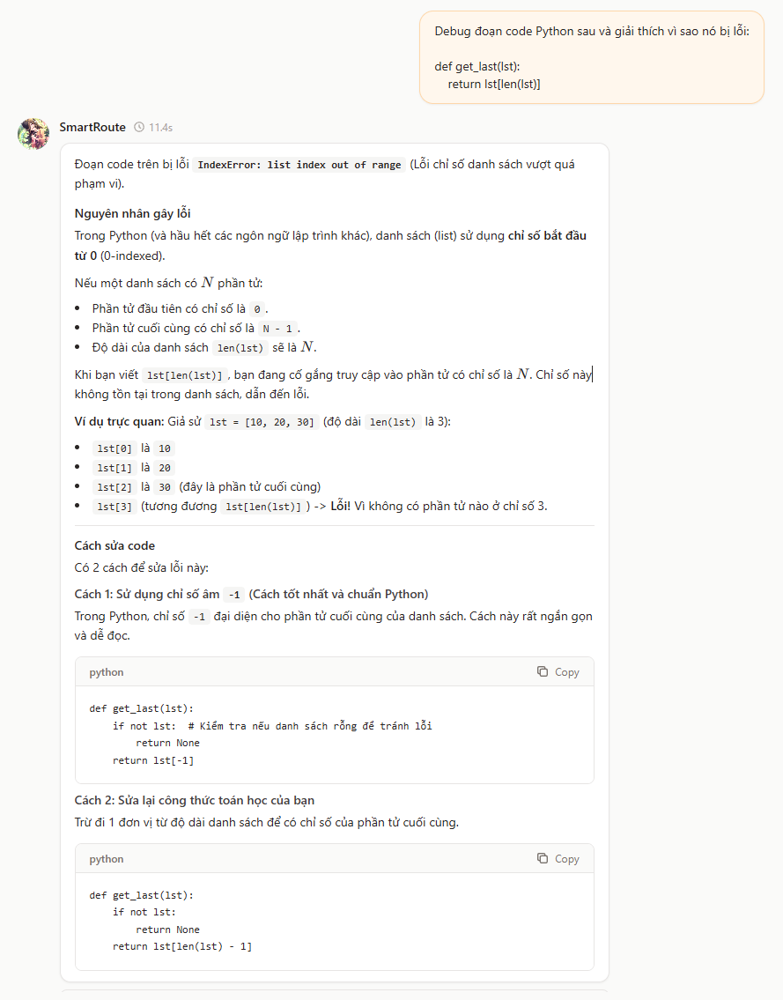
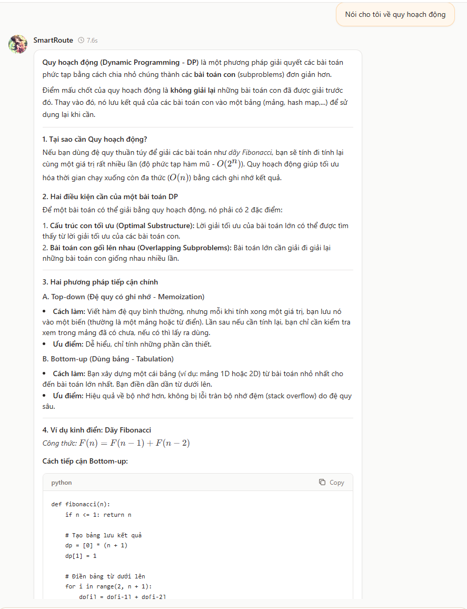
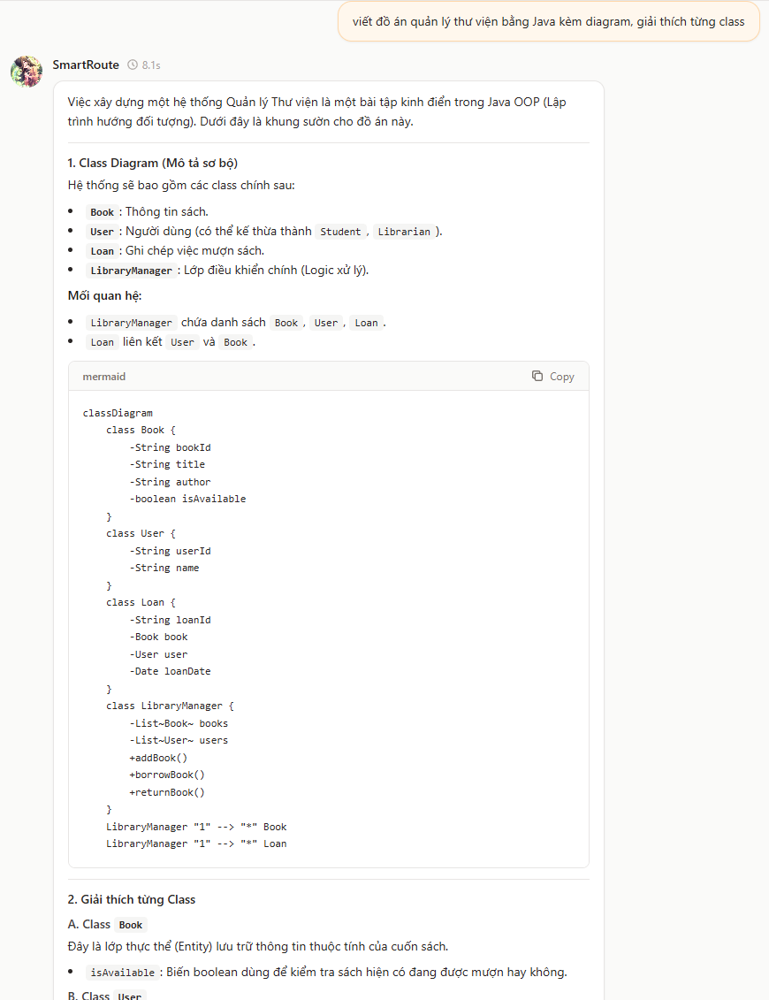

# 📊 Báo cáo Đánh giá Thực nghiệm (Evaluation Evidences)

> **Dự án:** SmartRoute Gateway — Team P-156  
> **Mục tiêu:** Đánh giá luồng hoạt động thực tế của Gateway qua 5 kịch bản kiểm thử (Test Cases) trên giao diện Playground: nhận diện prompt, chấm điểm độ khó, kích hoạt tín hiệu (signals), định tuyến đúng Tier và phản hồi chất lượng từ mô hình LLM.

---

## 🧪 Chi tiết 5 Test Cases Thực tế từ Playground UI

---

### 🔹 Test Case 1: Lập lịch cuộc họp & Suy luận ràng buộc thời gian

* **Prompt:**
  > *"Andrew is free from 11 am to 3 pm, Joanne is free from noon to 2 pm and then 3:30 pm to 5 pm. Hannah is available at noon for half an hour, and then 4 pm to 6 pm. What are some options for start times for a 30 minute meeting for Andrew, Hannah, and Joanne?"*
* **Phân loại & Định tuyến:**
  - **Tín hiệu kích hoạt:** `code (+22)`, `length (+10)`
  - **Điểm độ khó:** `32/100` $\rightarrow$ **Tier Medium (T2)**
  - **Độ trễ Router:** `0ms` (tức thì)
  - **Model thực thi:** `gemini-flash`
* **Kết quả đầu ra từ LLM:** Mô hình phân tích chính xác từng khoảng thời gian rảnh của 3 người, kiểm tra vùng giao thoa (overlap) và đưa ra kết luận duy nhất chuẩn xác: bắt đầu lúc `12:00 pm` (kết thúc lúc `12:30 pm`).



---

### 🔹 Test Case 2: Tạo Server FastAPI đơn giản (Fast-path Easy)

* **Prompt:**
  > *"Viết server fastapi với một endpoint helloworld"*
* **Phân loại & Định tuyến:**
  - **Tín hiệu kích hoạt:** `fast_path_easy (+0)` (Câu chào hỏi hoặc câu lệnh ngắn)
  - **Điểm độ khó:** `0/100` $\rightarrow$ **Tier Easy (T1)**
  - **Độ trễ Router:** `0ms`
  - **Model thực thi:** `gemini-flash-lite`
* **Kết quả đầu ra từ LLM:** Cung cấp đầy đủ các bước cài đặt thư viện (`pip install fastapi uvicorn`), mã nguồn `main.py` với endpoint `/`, lệnh chạy server và đường dẫn kiểm tra Swagger docs `http://127.0.0.1:8000/docs`.



---

### 🔹 Test Case 3: Debug & Giải thích lỗi lập trình Python

* **Prompt:**
  > *"Debug đoạn code Python sau và giải thích vì sao nó bị lỗi:*
  > ```python
  > def get_last(lst):
  >     return lst[len(lst)]
  > ```
* **Phân loại & Định tuyến:**
  - **Điểm độ khó & Tier:** Phân loại tác vụ kiểm tra mã nguồn (Code Debugging) $\rightarrow$ **Tier Medium (T2)**
  - **Model thực thi:** `gemini-flash`
* **Kết quả đầu ra từ LLM:** Chỉ rõ nguyên nhân gây lỗi `IndexError: list index out of range` do danh sách trong Python đánh chỉ số từ 0 (0-indexed). Cung cấp 2 giải pháp khắc phục chuẩn mực: Cách 1 dùng chỉ số âm `lst[-1]`, Cách 2 sửa công thức `lst[len(lst) - 1]`.



---

### 🔹 Test Case 4: Giải thích lý thuyết Thuật toán Quy hoạch động (Dynamic Programming)

* **Prompt:**
  > *"Nói cho tôi về quy hoạch động"*
* **Phân loại & Định tuyến:**
  - **Điểm độ khó & Tier:** Tác vụ tổng hợp kiến thức thuật toán phức tạp $\rightarrow$ **Tier Medium (T2)**
  - **Model thực thi:** `gemini-flash`
* **Kết quả đầu ra từ LLM:** Giải thích chi tiết khái niệm chia nhỏ bài toán con, 2 điều kiện cần (Cấu trúc con tối ưu & Bài toán con gối lên nhau), 2 hướng tiếp cận (Top-down Memoization vs Bottom-up Tabulation) và ví dụ minh họa kinh điển dãy Fibonacci kèm công thức toán và code Python.



---

### 🔹 Test Case 5: Thiết kế Đồ án Quản lý Thư viện Java & Sơ đồ Mermaid Class Diagram

* **Prompt:**
  > *"viết đồ án quản lý thư viện bằng Java kèm diagram, giải thích từng class"*
* **Phân loại & Định tuyến:**
  - **Điểm độ khó & Tier:** Thiết kế kiến trúc phần mềm hướng đối tượng (OOP Design) $\rightarrow$ **Tier Medium (T2)**
  - **Model thực thi:** `gemini-flash`
* **Kết quả đầu ra từ LLM:** Dựng cấu trúc hệ thống gồm các class `Book`, `User`, `Loan`, `LibraryManager`, sinh mã nguồn sơ đồ quan hệ `mermaid classDiagram` chuẩn cú pháp và giải thích chi tiết trách nhiệm của từng class.



---

## 📌 Tổng kết

- Hệ thống phân loại độ khó Heuristic hoạt động chuẩn xác trên các dạng prompt đa dạng: từ câu lệnh ngắn (Fast-path T1), gỡ lỗi code, suy luận logic lịch trình đến thiết kế hệ thống và sinh sơ đồ diagram.
- Toàn bộ 5 test case đều được định tuyến đến model tối ưu với độ trễ phân loại gần như bằng 0 (`Router: 0ms`), cho ra kết quả đầy đủ, chính xác và trực quan trên giao diện Playground.
