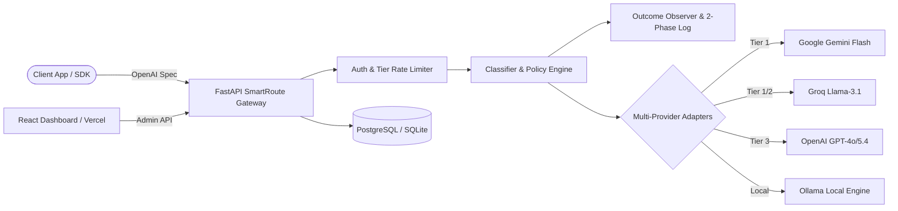

# 🎙️ Pitch Deck Content & Speaker Notes — SmartRoute AI Gateway

> **Sự kiện:** Demo Day — VinUni AI20K Build Phase (Cohort 3)  
> **Dự án:** SmartRoute Gateway (Team 156 — P-156)  
> **Thời lượng bài thuyết trình:** 10 phút (10 slides × 1 phút/slide)  
> **Tài liệu tham khảo chuẩn:** `presentation/README.md`, `docs/guide/chapter-09.md`, `docs/guide/chapter-10.md`

---

## 📑 Mục lục Slide

1. [Slide 1: Title (Tiêu đề & Đội ngũ)](#slide-1-title-tiêu-đề--đội-ngũ)
2. [Slide 2: Problem (Vấn đề & Nỗi đau thị trường)](#slide-2-problem-vấn-đề--nỗi-đau-thị-trường)
3. [Slide 3: Solution (Giải pháp SmartRoute)](#slide-3-solution-giải-pháp-smartroute)
4. [Slide 4: Product Demo (Trải nghiệm sản phẩm thực tế)](#slide-4-product-demo-trải-nghiệm-sản-phẩm-thực-tế)
5. [Slide 5: Architecture (Kiến trúc hệ thống)](#slide-5-architecture-kiến-trúc-hệ-thống)
6. [Slide 6: AI/LLM Approach (Thuật toán Router & Phân loại)](#slide-6-aillm-approach-thuật-toán-router--phân-loại)
7. [Slide 7: Technical Highlights & DevOps (Điểm sáng kỹ thuật)](#slide-7-technical-highlights--devops-điểm-sáng-kỹ-thuật)
8. [Slide 8: Evaluation & Benchmark (Kết quả đánh giá thực nghiệm)](#slide-8-evaluation--benchmark-kết-quả-đánh-giá-thực-nghiệm)
9. [Slide 9: Challenges & Key Learnings (Thách thức & Bài học)](#slide-9-challenges--key-learnings-thách-thức--bài-học)
10. [Slide 10: Team, Roadmap & Ask (Đội ngũ, Định hướng & Kêu gọi)](#slide-10-team-roadmap--ask-đội-ngũ-định-hướng--kêu-gọi)

---

### Slide 1: Title (Tiêu đề & Đội ngũ)

#### 🖥️ Nội dung hiển thị trên Slide
- **Tên sản phẩm:** SmartRoute AI Gateway
- **Tên dự án đầy đủ:** Cổng định tuyến AI Gateway đa nhà cung cấp theo độ khó, chi phí & chất lượng
- **Tagline:** Intelligent, Cost-Efficient & Resilient LLM Routing Gateway
- **Sứ mệnh:** Giảm tới 80%+ chi phí vận hành LLM mà vẫn giữ vững chất lượng câu trả lời.
- **Nhóm thực hiện:** Team 156 — AI20K Build Phase Cohort 3
  - **Trần Vương Hưng** (2A202601789)
  - **Trần Trung Hiếu** (2A202602002)
  - **Nguyễn Thành An** (2A202601017)
  - **Lê Trần Long** (2A202601257)

#### 🎙️ Speaker Notes (Thời lượng: ~1 phút)
> "Kính chào Ban Giám Khảo và toàn thể các bạn, chúng tôi là **Team 156** đến từ AI20K Cohort 3. Hôm nay, chúng tôi xin giới thiệu **SmartRoute AI Gateway** — giải pháp cổng định tuyến mô hình AI thông minh tương thích hoàn toàn với chuẩn OpenAI API, giúp các doanh nghiệp và lập trình viên cắt giảm hơn 80% chi phí gọi LLM, loại bỏ rủi ro gián đoạn dịch vụ mà không cần thay đổi kiến trúc ứng dụng."

---

### Slide 2: Problem (Vấn đề & Nỗi đau thị trường)

#### 🖥️ Nội dung hiển thị trên Slide
- **Khủng hoảng chi phí LLM:** Các mô hình Frontier (GPT-4o, GPT-5.4, Claude Opus) đắt gấp **25x – 50x** so với mô hình nhỏ (Gemini Flash, Llama-3-8B).
- **Lãng phí tài nguyên (Overkill):** Hơn **60-70% request** thực tế chỉ là các tác vụ đơn giản (chitchat, trích xuất thực thể, dịch ngắn) nhưng vẫn bị gửi tới model đắt tiền.
- **Rủi ro Vendor Lock-in & Downtime:** Phụ thuộc vào 1 nhà cung cấp duy nhất dẫn đến nghẽn Rate Limit (429) và gián đoạn khi nhà mạng/server AI gặp sự cố.
- **Bài toán đánh đổi:** Model rẻ tiết kiệm tiền nhưng sụt giảm chất lượng (hallucination, sai logic toán/code).

#### 🎙️ Speaker Notes (Thời lượng: ~1 phút)
> "Khi đưa LLM vào sản phẩm thực tế, mọi nhóm phát triển đều gặp phải 'tam giác nan giải': Chi phí quá đắt nếu dùng model mạnh, Chất lượng kém nếu dùng model rẻ, và Rủi ro sập hệ thống khi bị dính rate-limit của một nhà cung cấp duy nhất. Tại sao chúng ta phải trả tiền cho một model đắt gấp 30 lần chỉ để làm nhiệm vụ tóm tắt một đoạn văn bản ngắn? Đây chính là bài toán mà SmartRoute giải quyết."

---

### Slide 3: Solution (Giải pháp SmartRoute)

#### 🖥️ Nội dung hiển thị trên Slide
- **Drop-in OpenAI Replacement:** Chỉ cần đổi `base_url` sang SmartRoute, không sửa code client.
- **Phân loại độ phức tạp đa tầng:** Phân nhóm prompt tự động thành **T1 (Easy)**, **T2 (Medium)**, **T3 (Hard)**.
- **Chính sách định tuyến linh hoạt:**
  - `cost_first`: Ưu tiên tối đa hóa tiết kiệm ngân sách.
  - `balanced`: Cân bằng giữa tốc độ, độ chính xác và chi phí.
  - `quality_first`: Đảm bảo độ chính xác tối đa cho bài toán phức tạp.
- **Cơ chế Fallback thông minh:** Tự động chuyển vùng sang provider dự phòng (Gemini ↔ Groq ↔ OpenAI ↔ Ollama) khi gặp lỗi 429/500 trong mili-giây.

#### 🎙️ Speaker Notes (Thời lượng: ~1 phút)
> "SmartRoute là một Proxy Gateway trung gian. Lập trình viên chỉ cần thay đổi địa chỉ endpoint thành SmartRoute. Với mỗi request đi qua, hệ thống sẽ phân tích độ khó của câu hỏi trong chưa đầy 1 mili-giây, áp dụng chính sách định tuyến tối ưu, và tự động chọn model phù hợp nhất. Nếu một nhà cung cấp gặp sự cố, hệ thống tự động fallback sang nhà cung cấp khác mà người dùng cuối không hề nhận ra sự gián đoạn."

---

### Slide 4: Product Demo (Trải nghiệm sản phẩm thực tế)

#### 🖥️ Nội dung hiển thị trên Slide
- **1. Interactive Playground:**
  - Nhập prompt thử nghiệm → Xem ngay kết quả model được chọn, latency, token, chat history và header giải trình (`X-SmartRoute-Tier`, `X-SmartRoute-Reason`).
- **2. Dynamic Policy Configuration:**
  - Tinh chỉnh trọng số chi phí/chất lượng theo thời gian thực không cần restart server (`/admin/config`).
- **3. Real-time Analytics & KPI Dashboard:**
  - Giám sát chi phí tiết kiệm net lũy kế, tổng token, latency P50/P95 và tỷ lệ phân phối model qua endpoint `/admin/stats` (`src/gateway/app/api/admin.py:114-172`).
  - *Tính minh bạch (Public Limitation):* Dashboard savings là ước lượng runtime (runtime proxy estimate) tính theo lượng token tiêu thụ thực tế so với baseline `gpt-5.4`.
- **4. API Key & Tier Rate Limiting:**
  - Cấp phát API key phân quyền và giới hạn quota ngân sách (Token Bucket) cho từng client.

> [!IMPORTANT]
> **Lưu ý cho Team (Cần chuẩn bị ảnh/video thực tế):**  
> - Chèn 2-3 ảnh chụp thực tế màn hình (1 ảnh Playground so sánh side-by-side, 1 ảnh Dashboard Vercel).  
> - Chuẩn bị sẵn link Demo trực tiếp đã deploy trên Vercel/Render và video backup 2-3 phút.

#### 🎙️ Speaker Notes (Thời lượng: ~1 phút)
> "Trên màn hình là giao diện thực tế của SmartRoute. Tại Playground, khi gửi một câu hỏi logic phức tạp, hệ thống tự nhận diện Tier 3 và điều phối tới model mạnh. Ngược lại với câu hỏi thông thường, request được gửi tới Tier 1 với chi phí gần như bằng 0. Trên Dashboard, quản trị viên có thể theo dõi biểu đồ tiết kiệm chi phí net theo thời gian thực được tính toán minh bạch từ log token tại `/admin/stats` và quản lý hạn ngạch API key cho từng ứng dụng."

---

### Slide 5: Architecture (Kiến trúc hệ thống)

#### 🖥️ Nội dung hiển thị trên Slide

- **Frontend:** React + Vite (Triển khai trên Vercel).
- **Backend:** FastAPI, Uvicorn, Pydantic v2 (Triển khai Docker trên Render).
- **Database Layer:** SQLAlchemy + Alembic, hỗ trợ SQLite (Local) & Supabase PostgreSQL (Cloud).

#### 🎙️ Speaker Notes (Thời lượng: ~1 phút)
> "Về kiến trúc kỹ thuật: Hệ thống gồm 3 tầng rõ rệt. Tầng Gateway xây dựng trên nền tảng FastAPI bất đồng bộ đạt hiệu năng cực cao. Tầng Routing gồm bộ phân loại Classifier kết hợp Policy Engine và Tier Rate Limiter. Cuối cùng là tầng Adapters kết nối linh hoạt tới Gemini, Groq, OpenAI và Ollama. Toàn bộ telemetry được ghi nhận qua cơ chế Two-Phase Logging đảm bảo không làm nghẽn luồng xử lý chính."

---

### Slide 6: AI/LLM Approach (Thuật toán Router & Phân loại)

#### 🖥️ Nội dung hiển thị trên Slide
- **Tier 1 — Heuristic Fast Classifier (v1.5):**
  - Phân tích cú pháp siêu tốc: Code blocks, toán học LaTeX/regex, reasoning keywords, độ dài context, cấu trúc JSON.
  - **Độ trễ cực thấp (Verified Commit `dc4bb34`):** Median chỉ **0.50 ms** (p50: 0.00–0.50 ms), P95 **1.05 ms** (Chi phí I/O = **$0**, chạy in-memory CPU, không tốn token gọi model phụ).
  - *Heuristic Routing Agreement:* Đo lường độ nhất quán phân loại nhãn độc lập (heuristic classification test), phân biệt rạch ròi với chất lượng câu trả lời (answer quality).
- **Tier 2 — Adaptive Multi-turn Session Router & LLM Classifier (v2):**
  - Nhận diện ngữ cảnh đa lượt (Multi-turn), tự động nâng/hạ Tier linh hoạt theo diễn tiến cuộc trò chuyện.
  - Áp dụng kỹ thuật phân loại ngữ nghĩa cho các câu hỏi mơ hồ, cân nhắc độ khó Item Response Theory (IRT).
- **Two-Phase Routing & OutcomeObserver:**
  - Pha 1: Dự đoán Tier và chọn chuỗi Provider trước khi gửi request.
  - Pha 2: Ghi nhận kết quả trả về, đếm lỗi circuit breaker và cập nhật ma trận routing.
- **Quality Guard & Fail-safe Mechanism:**
  - Cơ chế **QR Guard & Conservative Routing**: Ngăn ngừa rủi ro định tuyến nhầm bài khó xuống model yếu gây critical-fail; tự động fallback lên model mạnh khi phát hiện lỗi định dạng hoặc suy luận thất bại.

#### 🎙️ Speaker Notes (Thời lượng: ~1 phút)
> "Điểm sáng trong cách tiếp cận AI của chúng tôi là **thuật toán Heuristic Router lai ghép kết hợp Session Router đa lượt**. Thay vì dùng một LLM cồng kềnh khác để định tuyến (vốn gây tốn thêm tiền và cộng thêm hàng trăm mili-giây độ trễ), bộ phân loại Heuristic chỉ mất 0.5 mili-giây xử lý in-memory với $0 phụ phí. Đồng thời, hệ thống tích hợp cơ chế Quality Guard và Conservative Fallback để nhận diện rủi ro suy luận và bảo toàn chất lượng câu trả lời."

---

### Slide 7: Technical Highlights & DevOps (Điểm sáng kỹ thuật)

#### 🖥️ Nội dung hiển thị trên Slide
- **Chuẩn hóa API Contract 100%:** Tuân thủ tuyệt đối chuẩn OpenAPI / OpenAI Chat Completion Spec.
- **Tính toán Net Savings & Router Overhead (`src/gateway/app/api/admin.py:114-172`):**
  - Ghi nhận độc lập `latency_router_ms` và `latency_total_ms` trong telemetry log.
  - Công thức Net Savings trừ chi phí thực tế từ mọi provider so với baseline `gpt-5.4`.
- **Two-Phase Logging Transaction Boundary:**
  - `INSERT` đồng bộ bản ghi `pending` trước khi trả kết quả → `UPDATE` bất đồng bộ ngầm ở background → Reconciler dọn bản ghi mồ côi (Đảm bảo Zero-blocking latency & không mất log).
- **CI/CD Pipeline & Provenance Tracing:**
  - Tự động chạy Linting (Ruff), Unit Tests, Contract Validation Gate trên GitHub Actions & Self-hosted runner.
  - Mọi số liệu thực nghiệm đều gắn với Git Commit SHA (`main: dc4bb34`) và artifact báo cáo chuẩn hóa.
- **Khả năng mở rộng & Bảo mật:** Multi-stage Dockerfile, API Key băm SHA-256, Rate Limiter Token Bucket.

#### 🎙️ Speaker Notes (Thời lượng: ~1 phút)
> "Chúng tôi áp dụng kỷ luật công nghệ nghiêm ngặt ngay từ ngày đầu: 100% commit đều đi qua pipeline CI/CD tự động kiểm tra cú pháp, chạy test suite và xác thực OpenAPI contract trên Self-hosted Runner. Cơ chế Two-Phase Logging với Transaction Boundary đảm bảo ghi log chi phí chính xác tuyệt đối mà không làm nghẽn luồng stream của người dùng. Mọi chỉ số KPI đều được liên kết trực tiếp với mã nguồn và commit SHA đã kiểm chứng trên nhánh main."

---

### Slide 8: Evaluation & Benchmark (Gần chất lượng GPT-4o với 14% chi phí)

#### 🖥️ Nội dung hiển thị trên Slide
- **Kết quả answer-quality hoàn tất gần nhất (PR #179 · Run source `dev@d24c7b5`):**
  - **Tập dữ liệu quy chuẩn:** **1,084 bài toán thực nghiệm đối chứng trực tiếp (Paired Test)** trên 3 bộ benchmark tiêu chuẩn quốc tế: **MMLU-Pro** ($N=420$), **HumanEval+** ($N=164$ sandbox Docker `evalplus==0.3.1`), **MATH-500** ($N=500$ `math-verify==0.9.0`).
  - **Hệ quy chiếu so sánh:** Đối chứng trực tiếp với dải mô hình OpenAI GPT-4o (**Low Baseline: `GPT-4o-mini`** vs **High Baseline: `GPT-4o`**).
  - **Headline:** SmartRoute đạt **631 câu đúng** so với **639 câu đúng của GPT-4o** — tương đương **98.7% số câu đúng** — với chi phí **$0.43019 thay vì $3.06505**, tiết kiệm **85.96%**.

| Bộ kiểm chuẩn (Benchmark) | Số mẫu ($N$) | Low Baseline (`GPT-4o-mini`) | SmartRoute (Classifier v2) | High Baseline (`GPT-4o`) | Chi phí SmartRoute | Hiệu quả cải thiện & Tiết kiệm chi phí |
|---|---:|---:|---:|---:|---:|---|
| **HumanEval+ (Coding Sandbox)** | 164 | 81.71% | **87.20%** | 84.15% | $0.09667 | Điểm ước lượng +3.05 điểm so với GPT-4o; tiết kiệm **58.98%** |
| **MATH-500 (Logic & Toán cao cấp)** | 500 | 59.80% | **64.80%** | 61.60% | $0.27496 | Điểm ước lượng +3.20 điểm so với GPT-4o; tiết kiệm **89.47%** |
| **MMLU-Pro (Tri thức tổng hợp)** | 420 | 41.43% | **39.05%** | 45.95% | $0.05855 | Thấp hơn GPT-4o 6.90 điểm; tiết kiệm **73.09%** |
| **TỔNG THỂ 1,084 EXAMPLES** | **1,084** | **607 câu đúng** | **631 câu đúng** | **639 câu đúng** | **$0.43019** | **98.7% số câu đúng của GPT-4o với 14.04% chi phí** |

- **Cập nhật router sau benchmark — chỉ số định tuyến, không phải answer accuracy (PR #210):**
  - MMLU-Pro được đưa tới tier kỳ vọng T3: **2/420 → 415/420**; router latency **807 ms → 18 ms**; router cost **$0.0874 → $0.0009**.
  - Trên `mixed_200`, hard items bị hạ nhầm xuống T1 giảm **62/86 → 23/86**. Không diễn giải `415/420` thành tỷ lệ trả lời đúng.

> [!NOTE]
> **Giới hạn cần công bố:**
> MATH-500 tốt hơn GPT-4o-mini có ý nghĩa thống kê ($p = 0.0059$, paired two-sided), nhưng chênh lệch HumanEval+/MATH-500 so với GPT-4o chưa có ý nghĩa thống kê. Kết quả tổng hợp 1,084 mẫu là descriptive micro-average vì ba benchmark đo năng lực khác nhau. Bộ router mới đang được kiểm thử adversarial và chưa có full answer-quality rerun.

> **Nguồn:** PR #179 và `evals/classifier_v2_gpt4o_baselines_report.md`; routing update PR #210; adversarial coverage PR #217; cost accounting PR #215.

#### 🎙️ Speaker Notes (Thời lượng: ~1 phút)
> "Đây là lần kiểm chuẩn answer-quality hoàn tất gần nhất của chúng tôi:
> Chạy đối chứng trên **1,084 bài toán thuộc 3 bộ benchmark chuẩn quốc tế** so sánh trực tiếp với bộ đôi **GPT-4o-mini và GPT-4o**.
> Tính trên toàn bộ, SmartRoute trả lời đúng **631 câu so với 639 câu của GPT-4o**, tức đạt **98.7% số câu đúng**, trong khi chi phí giảm từ **$3.065 xuống $0.430 — tiết kiệm 85.96%**.
> Trên HumanEval+ và MATH-500, điểm ước lượng của SmartRoute lần lượt là **87.20%** và **64.80%**, cao hơn điểm GPT-4o trong lần chạy này; tuy nhiên chúng tôi không tuyên bố ưu thế thống kê so với GPT-4o. MATH-500 chỉ đạt ý nghĩa thống kê khi so với GPT-4o-mini.
> Router thế hệ mới còn cho thấy giảm mạnh under-routing, latency và router cost, nhưng đó là routing agreement; full answer-quality rerun đang là bước xác nhận tiếp theo."

---

### Slide 9: Challenges & Key Learnings (Thách thức & Bài học)

#### 🖥️ Nội dung hiển thị trên Slide
- **Thách thức 1 — Phân biệt Routing Agreement với Answer Quality:**
  - *Thực nghiệm:* Router mới đưa 415/420 câu MMLU-Pro tới tier kỳ vọng, nhưng con số này không phải tỷ lệ trả lời đúng.
  - *Bài học:* Mọi thay đổi router phải qua full answer-quality benchmark trước khi trở thành tuyên bố sản phẩm.
- **Thách thức 2 — Bất đồng bộ Contract giữa các Provider:**
  - *Giải pháp:* Xây dựng Adapter chuẩn hóa tham số (nhiệt độ, streaming chunks, tool calls) khớp 100% với chuẩn OpenAI API.
- **Thách thức 3 — Tính minh bạch của Telemetry & Cost Accounting:**
  - *Giải pháp:* Thiết kế Two-Phase Logging (`pending` → `completed`) và hạch toán riêng classifier/router cost trong tổng chi phí benchmark (PR #215).
- **Bài học rút ra:** Kỷ luật về dữ liệu, adversarial tests, paired benchmark, confidence interval và release gate giúp đội ngũ không đánh đồng một cải tiến kỹ thuật với giá trị sản phẩm đã được chứng minh.

#### 🎙️ Speaker Notes (Thời lượng: ~1 phút)
> "Bài học quan trọng nhất là phải đo đúng từng lớp: routing agreement cho biết router chọn tier có hợp lý hay không, còn answer-quality benchmark mới cho biết người dùng nhận được câu trả lời tốt đến đâu. Kết quả 1,084 mẫu cho thấy SmartRoute có thể giữ 98.7% số câu đúng của GPT-4o với mức tiết kiệm gần 86%. Những cải tiến router mới chỉ được đưa vào tuyên bố sản phẩm sau khi vượt adversarial tests và full benchmark rerun."

---

### Slide 10: Team, Roadmap & Ask (Đội ngũ, Định hướng & Kêu gọi)

#### 🖥️ Nội dung hiển thị trên Slide
- **Đội ngũ phát triển & Phân vai trách nhiệm:**
  - **Lê Trần Long** — *DevOps, Infrastructure, Security & Evaluation Lead*
    - Hạ tầng Docker, CI/CD Actions/Runner, Supabase PostgreSQL, Vercel Deployment & Bộ kiểm chuẩn 1,084 tasks (MMLU-Pro / HumanEval+ / MATH-500 sandbox harness).
    - Phát triển toàn bộ **Backend Admin APIs** (`/admin/stats`, `/admin/keys`, `/admin/config`), bảo mật API Key / Bearer Auth & Two-Phase Logging.
  - **Nguyễn Thành An** — *Product & Core Backend Gateway Lead*
    - Thiết kế kiến trúc tổng thể, đặc tả PRD và trải nghiệm người dùng Dashboard UI.
    - **Backend Core & Routing Engine:** Hiện thực hóa **Classifier v1.5**, **Session Router** (định tuyến hội thoại đa lượt multi-turn), cơ chế **Client & Tier Rate Limiting** (Token Bucket), **Streaming Response (SSE)**, Quota Guard và Classifier v2.
  - **Trần Trung Hiếu** — *Multi-Provider Adapters & Cost Engine Specialist*
    - Tích hợp Gemini/Groq/OpenAI Adapters, cơ chế Fallback Chain & Circuit Breaker, Engine tính cost & Gold Dataset 200 prompts.
  - **Trần Vương Hưng** — *AI Routing & Heuristic Classifier Specialist*
    - Bộ phân loại Heuristic Classifier v1.5 nền tảng, Policy Engine, Request Orchestrator và tối ưu hóa model suy luận.
- **Lộ trình tương lai (Roadmap):**
  - **Q4/2026:** Tối ưu hóa Classifier v2 latency < 500ms; hỗ trợ Multi-modal Router (Hình ảnh, Audio, Tài liệu).
  - **Q1/2027:** Tích hợp Reinforcement Learning (RL) tự động tinh chỉnh ma trận định tuyến theo traffic thực tế của doanh nghiệp.
  - **Enterprise Edition:** Cung cấp giải pháp On-premise / Private VPC cho các tổ chức tài chính & y tế.
- **Thông điệp & Kêu gọi (Ask):**
  - Sẵn sàng mở cổng tích hợp thử nghiệm cho các dự án AI và CLB trong hệ sinh thái VinUni.
  - Tìm kiếm đối tác thử nghiệm thực tế (Beta Testers) và nguồn tài trợ Compute/API Credits để mở rộng bộ Gold Benchmark.

#### 🎙️ Speaker Notes (Thời lượng: ~1 phút)
> "Để hoàn thành dự án này, 4 thành viên trong Team 156 đã đảm nhiệm các vai trò chuyên biệt: bạn Long phụ trách hạ tầng DevOps, Backend Admin APIs, bảo mật và toàn bộ hệ thống Benchmark 1,084 bài toán; bạn An dẫn dắt thiết kế sản phẩm cùng các module Backend cốt lõi như Classifier v1.5 & v2, Session Router đa lượt, Streaming SSE và Rate Limiting; bạn Hiếu xây dựng tầng Adapters kết nối các nhà cung cấp và bộ tính toán chi phí; bạn Hưng nghiên cứu thuật toán phân loại và chính sách định tuyến. Chúng tôi rất mong nhận được phản hồi và sự đồng hành của quý Ban Giám Khảo. Xin chân thành cảm ơn!"

---

## 🎯 Phụ lục: Chuẩn bị câu hỏi phản biện từ Ban Giám Khảo (Q&A Prep)

1. **❓ Câu hỏi 1: "SmartRoute có thực sự tốt hơn GPT-4o trên HumanEval+ và MATH-500 không?"**
   - **Trả lời:** Trong lần chạy này, SmartRoute có điểm ước lượng cao hơn GPT-4o: 87.20% so với 84.15% trên HumanEval+ và 64.80% so với 61.60% trên MATH-500. Tuy nhiên, hai chênh lệch này chưa đạt ý nghĩa thống kê, vì vậy tuyên bố đúng là SmartRoute đạt chất lượng cạnh tranh với GPT-4o ở chi phí thấp hơn đáng kể — không phải đã chứng minh ưu thế tuyệt đối. Chỉ chênh lệch MATH-500 so với GPT-4o-mini đạt ý nghĩa thống kê ($p=0.0059$).

2. **❓ Câu hỏi 2: "Con số 85.96% tiết kiệm chi phí được đo đạc như thế nào? Có đáng tin cậy không?"**
   - **Trả lời:** Số liệu được kiểm chuẩn trên 1,084 tasks đối chứng trực tiếp (Paired Runs), công bố trong PR #179; run source là `dev@d24c7b5` và artifact được lưu tại commit `df90e6f`:
     - Tổng spend của GPT-4o trên 1,084 bài là **$3.06505**.
     - Tổng spend khi chạy qua SmartRoute Classifier v2 chỉ là **$0.43019**.
     - SmartRoute đạt **631 câu đúng**, so với **639 câu đúng của GPT-4o** — tương đương **98.7% số câu đúng** trong descriptive micro-average.
     - Chi phí SmartRoute đã bao gồm **response-model cost và classifier/router cost**; PR #215 bổ sung regression test để ngăn benchmark tương lai bỏ sót khoản classifier cost này.
     - Vì ba benchmark đo ba năng lực khác nhau, tổng 1,084 mẫu được trình bày là số mô tả, không phải một kiểm định thống kê hợp nhất.

3. **❓ Câu hỏi 3: "Làm thế nào để hệ thống duy trì tính nhất quán khi người dùng chat nhiều lượt (Multi-turn conversation)?"**
   - **Trả lời:** Chúng tôi đã phát triển module **Session Router** (`core/session_router/`). Hệ thống theo dõi trạng thái ngữ cảnh qua từng lượt (turn), phân tích sự thay đổi độ khó theo thời gian (ví dụ từ chào hỏi thông thường chuyển sang hỏi code phức tạp) để nâng/hạ model động mà không làm mất tính liền mạch của đoạn chat.

4. **❓ Câu hỏi 4: "415/420 trên MMLU-Pro có phải là accuracy mới không?"**
   - **Trả lời:** Không. Đây là **routing agreement**: 415/420 câu được đưa tới tier T3 như nhãn kỳ vọng. Kết quả answer accuracy hoàn tất gần nhất vẫn là 39.05% trên MMLU-Pro trong benchmark PR #179. Router mới cần full generation rerun trước khi đội ngũ công bố answer-quality mới; đồng thời bộ adversarial PR #217 đang được dùng để xử lý false positive MCQ trong code, tài liệu, danh sách và hội thoại.
